# AgentFlow

AgentFlow 是面向 OA、表单审批和结构化财务业务的 DDD 工作流平台。Vue 工作台承载设计、填报、审批与财务操作；Java 领域模型维护状态和业务不变量；Flowable 运行已发布流程；持久执行器通过受控适配器连接模型、预算、ERP 和资金系统。

平台以**可信身份、固定版本、人工决策、权威外部事实及可恢复的原操作**组织整条链路。Agent 提供摘要、票据抽取、费用草稿、预检解释、风险提示及有界报销办理；员工确认修改，审批、金额核定、付款授权及资金事实由各自业务用例负责。

本文正文及内嵌 Mermaid 图核对至 **2026-10-09** 的 `main`，基线为 [`3fa6d05e`](https://github.com/liulangjietou/agent-flow/commit/3fa6d05e)。业务持久层已使用 **MyBatis Mapper/XML**，业务迁移最高版本为 **V133**。企业接入、真实模型效果及最终发布的验收范围见[能力边界](#能力边界)。独立 PNG/SVG 图稿仍保留其 2026-10-03 基线，作为历史设计参考。

## 阅读导航

- [快速启动](#快速启动)：Docker 演示、本地开发、账号与第一个审批闭环。
- [功能入口](#功能入口)、[技术栈](#技术栈)：当前工作台菜单和构建依赖。
- [员工与审批者图文操作手册](docs/employee-approver-manual/README.md)：58页、29张界面截图，按创建、提交、审批及异常恢复说明员工和审批者操作，提供 Word、PDF 与完整资料包。
- [完整系统使用手册](docs/user-guide.md)：按实际操作顺序讲解安装、账号权限、首次配置、申请与审批、流程设计、财务执行、Agent 辅助、备份及故障恢复；源码核对至 2026-10-08。
- [全景架构图](#全景架构图)：工作台、业务编排、领域与引擎、存储及外部适配。
- [端到端流程图](#端到端流程图)：从流程发布到审批、财务执行、核销、归档及 Agent 辅助。
- [模块边界与职责](#模块边界与职责)：编译依赖、用例编排、领域端口与适配器。
- [流程定义与人工审批](#流程定义与人工审批)：发布、版本绑定、动态选人、会签及申请生命周期。
- [结构化财务链路](#结构化财务链路)：预检、提交、预算、凭证、付款、核销与异常恢复。
- [Agent 辅助链路](#agent-辅助链路)：输入选择、持久运行、模型校验与人工复核。
- [报销 Agent 自动办理](#报销-agent-自动办理)：授权范围、工具查询、人工节点与中断恢复。
- [安全与一致性](#安全与一致性)：身份、字段权限、职责分离、幂等与时间证据。
- [存储与部署](#存储与部署)：数据源、原件、生产迁移、实例和备份恢复。
- [验证](#验证)、[能力边界](#能力边界)与[详细文档](#详细文档)。

## 功能入口

菜单名称来自 [workspaceNavigation.ts](agentflow-web/src/workspaceNavigation.ts)，实际可见范围由当前身份决定，写操作仍由服务端授权。

| 工作台入口 | 已有能力 |
| --- | --- |
| 开始使用、模板中心、流程管理 | 首次流程引导、8 个内置模板、模板导入导出、可视化设计、表单配置、模拟、版本比较与发布 |
| 待我审批、我发起、我的草稿、已办记录、申请记录 | 发起与补正、会签、转交/委派、批量办理、轮次对比、真实运行图及授权检索 |
| 财务申请 | 事前申请、费用报销、员工借款、采购付款、预算调整；票夹、预检、凭证、结算与归档 |
| Agent 助理、报销编辑器中的办理面板 | 摘要与草稿、原件抽取、预检解释、风险提示、逐项补正、受控自动办理及原运行恢复 |
| 费用财务报表、出纳付款 | 按授权范围汇总费用事实；付款账户、法人和到期日筛选；原付款查询与异常处置 |
| 组织与人员、审批代理、工作日历 | 组织任职、可信源同步预检及人工采用、期限代理、日历版本与任务期限 |
| 科目映射、费用制度 | 有版本的财务配置、制度选择、补贴、事前额度、预算例外和项目审批策略 |
| 消息中心、集成投递、操作审计、审批运营、接口文档、系统自检 | 通知、Webhook、审计、运行统计、OpenAPI 和依赖诊断 |

## 技术栈

以下版本来自 [父 POM](pom.xml)、[server POM](agentflow-server/pom.xml) 和 [前端锁文件](agentflow-web/package-lock.json)，前端安装使用 `npm ci`。

| 层次 | 当前依赖与用途 |
| --- | --- |
| Java 后端 | Java 17、Spring Boot 3.5.6、Spring MVC、Bean Validation、Actuator |
| 流程引擎 | Flowable 7.2.0；发布图转换为 BPMN，运行真实实例、任务及历史 |
| 业务持久化 | MyBatis Spring Boot Starter 3.0.5 / MyBatis 3.5.19；Mapper 接口与 XML SQL |
| 数据库与迁移 | PostgreSQL 为默认开发库，Compose 使用 PostgreSQL 17；H2 2.5.250 用于隔离测试；Flyway 管理业务迁移 |
| 前端 | Vue 3.5.43、TypeScript 5.9.3、Vite 8.3.0、vue-tsc 3.3.11 |
| 身份与部署 | 演示 Bearer、可选企业 OIDC / Spring Session JDBC；Docker Compose、Nginx、可选 Prometheus |
| 模型接入 | 受控 OpenAI-compatible Chat Completions HTTP 适配器；非流式严格 JSON，默认关闭 |

## 全景架构图

[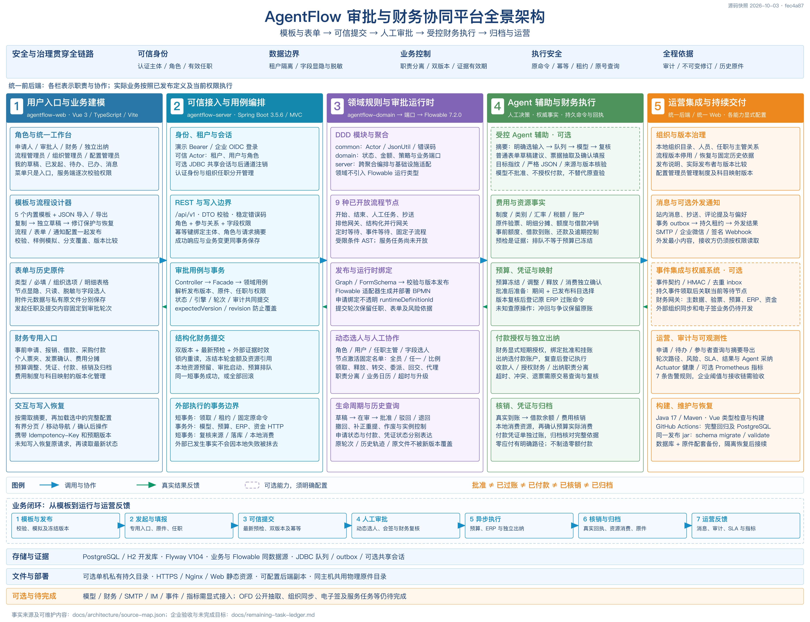](docs/assets/agentflow-panorama.png)

[查看高分辨率 PNG](docs/assets/agentflow-panorama.png) · [打开可缩放 SVG](docs/assets/agentflow-panorama.svg) · [内容与源码索引](docs/architecture/source-map.json) · [图稿维护说明](docs/architecture/README.md)

原图保留完整展示，图稿基线为 2026-10-03；下方 Mermaid 图补充当前代码的职责与依赖关系。

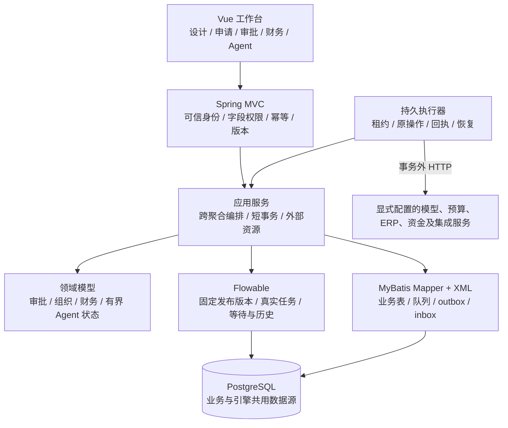

同一后端承载这些职责。一次业务不必经过所有栏目，具体入口和节点由业务类型及已发布流程决定。原图中 JDBC、模板数量及未开放节点等旧描述以当前正文为准。

| 层次 | 主要调用方与入口 | 核心职责 | 下游与持久结果 |
| --- | --- | --- | --- |
| 用户入口与业务建模 | 申请人、审批人、财务、出纳、流程及配置管理员 | 工作空间、模板复制、流程/表单设计、专用财务填报、版本冲突与原请求恢复 | `/api/v1` REST；浏览器只提交允许的输入和预期版本 |
| 可信接入与用例编排 | Spring MVC Controller、定时调度及事件消费者 | 认证主体、业务授权、幂等响应、跨聚合锁与事务、来源复核 | 领域聚合、Flowable 端口、MyBatis 仓储及持久任务 |
| 领域规则与审批运行时 | 发布、提交、办理、等待及实例控制用例 | 状态变更、条件 AST、节点策略、选人依据、会签门槛及业务日历 | 发布版本、引擎实例、真实待办、提交轮次、轨迹与审计 |
| Agent 辅助与财务执行 | 显式模型运行、最新预检、人工批准、财务授权及出纳执行 | 受控输入、金额与资源、预算、凭证、资金命令、未知恢复、核销及归档 | 模型原文和复核记录；外部回执、本地账本及原件清单 |
| 运营集成与持续交付 | 组织管理员、运营查询、集成管理员及部署维护人员 | 目录治理、消息/outbox、事件/inbox、查询导出、指标、迁移与恢复 | 外部适配器、追加审计、监控采集、发布包及隔离恢复点 |

## 端到端流程图

[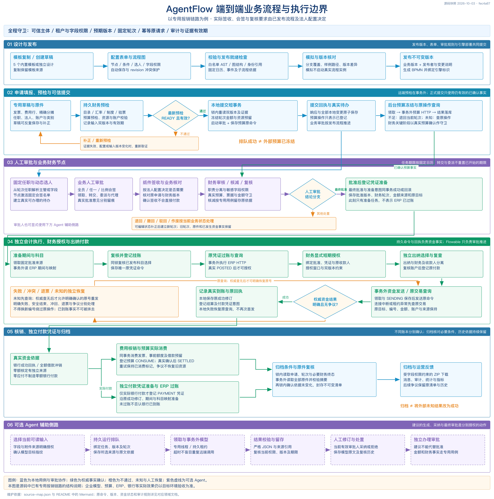](docs/assets/agentflow-business-flow.png)

[查看高分辨率 PNG](docs/assets/agentflow-business-flow.png) · [打开可缩放 SVG](docs/assets/agentflow-business-flow.svg)

原图保留完整展示，图稿基线为 2026-10-03。下面使用**专用报销链路**展示详细流程。事前申请、借款、采购付款和预算调整复用审批与执行基础设施，并保留自己的聚合、来源和金额规则。纸件签收、业务会签、财务审核与复核的具体要求来自发布定义及法人配置。

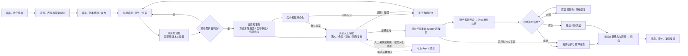

**批准、已过账、已付款、已核销和已归档分别表示不同事实。** 提交回执只证明本地事务成功及外部任务已登记；凭证准备 `READY` 不代表 ERP 已过账；`SETTLED` 还要求本地资源和预算实际消费完成。

## 模块边界与职责

| 模块 | 实际职责 | 代表源码 |
| --- | --- | --- |
| `agentflow-common` | `Actor`、当前主体、统一 `JsonUtil`、稳定领域错误 | [Actor](agentflow-common/src/main/java/io/agentflow/common/Actor.java)、[JsonUtil](agentflow-common/src/main/java/io/agentflow/common/JsonUtil.java) |
| `agentflow-domain` | 定义图、条件、表单、申请与轮次、组织、日历、财务聚合和端口；表达状态与业务不变量 | [Application](agentflow-domain/src/main/java/io/agentflow/approval/model/Application.java)、[DefinitionValidator](agentflow-domain/src/main/java/io/agentflow/definition/DefinitionValidator.java)、[领域依赖](agentflow-domain/pom.xml) |
| `agentflow-server` | Spring MVC 接口；认证和权限；跨聚合编排；Flowable、Flyway、MyBatis、文件与 HTTP 适配；持久执行器 | [ApprovalApplicationFacade](agentflow-server/src/main/java/io/agentflow/approval/ApprovalApplicationFacade.java)、[运行适配器](agentflow-server/src/main/java/io/agentflow/approval/process/FlowableProcessRuntimeAdapter.java) |
| `agentflow-web` | Vue 工作空间、设计器、表单、财务工作台；按需查询、确认写入、身份切换和原请求恢复 | [入口菜单](agentflow-web/src/workspaceNavigation.ts)、[请求恢复](agentflow-web/src/pendingWrites.ts)、[按需定义选择](agentflow-web/src/definitionSelection.ts) |

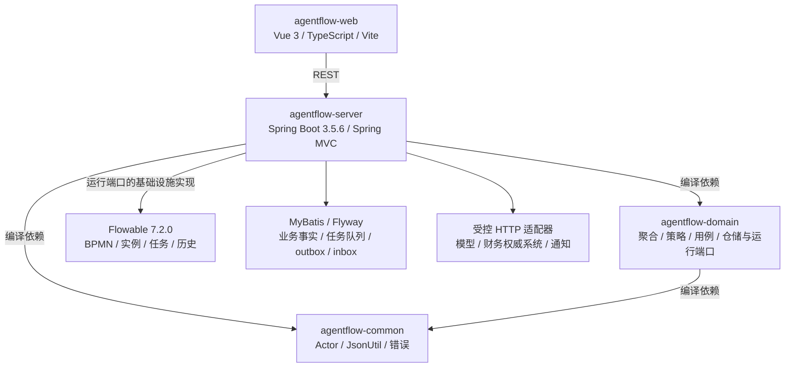

职责按业务归属划分：实体判断和改变自身状态；跨聚合读取、锁和外部资源编排位于用例层；适配器处理引擎、数据库、文件和远端协议。领域层通过 `ProcessRuntimePort`、仓储和财务端口调用下游，不把 Flowable 类型带入业务模型。

`agentflow-domain` 的直接业务依赖是 `agentflow-common`；部分领域对象使用由 common 传入的 Spring `CollectionUtils`，因此不能把当前实现描述为完全没有 Spring 依赖。Spring MVC、事务容器和 Flowable 适配均位于 server。

同一个 `agentflow-server` 承载这些上下文；图中的领域分栏不是多个独立微服务。后台持久执行器使用平台自己的调度和租约，配置中的 Flowable 异步执行器默认关闭。

```text
agentflow-common/                   主体、JSON 与公共错误
agentflow-domain/                   领域模型、策略及端口
agentflow-server/src/main/java/     Controller、应用服务、仓储、Mapper 与适配器
agentflow-server/src/main/resources/
  mapper/                          按业务分组的 MyBatis XML
  db/migration/                    Flyway SQL 迁移（另有 Java 迁移）
  process-templates/               8 个只读内置流程模板
  processes/                      开发模式的示例 BPMN
agentflow-web/                      Vue 工作台、请求测试与 OpenAPI 校验
deploy/                            容器、Nginx、生产配置与监控
scripts/                           作者检查、运行验收及备份恢复工具
docs/                              手册、接口、专题说明与阶段证据
```

业务 SQL 放在 `mapper/**/*.xml`，Java 仓储负责聚合恢复与类型转换，应用服务负责事务。部分仓储保留 `Jdbc*` 类名，例如 [JdbcApplicationRepository](agentflow-server/src/main/java/io/agentflow/approval/JdbcApplicationRepository.java)，其内部已调用 Mapper。MyBatis 使用 `local-cache-scope: STATEMENT` 且关闭二级缓存，避免同一事务中与 Flowable 交叉读写时读取旧值。历史迁移及启动前数据库锁仍可直接使用 JDBC；Spring Session 的 JDBC 存储也保留。

## 流程定义与人工审批

### 定义从草稿到发布

内置目录当前包含 **8 个模板**，来源为 [process-templates](agentflow-server/src/main/resources/process-templates)：

| 模板键 | 名称 | 业务类型 |
| --- | --- | --- |
| `leave-request` | 请假申请 | 普通表单 |
| `seal-application` | 用印申请 | 普通表单 |
| `contract-review` | 合同审批 | 普通表单 |
| `expense-plan` | 事前费用申请 | `EXPENSE_PLAN` |
| `expense-report` | 员工费用报销 | `EXPENSE` |
| `advance-request` | 员工借款申请 | `ADVANCE_REQUEST` |
| `procurement-payment` | 已验收采购付款 | `PROCUREMENT_PAYMENT` |
| `budget-adjustment` | 预算追加与调拨 | `BUDGET_ADJUSTMENT` |

模板复制产生独立草稿并保存来源，已有副本不会被目录升级覆盖。财务模板需要匹配的组织、制度和外部主数据；[财务配套示例](docs/financial-template-examples.md)用于本地验证，复制模板不等于完成企业初始化。

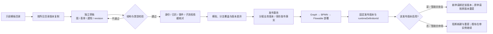

发布由 [DefinitionApplicationService](agentflow-server/src/main/java/io/agentflow/definition/DefinitionApplicationService.java) 编排，经过 [DefinitionValidator](agentflow-domain/src/main/java/io/agentflow/definition/DefinitionValidator.java)、引用核对、分支覆盖和同一套条件求值器，再调用 [FlowableDefinitionDeploymentAdapter](agentflow-server/src/main/java/io/agentflow/definition/FlowableDefinitionDeploymentAdapter.java) 生成 BPMN。定义、部署和发布记录在同一事务内成功或回滚。

当前开放节点：

| 节点 | 运行含义 | 关键约束 |
| --- | --- | --- |
| `START / END` | 明确开始和结束 | 图结构及可达性必须合法 |
| `USER_TASK` | 真实人工任务 | 当前可办理权限、固定选人依据、版本和决策意见 |
| `COPY` | 只读抄送 | 收件范围与字段读取权限；不授予批准权 |
| `EXCLUSIVE_GATEWAY` | 有顺序的排他分支 | 白名单条件 AST、默认分支与覆盖检查 |
| `PARALLEL_GATEWAY` | 结构化并行与汇合 | 校验分支结构，历史保留真实执行路径 |
| `TIMER_WAIT` | 到期后的受控恢复 | 固定等待实例及当前轮次 |
| `EVENT_WAIT` | 等待契约匹配的可信事件 | 来源、签名、去重及等待绑定 |
| `SUB_PROCESS` | 引用固定发布子流程 | 版本、输入和关系可追溯，不任意调用流程 |
| `SERVICE_TASK` | 持久执行已安装的白名单服务契约 | 固定版本、明确字段映射、原命令与回执；未知结果查询原号 |

上表共 **10 种节点类型**（`START` 和 `END` 分别计数）。[白名单服务任务](docs/service-tasks.md)已接通设计、发布、模拟、后台执行和“服务运行”历史；只有部署配置安装的契约可用，流程不能提交任意 URL、Bean 或脚本。条件使用白名单 AST，不执行用户输入的 JUEL、Java 或脚本。

### 申请生命周期与轮次

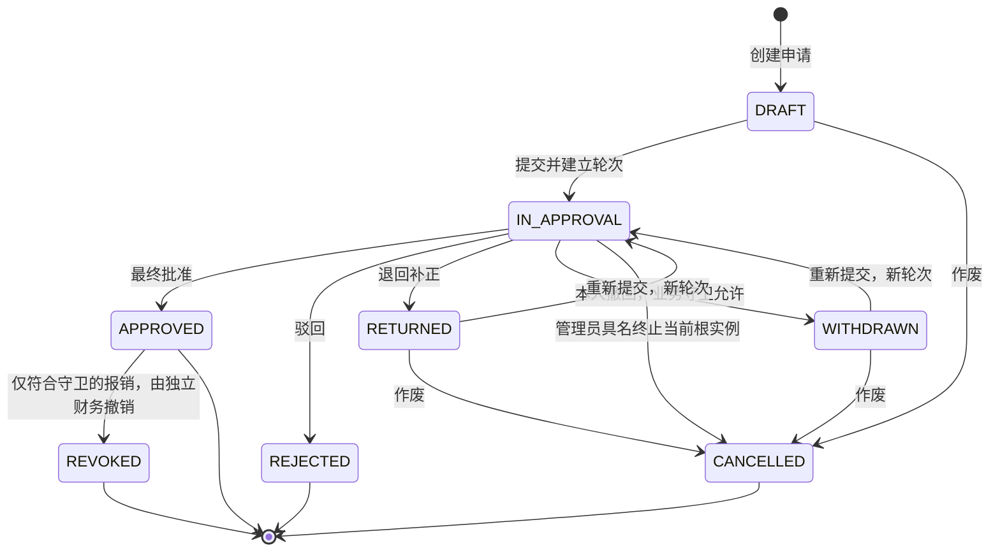

[ApprovalApplicationFacade](agentflow-server/src/main/java/io/agentflow/approval/ApprovalApplicationFacade.java) 解析发布版本、认证主体、任职和原件依据，再调用领域 [ApprovalApplicationService](agentflow-domain/src/main/java/io/agentflow/approval/service/ApprovalApplicationService.java)。提交通过运行端口启动真实实例，同时保存申请版本、`SubmissionRound` 和操作审计。

申请人只在 **DRAFT / RETURNED / WITHDRAWN** 编辑。重提继续使用原绑定的流程与表单版本；原版本被停用时先恢复该版本，不静默切换最新版。每次提交建立新的任职和内容快照，旧轮次保持不变。结构化财务的撤回、核减和撤销还要通过其资源及执行状态守卫；生命周期不能单独推定预算、银行或 ERP 已撤销。

管理员只可具名终止当前在审根轮次及尚未完成的后代，结果为 `CANCELLED`，不能恢复或重提；已经批准或驳回的结论保持。暂停和恢复仍保持 `IN_APPROVAL`，属于运行状态变化。[已批准报销撤销](docs/approved-expense-revocation.md)由独立财务入口处理：尚无凭证发送尝试、付款授权或核销依据且其他守卫通过时，申请进入 `REVOKED`，保留原批准轮次，释放本地预留并登记预算释放任务。已有未知或实际外部结果时走原对账/冲回流程。

### 动态选人、会签与任务办理

- 发起时明确选择有效任职并固定到该轮次。主管、部门负责人或字段选人依据来自可信目录及提交快照。
- 全员、任一人、比例会签在节点激活时固定名单和门槛；达标结束剩余待办，保留已经发生的批准和意见。
- 领取、释放、转交、委派、受托回交和期限代理分别授权。委派协助不替代原审批人的最终责任。
- 职责分离过滤冲突人员；无人可审批时阻断。费用流程已支持按发布策略启用[自审批上溯](docs/expense-self-approval.md)和[相邻重复业务审批人自动通过](docs/expense-duplicate-approval.md)，保存固定依据与审计；财务签收、审核、复核仍需各自办理。
- 任务期限从真实创建时刻按固定业务日历计算。转交和委派不重置已经开始的期限；超时、升级和代理保留实际依据。

真实动作由 [TaskController](agentflow-server/src/main/java/io/agentflow/approval/TaskController.java) → [FlowableTaskFacade](agentflow-server/src/main/java/io/agentflow/approval/process/FlowableTaskFacade.java) → 运行端口办理；[OrganizationAssigneeResolver](agentflow-server/src/main/java/io/agentflow/organization/OrganizationAssigneeResolver.java) 负责组织依据解析。界面显示的可操作按钮只是提示，写接口重新校验。

## 结构化财务链路

### 业务聚合各自负责自己的事实

| 业务 | 本地生命周期与主要事实 | 审批后的后续处理 |
| --- | --- | --- |
| 事前申请 | 计划草稿、目录/汇率预检、冻结轮次、实际批准和事前额度 | 本人额度关闭、报销引用与并发预留 |
| 费用报销 | 精确明细、税额和分摊；票据、事前额度、借款冲销；制度版本和财务轮次 | 预算、审核核减、凭证、付款或零应付、核销、归档 |
| 员工借款 | 借款申请、账户、金额、还款日及法人时区 | 放款凭证与资金执行、到账余额、还款、退回复核和逾期控制 |
| 采购付款 | 采购申请与真实应付来源、原应付预留、供应商账户和职责分离 | 独立供应商银行指令、结算、调整、争议与退票 |
| 预算调整 | 预算来源、调整预检、人工批准与授权 | 独立原调整命令、结果查询、异常复核及财务终态 |

客户端不能用普通表单、金额总数或“已成功”标志替代这些业务事实。不同业务通过 `BusinessReference` 关联审批申请，财务金额和版本由专用服务派生。

当前费用链路还包含以下有版本的控制，具体是否生效由发布配置及本轮证据决定：

| 能力 | 实际边界与说明 |
| --- | --- |
| 定额补贴与事前额度 | [补贴](docs/expense-allowances.md)按已发布行程规则计算；[事前控制](docs/expense-prior-controls.md)支持 `STRICT / TOLERANCE / NONE` 及必要独立审批 |
| 跨单拆单路由 | [拆单规则](docs/expense-split-routing.md)按受控窗口和阈值冻结合计依据，不改写本单财务金额 |
| 柔性预算例外 | [预算例外](docs/expense-budget-exceptions.md)只在外部预算明确支持时进入指定审批，审批后仍需确认真实预算结果 |
| 项目负责人会签 | [项目审批](docs/expense-project-approvals.md)按实际分摊项目固定可信负责人，全员完成必要责任 |
| 原件签收、核减与补正 | [签收清单](docs/expense-receipt-checklist.md)、[核减原因](docs/expense-reduction-reasons.md)和[补正反馈](docs/expense-review-feedback.md)保留逐行依据，重提建立新轮次 |
| 财务报表与付款排序 | [费用报表](docs/expense-financial-reporting.md)受原轮次权限约束；[付款到期日](docs/payment-due-dates.md)来自显式业务日期，支持出纳筛选 |

### 预检与正式提交

预检读取外部主数据、账户、汇率、制度、原件查验及预算预检，保存完整请求、目标指纹、双版本和证据有效期。制度提示服务提供填报依据，正式预检仍要使用实际费用行和票据执行权威规则判定。

正式提交由 [ExpenseSubmissionService](agentflow-server/src/main/java/io/agentflow/expense/ExpenseSubmissionService.java) 在本地短事务中完成：

1. 校验本人、申请版本、财务版本及最新 `READY` 预检，锁定并重读资源。
2. 核对预检时效、制度发布选择、原流程可启动性及必要财务阶段。
3. 冻结轮次金额、税额、账户、分摊及资源预留；保存当前财务状态。
4. 启动原绑定版本的真实审批，固定任职和提交轮次。
5. 登记预算原命令；再检查证据时效，将业务变化、审计与幂等回执共同提交。

任何末尾失败整体回滚。提交事务不等待外部预算 HTTP，排队结果不是预算成功。预算明确不足会退回匹配的当前轮次；旧轮次结果不能退回已重提的新轮次。

### 凭证、付款、核销与归档

| 阶段 | 实际触发与执行 | 成功事实 | 失败或未知的处理 |
| --- | --- | --- | --- |
| 预算操作 | 固定本轮分摊及原目标，后台冻结/调整/释放/消费 | 对应预算命令的权威确认 | 依赖不可用与业务拒绝分开；未知查询原操作 |
| 挂账准备 | 最终批准同事务登记准备任务；事务外读取会计期间和科目 | 原批准来源、有效期间及已发布科目选择复核通过 | 配置发布竞争或来源改变阻断登记；人工刷新准备 |
| ERP 过账 | 保存唯一原凭证命令，后台发送并记录修订 | 权威凭证号和过账回执 | 未知查询原命令；查无后按规则明确原号重发；冲回及争议单独留存 |
| 付款授权 | 财务按刚查看的批准、业务及凭证版本显式授权 | 短期授权及原收款账户依据 | 过期、来源改变及安全结束不与银行未知混同 |
| 出纳执行 | 独立出纳选付款账户，事务外复查，登记原付款 | 银行/资金权威成功修订 | 超时、迟到、冲突及退票原查询；不能换号绕过 |
| 资源核销 | 真实付款、全额借款冲销或零额核定具有独立来源 | 本地资源已消费且预算实际消费成功 | 重试保留已消费标记；争议冻结不恢复旧资源 |
| 付款凭证 | 实际银行成功单独登记 `PAYMENT` 准备与过账 | 对应银行事实的会计结果 | ERP 不可用不能把银行到账改为未付款 |
| 归档 | 核对必要审批、财务终态和原件；事务外读文件后再锁内复核 | 不可变清单与受字段权限约束的 ZIP | 不造外部成功、不覆盖原件；后续争议保留原清单 |

[科目映射管理](docs/account-mapping-configuration.md)按照法人及类别管理发布版本。凭证准备领取时固定选择，登记前与配置发布共用锁复核；已经登记的原凭证保留原映射与摘要，新版本不会改写旧会计依据。

**零应付是独立业务路径。** 全额借款冲销或零额核定不生成零额银行付款；核销仍核对真实资源及预算事实。只有实际银行付款才需要对应付款凭证。

### 持久执行与未知结果恢复

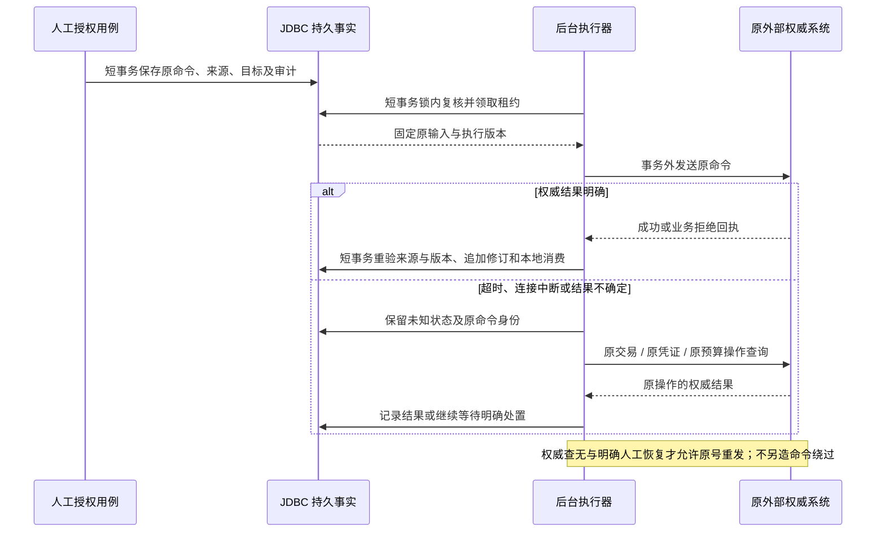

代表执行器：[BudgetOperationWorker](agentflow-server/src/main/java/io/agentflow/finance/BudgetOperationWorker.java)、[VoucherPreparationWorker](agentflow-server/src/main/java/io/agentflow/finance/VoucherPreparationWorker.java)、[VoucherOperationWorker](agentflow-server/src/main/java/io/agentflow/finance/VoucherOperationWorker.java)、[PaymentOperationWorker](agentflow-server/src/main/java/io/agentflow/finance/PaymentOperationWorker.java)。

本地数据库事务不会跨越外部网络请求。原命令唯一身份、固定目标、租约、来源版本和追加回执共同解决不确定性；它们不能把多个企业系统变成一个分布式 ACID 事务。资金已经发生而本地确认失败时恢复原查询，原事实持续保留。

## Agent 辅助链路

| 能力 | 允许输入与输出 | 人工及权限边界 |
| --- | --- | --- |
| 审批摘要 | 当前有效审批人明确选择可读字段/附件来源，生成结构化摘要与来源引用 | 采纳、修订或拒绝保留模型原文；最终批准另行执行 |
| 普通表单草稿 | 按发布表单和当前可编辑状态提出建议 | 人工确认并走原草稿保存 |
| 票据抽取与辅助填报 | 图片/PDF、XML、OFD 原件的受控解析或模型抽取，保留来源与候选值 | 本人确认票面字段；抽取和签章呈现不能替代权威验票或签名有效性验证 |
| 结构化费用草稿 | 按本人报销、行程、费用类别及允许来源准备草稿 | 目录预览、发送范围和建议逐次确认，最终由本人核对原费用表单并保存 |
| 预检解释与补正 | 引用当前预检、问题和明确选择的制度/费用事实，生成原因及字段差异 | 只采纳原建议中选中的字段，保存后排队新预检，不改写旧预检结论 |
| 审批风险提示 | 基于授权的费用证据解释风险并保留来源 | 当前审批人复核；模型标签不自动驳回、核减或改变金额路由 |
| 报销自动办理 | 在原登录、单据双版本、工具白名单及步数内循环查询、提问与提出后续动作 | 涉及票据抽取、费用草稿和业务修改时进入人工节点；不自动提交、批准或付款 |

### 审批摘要执行

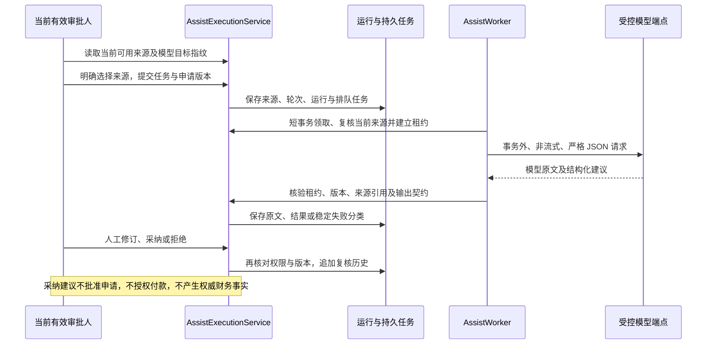

[AssistExecutionService](agentflow-server/src/main/java/io/agentflow/agent/AssistExecutionService.java) 固定输入及运行版本，[AssistWorker](agentflow-server/src/main/java/io/agentflow/agent/AssistWorker.java) 在事务外调用模型，[OpenAiTextClient](agentflow-server/src/main/java/io/agentflow/agent/OpenAiTextClient.java) 校验原目标、响应结构和有界正文。

模型目标来自部署配置，浏览器只能确认目标指纹。身份、来源、任务或版本变化后重新授权；过期租约不能接受迟到结果。超时及进程中断不盲目重发模型调用。默认 `AGENTFLOW_ASSIST_ENABLED=false`，合成模型验证只证明协议与权限链路，真实模型连接和样本质量仍需验收。

### 报销 Agent 自动办理

在已保存的本人报销编辑器中创建办理记录，先预览发送材料、模型目标和查询范围，再明确授权自动办理。界面恢复原任务、步骤及等待状态；办理记录最多 32 步，单次 Agent 授权的自动循环最多 **12 步、30 分钟**，二者由不同状态模型控制。

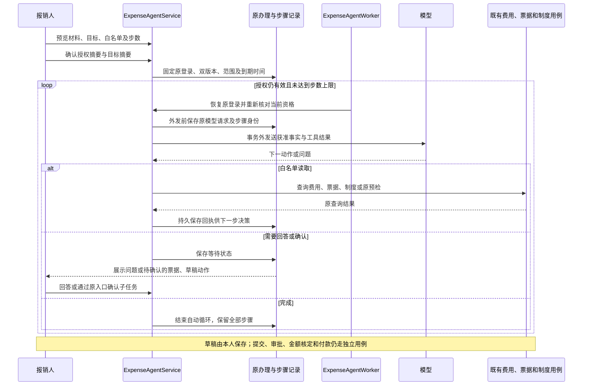

调用链为 [ExpenseAgentController](agentflow-server/src/main/java/io/agentflow/agent/ExpenseAgentController.java) → [ExpenseAgentService](agentflow-server/src/main/java/io/agentflow/agent/ExpenseAgentService.java) → [ExpenseAgentRun](agentflow-domain/src/main/java/io/agentflow/agent/ExpenseAgentRun.java) / [ExpenseAgentTools](agentflow-server/src/main/java/io/agentflow/agent/ExpenseAgentTools.java)。状态转换属于领域模型，原登录恢复、事务和既有工具的组合属于应用服务，模型 HTTP 在事务外执行。

- 自动读取只开放 `EXPENSE / INVOICE / POLICY / PRECHECK_RESULT`。`ASK_USER / EXTRACT_INVOICE / DRAFT / FINISH` 分别进入提问、人工确认或结束状态，模型不能传入任意 URL、SQL、脚本或身份。
- 结构化补正只允许费用类别、城市、开始/发生日期、结束日期、事由和例外原因六类字段。服务端核对原值及原建议编号，金额、税额、票据、分摊和审批字段不在该补正白名单中。
- 票据抽取与原办理绑定；本人确认后接续费用草稿人工节点。草稿确认不自动保存报销或提交审批。
- 外部只读查询先保存原编号、输入和目标，可恢复原读取。模型执行中断则保留未知，原登录有效时由本人明确确认后开启新决策，不静默重发旧模型步骤。
- 原登录失效、人员停用、单据版本或模型目标改变会停止运行。演示令牌随进程重启失效；企业跨实例及重启续办依赖共享 OIDC 会话配置。

接口入口为 `/api/v1/expense-reports/{id}/handling-tasks` 及其 `/{taskId}/agent` 子资源；实际请求结构见 [OpenAPI](docs/openapi-reference.md)。[AgentUsageController](agentflow-server/src/main/java/io/agentflow/agent/AgentUsageController.java) 提供本人可读的运行用量，记录七类用途的排队耗时、执行耗时、服务商原始 token 用量和结果；未知保留为未知，不补成零。业务链路和模型评估方法见[企业报销与 Agent 验收](docs/enterprise-expense-agent-acceptance.md)。

## 安全与一致性

### 权限分层

| 层面 | 实际判断 | 业务影响 |
| --- | --- | --- |
| 认证主体 | 演示 Bearer 或 OIDC 生成可信 `Actor` | 请求不能自带任意租户、用户或系统角色 |
| 系统角色 | `PROCESS_ADMIN / FINANCE_CONFIG_ADMIN / FINANCE / CASHIER / ADMIN` 等能力 | 角色只授予相应功能入口，不替代本人、参与者或组织范围规则 |
| 组织与职责 | 人员、部门、岗位、有效任职、主管关系、代理及冲突人员 | 选人依据可追溯，认证身份与组织目录分别管理 |
| 数据读取 | 当前参与关系、轮次与节点字段显隐、只读、脱敏 | 管理员、财务及出纳仍受敏感字段规则约束 |
| 文件读取 | 元数据所属租户、申请、字段及当前授权 | 无匿名原件 URL；移除当前引用不删除历史原件 |
| 决策与执行 | 可办理任务、双版本、证据时效、原目标及职责分离 | 页面提示不能代替写接口检查，付款需独立出纳 |

### 写入、快照与时间证据

- 业务写接口要求 `Idempotency-Key`。原键绑定租户、主体、角色摘要、方法、路径、查询和原始正文，成功响应与本地业务变更同事务保存。不同请求或权限变化不能复用原回执。
- `expectedVersion`、草稿 `revision`、申请/财务双版本和运行版本解决各自的并发覆盖。幂等解决重复操作，版本解决所见事实是否仍然成立。
- 发布流程、表单、通知、日历修订、任职、风险、金额、制度和科目选择按各自业务边界固定；历史依据不能由今天的配置推断或补造。
- 金额以精确十进制文本及币种表达，分摊按业务规则平衡；未知结果不转成业务拒绝或成功。
- 业务截止时刻保留原始精度。JDBC 的 `TIMESTAMP(6)` 使用显式微秒投影校验，冻结 JSON 保留纳秒证据，避免数据库舍入改变授权截止判断。
- 模型、财务和通知目标由可信配置指定；远端身份、协议回显、来源、摘要、时效和结果分类由适配器核对。

实现入口：[IdempotencyExecutor](agentflow-server/src/main/java/io/agentflow/api/idempotency/IdempotencyExecutor.java)、[ApplicationFieldViews](agentflow-server/src/main/java/io/agentflow/approval/ApplicationFieldViews.java)、[JdbcTimestampPrecision](agentflow-server/src/main/java/io/agentflow/jdbc/JdbcTimestampPrecision.java)。

## 存储与部署

### 数据与运行底座

| 内容 | 当前位置与配置 | 运行约束 |
| --- | --- | --- |
| 业务事实 | MyBatis Mapper/XML，本地开发默认 PostgreSQL | 申请、财务聚合、轮次和修订以租户及来源约束关联 |
| 工作流运行 | 同数据源 Flowable 表 | 与申请/轮次的本地事务共同提交，不将引擎状态等同于财务终态 |
| 结构迁移 | Flyway，当前源码最高业务迁移 `V133` | 生产用维护命令迁移；服务启动校验已迁移结构 |
| 持久后台任务 | 数据库任务、租约、执行状态和回执修订，经 MyBatis 访问 | 副本竞争原任务；网络请求在事务外 |
| 外发与事件 | 通知/Webhook outbox，可信事件 inbox | 持久去重、最小外发、签名、租约与结果恢复 |
| 企业会话 | 可选 Spring Session JDBC | 多实例 OIDC 需要统一共享会话配置，支持跨实例回调及注销 |
| 原件 | 可选单机私有持久目录与数据库元数据 | 同主机副本共用同一物理目录；跨主机独立目录不支持当前附件方案 |
| 可观测性 | Actuator 健康，可选专用凭证 Prometheus 入口 | 不暴露表单正文；企业容量目标、阈值和告警接收链另行验收 |

当前实现使用关系数据库队列和原件目录；部署图按已有 Compose 及维护命令组织。V129–V133 分别引入补正、模型用量、办理记录、持久查询和 Agent 自动编排。迁移包含 SQL 与 Java 两类，不能仅按 SQL 文件编号判断是否缺失。

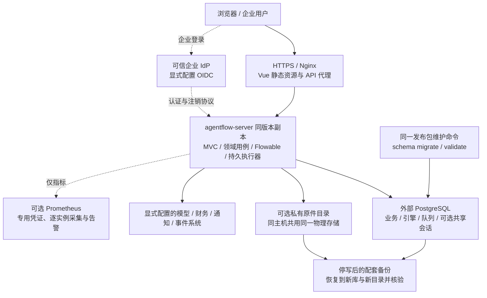

### 启用与部署方式

| 能力 | 默认状态或入口 | 配套说明 |
| --- | --- | --- |
| 开发与 Docker 演示 | 开发 PostgreSQL；`compose.demo.yml` 使用 PostgreSQL 17，入口 `8180` | [演示安装](docs/demo-installation.md) |
| 企业身份 | 开发演示认证启用；`prod` 关闭演示，OIDC 需可信配置 | [OIDC](docs/enterprise-oidc.md)、[共享会话](docs/shared-enterprise-sessions.md) |
| Agent 模型 | `AGENTFLOW_ASSIST_ENABLED=false` | `compose.assist.yml` 与生产 Compose 合用；[受控模型执行](docs/agent-execution.md) |
| 财务权威系统 | `AGENTFLOW_FINANCE_GATEWAY_ENABLED=false` | 按租户显式目标与凭据；[财务网关](docs/finance-gateway.md) |
| 附件与票据原件 | 未配置 `AGENTFLOW_ATTACHMENT_DIRECTORY` 时关闭 | `compose.attachments.yml`；[原件与配套恢复](docs/field-attachments.md) |
| 外发通知 | 外发 worker 默认关闭；目的地、绑定和凭据显式配置 | [通知投递](docs/notification-delivery.md)、[Webhook](docs/webhook-delivery.md) |
| 事件集成 | `AGENTFLOW_EVENTS_ENABLED=false` | [事件契约](docs/event-contracts.md)、[事件工作区](docs/event-workspace.md) |
| 白名单服务任务 | `agentflow.service-tasks.gateway.enabled=false`，需安装租户契约 | [服务任务配置与恢复](docs/service-tasks.md) |
| 外部组织同步 | `agentflow.organization-sync.enabled=false`，需可信源与映射 | [同步预检及人工采用](docs/organization-sync.md) |
| 电子签 | `agentflow.signatures.gateway.enabled=false`，需签署配置与原登录授权 | [签署、回调及回执证据](docs/electronic-signatures.md) |
| Prometheus | `AGENTFLOW_METRICS_ENABLED=false` | `compose.monitoring.yml`；[监控与告警](docs/production-monitoring.md) |
| 企业 HTTPS | `compose.production.yml` 默认外部端口 `443`，后端副本默认 1 | [生产容器](docs/production-container-deployment.md)、[多实例](docs/multi-instance-deployment.md) |

生产数据库生命周期使用**同一个发布 jar**。以下以本地构建产物为例，生产部署替换为实际发布路径，并设置目标数据库及维护身份：

```bash
java -jar agentflow-server/target/agentflow-server-0.1.0-SNAPSHOT.jar --schema=migrate
java -jar agentflow-server/target/agentflow-server-0.1.0-SNAPSHOT.jar --schema=validate
```

维护命令使用对应数据库身份；`prod` 应用启动只检查既有结构，未迁移则拒绝启动。备份、只读校验、数据库和文件配套恢复分别见[数据库生命周期](docs/production-database-lifecycle.md)、[生产备份恢复](docs/production-backup-recovery.md)和[原件恢复](docs/field-attachments.md#数据库与文件配套恢复)。恢复到独立新资源并核验原待办接续，生产切流及 RPO/RTO 以目标环境验收为准。

## 快速启动

先获取源码，两种启动方式任选一种：

```bash
git clone https://github.com/liulangjietou/agent-flow.git
cd agent-flow
```

### 单命令 Docker 演示

需要 Docker Engine / Docker Desktop 与 Compose v2。Docker 已启动时，在仓库根目录执行：

```bash
docker compose -f compose.demo.yml up --build -d --wait --wait-timeout 180
```

打开 `http://127.0.0.1:8180`，租户 `demo`，用户 `admin`，密码 `demo`。数据库持久卷保留数据；停止环境时不需要删除卷。首次构建需要网络。系统自检显示依赖配置和实际查询状态；可选模型、财务和文件能力仍按上表启用。

```bash
# 查看状态及服务日志
docker compose -f compose.demo.yml ps
docker compose -f compose.demo.yml logs --tail=100 server

# 停止本次演示，保留数据库卷
docker compose -f compose.demo.yml down
```

需要更换入口端口时，在启动前设置 `AGENTFLOW_DEMO_PORT`。默认演示包含数据库、后端和前端，不要求先安装本机 Java、Node 或 PostgreSQL。

### 本地 Java 与 Vue

使用 JDK 17、Maven 3.6.3+；前端锁文件要求 Node.js `^20.19.0 || >=22.12.0`，CI 使用 Node.js 22。先用 `java -version`、`mvn -version`、`node --version` 确认实际版本。

默认连接本机 PostgreSQL，数据库名为 `agentflow`，账号为 `root`，密码为 `123456`，JDBC URL 为 `jdbc:postgresql://localhost:5432/agentflow`。启动前需准备数据库和账号；首次启动由 Flyway 创建业务表，Flowable 创建引擎表并部署 `expense-reimbursement` 示例流程。

如果尚未安装 PostgreSQL，可先启动独立的本地数据库（需确保 `5432` 和容器名未被占用）：

```bash
docker run --name agentflow-postgres \
  -e POSTGRES_DB=agentflow -e POSTGRES_USER=root -e POSTGRES_PASSWORD=123456 \
  -p 127.0.0.1:5432:5432 \
  -v agentflow-postgres:/var/lib/postgresql/data \
  -d postgres:17

# 等数据库就绪后再启动后端；预期显示 accepting connections
docker exec agentflow-postgres pg_isready -U root -d agentflow
```

可通过 `AGENTFLOW_DATASOURCE_URL`、`AGENTFLOW_DATASOURCE_USERNAME`、`AGENTFLOW_DATASOURCE_PASSWORD` 和 `AGENTFLOW_DATASOURCE_DRIVER` 覆盖连接配置。自动化测试默认使用独立 H2 内存库，PostgreSQL 专项测试使用显式指定的隔离数据库。

```bash
# macOS：选择已安装的 JDK 17；其他系统使用自己的 JDK 路径
export JAVA_HOME=$(/usr/libexec/java_home -v 17)
export PATH="$JAVA_HOME/bin:$PATH"
export AGENTFLOW_WEB_ORIGIN=http://127.0.0.1:5173

mvn -pl agentflow-server -am package
java -jar agentflow-server/target/agentflow-server-0.1.0-SNAPSHOT.jar
```

另开终端，在同一仓库执行：

```bash
cd agentflow-web
npm ci
npm run dev -- --host 127.0.0.1
```

打开 `http://127.0.0.1:5173`。Vite 将 `/api` 代理到 `http://127.0.0.1:8080` 并保持同源 Host。`npm run preview` 使用 `4173`，不替代开发服务器。访问主机或端口变更时，同步更新后端 `AGENTFLOW_WEB_ORIGIN`。直接调用另一后端时，`VITE_API_BASE` 必须包含完整 `/api/v1` 前缀，并在前端启动/构建前设置。

后端就绪与身份模式可直接核对：

```bash
curl --fail http://127.0.0.1:8080/actuator/health/readiness
curl --fail http://127.0.0.1:8080/api/v1/auth/options
```

### 演示账号与第一个审批闭环

演示租户为 `demo`，账号 `admin / finance / cashier / manager / employee / alice / bob`，密码统一为 `demo`。`cashier` 为独立出纳；账户、角色与组织任职仍按各自规则检查。生产关闭演示认证并接入企业 OIDC，不能把演示身份作为企业目录。

| 账号 | 演示职责 |
| --- | --- |
| `admin` | 流程、组织、财务配置及管理；具有财务角色，不包含 `CASHIER` |
| `finance` | 财务审核与授权 |
| `cashier` | 独立出纳付款 |
| `manager` | 示例经理审批 |
| `employee / alice / bob` | 发起申请及在实际获派任务中办理审批 |

1. `admin` 在“模板中心”复制“请假申请”，核对表单、示例审批人和模拟结果后发布。
2. 切换 `alice`，在“我发起”新建该发布版本的申请，填写短假样例并提交。
3. 切换模板中指定的审批人，在“待我审批”办理；若修改过模板，以真实待办和分支为准。
4. 回到申请详情核对状态、提交轮次、运行轨迹与审计。“开始使用”按实际保存、发布、提交和批准证据更新进度。

普通请假链路可在默认演示环境验证。结构化财务还需要组织任职、法人、制度、账户和权威财务端点；模型关闭不妨碍人工审批，但不能把未配置的财务或模型调用当作成功。

### 常用配置与可选模型

配置入口为 [application.yml](agentflow-server/src/main/resources/application.yml) 和 [application-prod.yml](agentflow-server/src/main/resources/application-prod.yml)。本地 `java -jar` 读取当前进程环境变量；仅在仓库写入 `.env` 不会让 Java 自动加载它。

| 配置 | 默认值 | 用途 |
| --- | --- | --- |
| `SERVER_ADDRESS` / `SERVER_PORT` | `127.0.0.1` / `8080` | 后端监听；容器中显式绑定 `0.0.0.0` |
| `AGENTFLOW_DATASOURCE_URL` | `jdbc:postgresql://localhost:5432/agentflow` | 开发数据库地址 |
| `AGENTFLOW_DATASOURCE_USERNAME` / `AGENTFLOW_DATASOURCE_PASSWORD` | `root` / `123456` | 本地开发默认凭据，生产必须显式配置 |
| `AGENTFLOW_DATASOURCE_DRIVER` | `org.postgresql.Driver` | 数据源驱动 |
| `AGENTFLOW_WEB_ORIGIN` | `http://localhost:5173` | 允许的浏览器来源；上面的启动命令改为 `127.0.0.1:5173` |
| `AGENTFLOW_DEMO_AUTH` | `true`，`prod` 强制关闭 | 演示登录 |
| `AGENTFLOW_ASSIST_ENABLED` | `false` | 模型能力总开关 |
| `AGENTFLOW_ASSIST_ENDPOINT` / `AGENTFLOW_ASSIST_MODEL` / `AGENTFLOW_ASSIST_API_KEY` | 空 | 受信任的完整 Chat Completions URL、模型标识和凭据 |
| `AGENTFLOW_ASSIST_PROVIDER` / `AGENTFLOW_ASSIST_TIMEOUT_SECONDS` | `openai-compatible` / `45` | 提供者标识与单次超时 |
| `AGENTFLOW_ATTACHMENT_DIRECTORY` | 空，文件能力关闭 | 私有持久原件目录 |
| `AGENTFLOW_FINANCE_GATEWAY_ENABLED` | `false` | 财务端口总开关；还需租户配置 |
| `AGENTFLOW_JDBC_SESSIONS` | `false` | 企业共享会话，后台原登录恢复所需 |

启用模型前配置完整端点、模型和凭据，并在界面预览实际发送范围。生产使用 HTTPS；回环 HTTP 仅用于本地夹具。`compose.assist.yml` 与生产 Compose 合用，从密钥文件注入凭据；附件覆盖文件可与演示或生产 Compose 合用，挂载目录必须事先存在。详细示例见[受控模型配置](docs/agent-execution.md)、[原件配置](docs/field-attachments.md)和[生产环境示例](deploy/production/production.env.example)。

后台调度有三组开关：`agentflow.assist.worker-enabled` 统一控制摘要、普通草稿、预检解释、费用草稿和风险提示的五个独立轮询；`agentflow.invoices.extraction-worker-enabled` 控制票据抽取；`agentflow.expense-agent.worker-enabled` 控制独立的报销自动循环。模型类调度还要求模型总开关开启。停止领取不会删除已有运行记录，详见 [AssistScheduling](agentflow-server/src/main/java/io/agentflow/agent/AssistScheduling.java) 和 [ExpenseAgentScheduling](agentflow-server/src/main/java/io/agentflow/agent/ExpenseAgentScheduling.java)。

### 常见启动问题

| 现象 | 核对位置 |
| --- | --- |
| Java 发行版或 class 版本错误 | `mvn -version` 是否实际使用 JDK 17；仅修改 IDE 的 JDK 不会改变终端 |
| 数据库连接失败、库不存在 | PostgreSQL 是否就绪，库和用户是否已创建，数据源 URL/凭据是否对应当前环境 |
| 前端写请求因 Origin 被拒绝 | 浏览器实际来源、`AGENTFLOW_WEB_ORIGIN` 和代理 Host 是否一致 |
| 模型提示关闭或未配置 | 总开关、完整端点、模型标识、凭据和相应用途的 worker 开关 |
| 上传原件不可用 | 原件目录是否配置、可写且持久挂载 |
| `prod` 因数据库结构不匹配拒绝启动 | 先用同版 jar 和维护身份执行 `--schema=migrate`，再执行 `--schema=validate` |

## 验证

### 构建与全量门禁

在仓库根目录、JDK 17 环境下执行。测试临时文件统一放在 `/fyoung/tmp`：

```bash
mkdir -p /fyoung/tmp
export JAVA_TOOL_OPTIONS="-Dspring.test.context.cache.maxSize=4 -Djava.io.tmpdir=/fyoung/tmp"
"$JAVA_HOME/bin/java" scripts/CheckAuthors.java .
mvn -B -ntp verify
PYTHONDONTWRITEBYTECODE=1 python3 -m unittest discover -s scripts/tests -p 'test_*.py' -v

cd agentflow-web
npm ci
npm run test:requests
npm run build
```

`test:requests` 包含前端请求/状态测试及 OpenAPI 校验；`build` 先执行 Vue/TypeScript 类型检查，再生成生产资源。Java 作者检查覆盖全部命名类型与语法，包括内部类、record 和测试；Javadoc 必须包含 `@author owlzhangfq@gmail.com`。

GitHub Actions 还执行 PostgreSQL 迁移与共享会话、组织/字段/财务边界测试、维护脚本保护、四组生产 Compose 配置、监控规则及告警行为、代理故障与一次性认证回调检查。接口契约以实际路由和公开 DTO 对照，详见 [OpenAPI](docs/openapi-reference.md)。

门禁以当前提交的 [.github/workflows/ci.yml](.github/workflows/ci.yml) 为准，执行结果在 [GitHub Actions](https://github.com/liulangjietou/agent-flow/actions/workflows/ci.yml) 查看。默认 `mvn verify` 不会代替显式启用的 PostgreSQL 集成矩阵；数据库迁移、MyBatis 映射、共享会话及业务边界使用各自测试环境变量和隔离库。范围、命令与前置条件见 [PostgreSQL 发布门禁](docs/postgres-release-gate.md)。测试数量与结果以对应提交的日志为准。

### 接口和运行验收入口

| 脚本或文档 | 验证对象 | 执行条件 |
| --- | --- | --- |
| `scripts/check-web-proxy.py` | 浏览器 Origin、同源代理与拒绝未允许来源 | 本地前后端已启动 |
| `scripts/check-idempotency.py` | 原写接口回放和并发幂等 | 演示服务；产生并保留随机业务记录 |
| `scripts/check-versioned-forms.py` | 表单契约、精确值、版本隔离及补正历史 | 独立验收服务 |
| `scripts/check-process-templates.py` | 通用模板复制、场景、真实审批与来源 | 独立验收服务 |
| `scripts/check-designer-simulation.py` | 当前设计、样例和业务数据只读性 | 本地服务 |
| `scripts/check-assist-execution.py` | 受控合成模型、输入授权与执行恢复 | 显式回环夹具；不能作为真实质量评估 |
| `scripts/check-first-workflow.py` | 保存、发布、提交、真实批准与首次引导 | 独立回环演示服务，显式传入 `--exercise` |
| `scripts/check-expense-handling.py` | 办理记录、补正、用量及恢复 | 固定 jar、隔离数据和合成端点；[验收说明](docs/enterprise-expense-agent-acceptance.md) |
| `scripts/check-expense-orchestration.py` | 自动查询、提问、人工差异确认、票据接续及原查询恢复 | 固定 jar、浏览器及独立输出目录；不连接真实供应商 |
| `scripts/evaluate-expense-agent.py` | 财务标注与模型实际输出的离线比较 | 合成示例仅供工具验证，企业准入需要真实样本、阈值和价格依据 |
| [PostgreSQL 发布门禁](docs/postgres-release-gate.md) | 非空迁移、运行时与业务一致性 | 固定发布版本及隔离 PostgreSQL |
| [容量基线](docs/capacity-baseline.md) | 真实 API 负载、分位延迟、并发与资源 | 独立负载环境；保留数据与报告 |
| [历史图稿维护](docs/architecture/README.md) | 2026-10-03 图稿、源码索引与导出方式 | 重新发布图片时更新其独立基线 |

运行写入验收使用独立环境，脚本通常保留生成的数据及历史记录。分阶段证据证明其记录中的版本和场景；目标版本升级、恢复后原待办接续和真实企业链路分别验收。

## 能力边界

源码中已经实现审批、组织选人、字段权限、多个财务聚合、受控 Agent、持久集成及部署维护能力，不能由某个接口存在推定整个平台已经完成企业上线。

| 状态 | 当前范围 |
| --- | --- |
| 已有本地实现与相应范围证据 | 流程/表单版本、8 个内置模板、10 种开放节点、选人与会签、任职快照、字段与原件权限、审批协作、结构化财务、制度与映射、凭证/资金/核销/归档、消息事件及维护部署 |
| 已新增实现，按功能核对验收证据 | 白名单服务任务、OFD 公开抽取、费用草稿/预检解释/风险提示、组织同步、电子签、补贴、拆单路由、事前与预算例外、项目会签、费用报表、已批准报销撤销，以及有界 Agent 自动办理、逐项补正、持久查询与模型用量 |
| 已实现适配，需显式配置及企业验收 | OIDC/共享会话与注销、模型、财务主数据、验票、预算、ERP、资金、SMTP、企业 IM、目标部署、容量与告警接收链 |
| 仍需补齐的交付证据 | 各专题仍未完成的真实浏览器、PostgreSQL、升级恢复及企业联调项目；真实模型/财务样本效果、正式制度、容量目标和最终发布验收 |

[任务台账](docs/remaining-task-ledger.md)保留阶段状态及尚未关闭的验收终点，其中 `OPEN` 不等于尚无代码实现。近期报销 Agent 的调用链、浏览器/数据库验证范围和真实业务待输入项见[企业报销与 Agent 验收](docs/enterprise-expense-agent-acceptance.md)。历史证据只证明其对应版本和场景，不能汇总成当前完成百分比。

自动编排只覆盖当前报销办理白名单。平台未开放任意工具执行，也没有根据模型置信度自动批准或付款的规则；真实模型质量、成本和风险阈值须通过已标注企业样本单独验证。

## 详细文档

| 主题 | 入口文档 |
| --- | --- |
| 首次使用、目录与模板 | [首次引导](docs/first-workflow-guide.md)、[按需定义选择](docs/definition-selection.md)、[流程目录](docs/definition-catalog.md)、[模板目录](docs/process-templates.md)、[可携带模板](docs/portable-process-templates.md) |
| 设计器、表单与发布 | [画布](docs/designer-canvas.md)、[快速设计](docs/quick-workflow-designer.md)、[自动保存](docs/designer-autosave.md)、[版本化表单](docs/versioned-forms.md)、[明细表格](docs/detail-table-forms.md)、[模拟](docs/designer-simulation.md)、[版本比较](docs/definition-comparison.md)、[发布记录](docs/definition-publication.md) |
| 条件与高级节点 | [条件语言](docs/condition-language.md)、[中文说明](docs/readable-conditions.md)、[可视化条件组](docs/visual-condition-groups.md)、[分支覆盖](docs/branch-coverage.md)、[并行](docs/parallel-gateways.md)、[子流程](docs/subprocesses.md)、[定时等待](docs/timer-waits.md)、[事件等待](docs/event-workspace.md)、[白名单服务任务](docs/service-tasks.md) |
| 组织、选人与权限 | [本地组织](docs/local-organization.md)、[任职与字段权限](docs/organization-context-and-field-permissions.md)、[字段选人](docs/form-assignees.md)、[职责分离](docs/approval-responsibilities.md)、[期限代理](docs/approval-proxies.md)、[业务日历](docs/business-calendars.md)、[版本停用恢复](docs/definition-availability.md) |
| 人工审批与历史 | [批准意见](docs/approval-comments.md)、[会签模式](docs/countersign-policies.md)、[全员会签](docs/all-countersign.md)、[会签名单](docs/countersign-membership.md)、[委派与回交](docs/task-delegation.md)、[期限](docs/task-deadlines.md)、[升级](docs/task-escalation.md)、[补正重提](docs/approval-resubmission.md)、[实例控制](docs/instance-control.md) |
| 申请、检索与运营 | [个人工作空间](docs/personal-workspace.md)、[移动导航](docs/mobile-workspace-navigation.md)、[参与者检索](docs/participant-application-search.md)、[待办分页](docs/pending-task-queue.md)、[管理员申请](docs/application-search.md)、[申请导出](docs/application-export.md)、[审计查询](docs/audit-search.md)、[审计导出](docs/audit-export.md)、[运营统计](docs/approval-operations.md)、[轮次路径](docs/round-process-diagram.md) |
| 费用填报与配置 | [结构化财务](docs/structured-finance.md)、[费用制度](docs/expense-configuration.md)、[制度提示与权威查询](docs/finance-gateway.md)、[填报](docs/expense-origination.md)、[持久预检](docs/expense-precheck.md)、[正式提交](docs/expense-submission.md)、[核减](docs/expense-resource-adjustments.md)、[事前申请](docs/expense-plan.md)、[额度关闭](docs/expense-request-closure.md) |
| 原件、票夹与模型 | [附件](docs/field-attachments.md)、[个人票夹](docs/invoice-wallet.md)、[票夹页面](docs/invoice-wallet-ui.md)、[XML 原件](docs/invoice-xml-originals.md)、[权威验票](docs/invoice-verification.md)、[票据抽取](docs/invoice-extraction.md)、[Agent 执行](docs/agent-execution.md)、[摘要历史](docs/agent-summary-records.md)、[普通草稿助手](docs/draft-assist.md) |
| 报销 Agent 与补正 | [办理编排及企业验收](docs/enterprise-expense-agent-acceptance.md)、[结构化费用草稿](docs/expense-draft-assist.md)、[预检解释](docs/precheck-explanation.md)、[审批风险](docs/expense-risk-hints.md)、[OFD 原件抽取](docs/invoice-ofd-extraction.md) |
| 费用控制与报表 | [补贴](docs/expense-allowances.md)、[拆单路由](docs/expense-split-routing.md)、[事前额度](docs/expense-prior-controls.md)、[柔性预算](docs/expense-budget-exceptions.md)、[项目会签](docs/expense-project-approvals.md)、[财务报表](docs/expense-financial-reporting.md)、[已批准报销撤销](docs/approved-expense-revocation.md) |
| 借款、还款与退回 | [借款申请](docs/advance-request-ui.md)、[实际到账](docs/advance-disbursement.md)、[冲销建议](docs/advance-offset-suggestion.md)、[逾期控制](docs/advance-overdue-controls.md)、[还款结清](docs/advance-repayments.md)、[还款复核](docs/advance-repayment-review.md)、[部分退回](docs/partial-repayment-returns.md)、[放款退回](docs/advance-disbursement-returns.md) |
| 预算、凭证与付款 | [预算原操作](docs/budget-operations.md)、[科目映射管理](docs/account-mapping-configuration.md)、[会计端口](docs/accounting-ports.md)、[挂账准备](docs/voucher-preparation.md)、[凭证工作区](docs/voucher-workspace.md)、[付款授权与出纳](docs/payment-workspace.md)、[原付款执行](docs/payment-execution.md)、[付款凭证](docs/payment-vouchers.md)、[核销](docs/expense-settlement.md)、[归档](docs/expense-archives.md) |
| 财务异常与原账 | [凭证争议](docs/voucher-dispute-resolution.md)、[付款争议](docs/payment-dispute-resolution.md)、[付款安全结束](docs/payment-retirement.md)、[账户变更复核](docs/payment-payee-review.md)、[回调](docs/payment-callbacks.md)、[凭证冲回](docs/voucher-reversal-commands.md)、[报销退票](docs/expense-payment-returns.md)、[供应商付款](docs/supplier-payments.md) |
| 消息、事件与集成 | [站内通知](docs/notification-inbox.md)、[偏好](docs/notification-preferences.md)、[外发投递](docs/notification-delivery.md)、[企业微信](docs/wecom-notifications.md)、[Webhook](docs/webhook-delivery.md)、[投递概况](docs/webhook-overview.md)、[事件契约](docs/event-contracts.md)、[开放 API](docs/openapi-reference.md) |
| 企业身份与系统自检 | [OIDC 登录](docs/enterprise-oidc.md)、[共享会话](docs/shared-enterprise-sessions.md)、[后通道注销](docs/oidc-backchannel-logout.md)、[企业账号退出](docs/provider-initiated-logout.md)、[租户初始化](docs/tenant-initialization.md)、[自检边界](docs/system-adapter-checks.md) |
| 企业集成扩展 | [组织同步](docs/organization-sync.md)、[电子签与回执](docs/electronic-signatures.md)、[财务模板配套](docs/financial-template-examples.md)、[业务追踪](docs/operation-tracing.md) |
| 安装、恢复与运行维护 | [演示安装](docs/demo-installation.md)、[演示备份](docs/demo-backup-recovery.md)、[生产迁移](docs/production-database-lifecycle.md)、[生产容器](docs/production-container-deployment.md)、[多实例接续](docs/multi-instance-deployment.md)、[监控](docs/production-monitoring.md)、[生产恢复](docs/production-backup-recovery.md)、[容量](docs/capacity-baseline.md) |
| 已知缺口与图稿维护 | [当前未完成台账](docs/remaining-task-ledger.md)、[原需求核对](docs/product-goal-gap-audit.md)、[图稿与源码索引维护](docs/architecture/README.md) |
