# AgentFlow员工与审批者使用手册

## 查阅说明

本手册面向使用 AgentFlow 的员工与审批者，涵盖普通表单审批、事前申请、费用报销、员工借款、采购付款和预算调整，说明创建、保存、提交、审批、进度查询及异常处理。管理员、财务和出纳只说明交接职责与结果，不展开这些角色的办理教程。

| 当前要做的事 | 从哪里查阅 |
|---|---|
| 首次登录或确认身份、任职 | 第 1 章 |
| 新建、保存或提交普通申请 | 第 2 章；退回、撤回、重提和作废见第 3 章 |
| 创建财务申请 | 先读第 4 章共同流程，再读第 5 章对应业务；票据、额度和借款资源见第 6 章 |
| 找到并办理审批任务 | 第 7、8 章；财务审批节点额外要求见第 9 章 |
| 查进度、历史、评论、消息或签署 | 第 10 章；财务后续结果见第 12 章 |
| 使用 Agent 助理或查失败原因 | 第 11 章；问题、检查单和按钮索引见第 13 章 |

每项操作先看前提与入口，再按步骤执行，最后核对状态、轮次、提示或记录。截图中的账号、法人、金额和单号均为演示示例；请用本人的实际业务资料填写，并确认自己的角色、任职和单据状态符合该项操作条件。

## 1 使用前准备与导航

### 1.1 登录并确认工作空间

企业实例在登录页点“使用企业账号登录 ↗”，按企业身份服务完成认证。租户空间和权限由管理员分配。演示实例则填写“租户空间、用户名、密码”，点“进入工作台 ↗”；截图中的 demo 租户及演示账号只用于示例。

图 1　登录页：按当前实例显示的认证方式进入工作台。

进入后核对侧栏租户空间、当前账号及要处理的业务。“尚未配置登录服务”由管理员配置；“无法读取登录配置”时检查连接并点“重新检查”。企业登录未完成或未分配平台权限，应将登录提示交管理员核对账号授权。

### 1.2 找到自己的工作入口

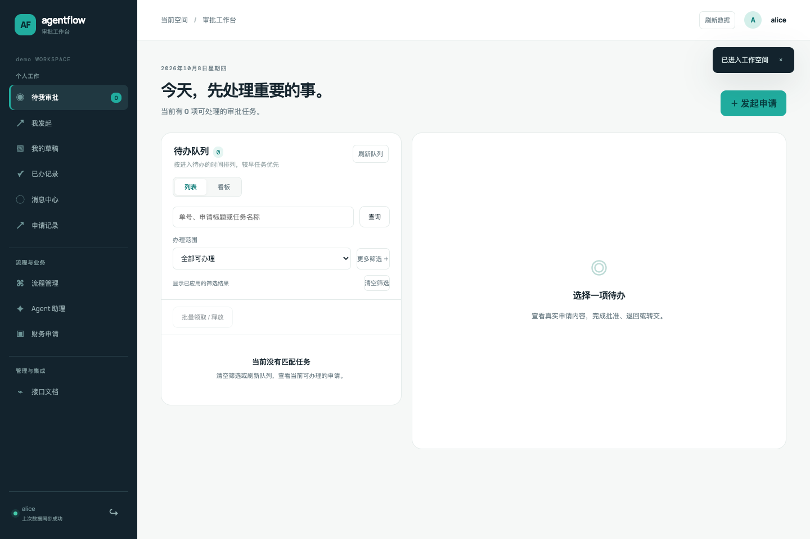

图 2　员工工作台：个人记录与财务申请分别从侧栏进入。

| 菜单 | 用途 |
|---|---|
| 待我审批 | 查看当前可办理任务，检查申请并作出决定 |
| 我发起 | 跟进本人申请，继续处理退回或撤回的单据 |
| 我的草稿 | 继续填写尚未提交的申请 |
| 已办记录 | 回看本人办理动作、意见和申请当前状态 |
| 申请记录 | 按条件检索本人发起或有权参与的申请 |
| 消息中心 | 读审批进展、任务交接和被提及提醒 |
| 财务申请 | 创建和查询五类财务单据及相关个人资源 |
| Agent 助理 | 从当前可办理待办进入摘要辅助 |

窄屏先点“菜单”展开导航。列表只显示已加载内容，底部有“加载更多”时继续读取；查询无结果先检查筛选，再刷新。流程管理可供查看；流程发布、人员目录、代理授权和工作日历由相应管理角色维护。能读历史不等于能处理当前任务。

### 1.3 任职、会话恢复与退出

流程需要主管或部门负责人等动态审批人时，提交前选择“本次发起任职”；有多个任职，应选择这次业务所属任职。没有有效任职时请管理员核对本人法人、部门、岗位及有效期。该选择固定到本轮，重提可以重新选择。

出现“需要恢复企业会话”时，保留当前页面，点“重新登录”，在新窗口恢复原账号，再点“恢复当前会话”。租户和账号必须与原页面一致；恢复后仍须确认原操作结果。

退出前保存申请和正在核对的输入。企业实例提供退出范围时，“仅退出平台”保留企业登录；“同时退出企业账号”还会退出身份服务，可能影响其他企业应用。未保存内容随退出丢失。请求还在发送时等待结束，结果未确认时按第 13.2 节处理。

## 2 普通申请创建、保存与提交

### 2.1 选择流程并填写表单

**前提：**当前工作空间已有允许新发起的已发布流程。报销、事前申请、借款、采购付款及预算调整通过“财务申请”专用入口创建。

1. 从工作台或个人申请列表点“＋ 发起申请”，打开“发起表单审批”。
2. 在“申请流程”选择流程，核对名称、版本及表单用途。没有可选版本时，请流程管理员发布或核对原版本是否停用。
3. 填“申请标题、业务单号”和表单字段。新建标题最多 200 字符；业务单号同租户不能重复，创建后不能改为另一个单号。
4. 根据字段旁的星号、说明和范围填写。暂缺材料可保存草稿，正式提交前补齐。

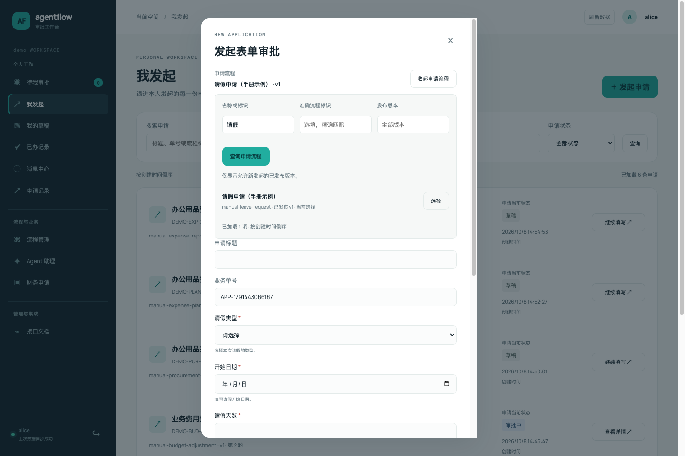

图 3　选择申请流程：核对版本后按该版本的表单填写。

数字采用十进制，不含空格或指数；日期按 YYYY-MM-DD 填写；单选使用当前版本选项。数值上下限和文字长度以字段提示为准。重复明细支持添加、删除和上下移动，注意表单行数上限；所有明细合计最多 2,000 个单元格。附件上传时先等完成，再调整明细行。

### 2.2 保存草稿与继续填写

1. 在创建页点“保存草稿”。必填字段可以暂缺，已填值仍需符合类型、选项、长度和范围要求。
2. 保存成功后进入“我的草稿”，核对标题与业务单号。
3. 点“继续填写”打开“申请详情与轮次”，补充内容，再点“保存修改”。
4. 检查“当前内容已保存”或保存成功提示；普通申请需要主动保存。

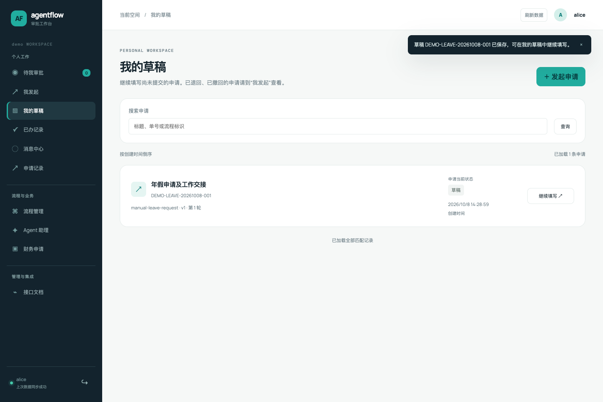

图 4　我的草稿：保存后的申请可继续填写。

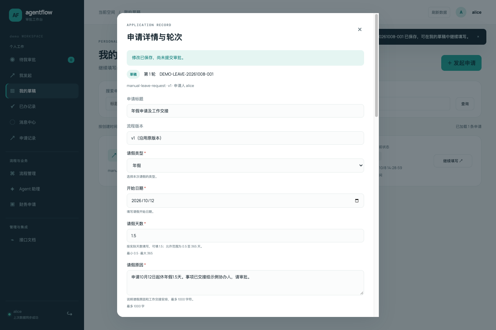

图 5　草稿详情：核对保存后的内容与草稿状态；保存、提交按钮需向下滚动查看。

草稿页可能已经显示“第1轮”，此标签不代表已经提交。只保存草稿时不会产生审批待办，应以草稿状态、提交成功提示和实际提交记录核对。

详情编辑标题最多 256 字符；业务单号、流程标识和绑定版本保持原样。“保存修改”尚未产生待办或提交轮次。已退回、已撤回的申请在“我发起”查询，不在“我的草稿”补正。

### 2.3 上传、恢复与下载附件

**前提：**流程表单配置了附件字段，申请已保存，当前本人可编辑，附件存储可用。

1. 打开原草稿，到附件字段点“添加附件”，选择本地原文件。
2. 等待“上传完成，请保存申请内容”，核对文件名和“完整性已校验”。
3. 点“保存修改”，保存本次附件引用；正式提交前所有引用文件必须上传完整。
4. 查看材料时点“下载”。历史轮次的附件从对应轮次打开。

每字段最多 10 份。单份容量、本申请累计容量及上传次数以页面显示为准，历史和未完成上传也计入累计。当前“完整性已校验”表示文件传输完整，系统未接入内容扫描。

失败或断网时保留原文件，用“重试本次上传”或“选择原文件恢复”；原大小与内容须匹配。换文件应“移除引用”后添加新文件，不覆盖原登记。移除后须保存，历史轮次文件仍保留。隐藏或脱敏字段没有原件下载权限；存储未就绪时把提示交管理员核对持久目录。

### 2.4 正式提交与结果核对

1. 核对标题、单号、必填字段、明细及附件。
2. 按页面要求选“本次发起任职”。要求正在读取或读取失败时先重试；不需要任职的静态流程可不选。
3. 新建页点“创建并提交”；已保存草稿在详情点“提交申请”。
4. 等成功提示，到“我发起”核对状态和提交轮次。

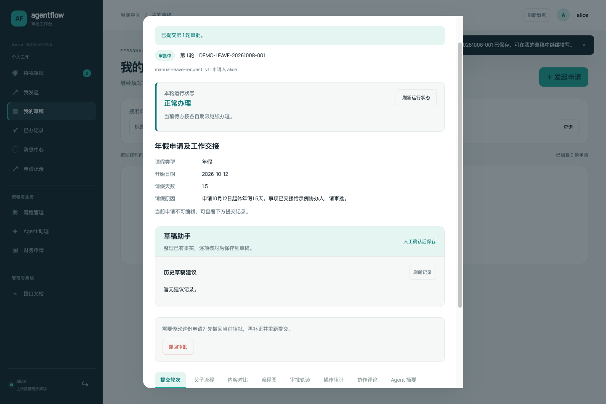

图 6　提交后详情：核对真实状态、轮次和后续处理信息。

创建已成功而提交失败时，原草稿保留。创建弹窗的“重试提交草稿”只提交这张原草稿；需要改内容，关闭弹窗后从申请记录打开。不再新建同一业务。停用原流程版本会阻止首次提交及重提；由流程管理员核对原版本可发起状态。

## 3 撤回、退回重提与作废

### 3.1 看清状态后选择下一步

| 状态 | 含义与下一步 |
|---|---|
| 草稿 | 本人继续填、保存并提交，或作废 |
| 审批中 | 查询进度；本人在允许时撤回后修改 |
| 已退回 | 阅读原因，补正并重新提交审批 |
| 已撤回 | 本人修改重提，或作废 |
| 已驳回／已拒绝 | 原申请进入终态，不能按退回方式重提 |
| 已批准 | 查看审批结果；财务业务另查后续实际处理 |
| 已作废 | 保留记录，不能恢复编辑或重提 |
| 已撤销 | 仅按支持财务撤销的业务核对后续交接；员工不能当作普通申请撤回办理 |

主工作台可能显示“已拒绝”，详情和个人列表显示“已驳回”，二者指同一驳回终态。普通申请显示“已批准”，财务视图可能显示“审批通过”；核对所在页面的实际状态名称。财务单据的可撤回、可作废条件见对应业务章节，不能照搬普通申请按钮。

### 3.2 退回后补正并重提

1. 到“我发起”找到已退回申请，打开详情，阅读“退回原因”和处理人、时间。
2. 根据原因修改允许字段、附件，点“保存修改”。
3. 核对当前内容，按要求重新选本次任职，点“重新提交审批”。
4. 核对新的轮次与状态，到“提交轮次”看旧意见是否保留。

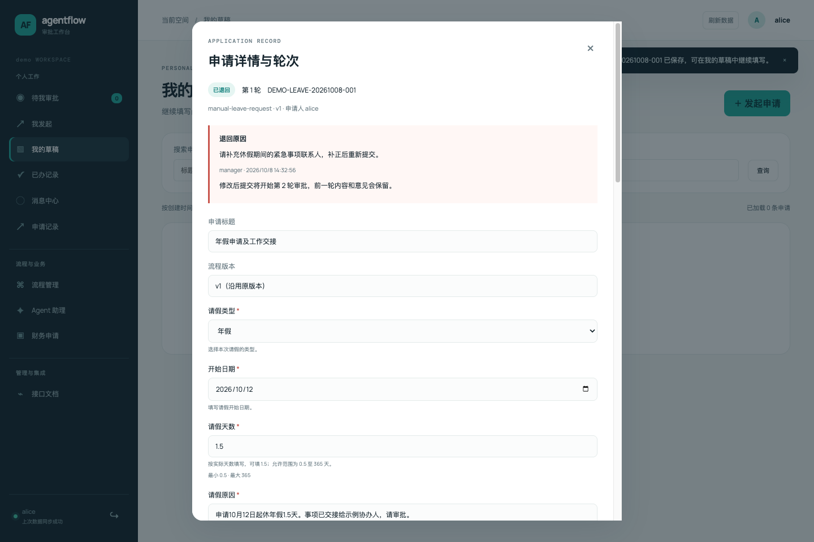

图 7　退回申请：先看原因，再补正原单。

示例中的同一张普通申请按“第一轮提交→审批者退回→申请人补正→第二轮重提→审批者继续办理”运行。重提开新轮，沿用原业务单号和流程版本，旧内容和意见不覆盖；第 10 章说明如何比较两轮。

### 3.3 撤回当前审批

**前提：**普通申请属于本人、状态审批中、运行状态允许撤回。

打开原申请，点“撤回审批”，可填写最多 2,000 字符说明，再“确认撤回审批”。成功后状态为已撤回，当前待办停止，原意见保留。随后修改并重提下一轮，或作废。审批已暂停时请管理员恢复后办理或撤回；运行状态无法确认时先核查原记录。

### 3.4 作废不再需要的申请

**前提：**普通申请属于本人，处于草稿、已退回或已撤回。未保存修改须先保存，或重新加载已保存内容。

点“作废申请”，填写选填说明，核对后“确认作废申请”。成功后已作废，不能恢复编辑或重提，原内容和历史留存。审批中的申请应先按允许条件撤回；已驳回或已批准不能使用草稿作废方式改结论。

## 4 财务申请共同提交流程

### 4.1 找到对应业务入口

员工在左侧导航进入“财务申请”。按需要选择“我的事前申请”“我的报销”“我的借款申请”“我的采购付款”或“我的预算调整”；“个人票夹”“事前批准额度”“已放款借款”用于准备材料和查询本人财务资源。

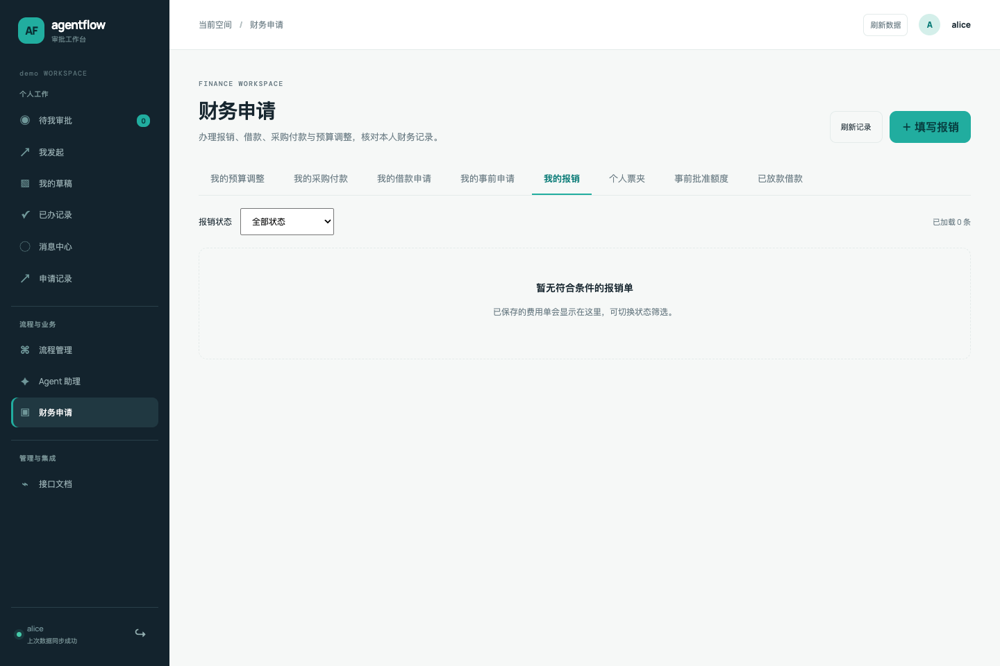

图 8：员工进入“财务申请”后，先选择业务视图，再使用该视图的填写按钮。

页面顶部“＋ 填写报销”用于报销。创建事前、借款、采购或预算申请，请使用对应视图中的专用按钮。表单和预检要求见第 5 章；票夹和资金资源见第 6 章。

### 4.2 保存、预检、正式提交

五类财务申请都按以下顺序办理：

1. **选择流程并填写。**填写业务单编号，选择适用于当前业务的流程，核对标题、法人及明细。新建时选择允许发起的发布版本；编辑已有单据沿用原流程版本。
2. **保存草稿。**点击当前业务的保存按钮。保存只保留填报内容，尚未进入审批。有“未保存的内容”提示时，先保存再继续。
3. **选择本次任职。**确认任职属于申请法人；系统按本次任职固定该轮发起上下文。报销还需选择“会计日期”，用于预算归属。
4. **开始预检。**点击当前业务的“开始……预检”。执行中使用“刷新预检结果”，查看“等待检查”“正在检查”或完成后的结果。
5. **核对结果。**阅读逐项提示、金额、账户或台账依据、任职及有效期。检查未通过时先补正；“检查完成”后也应核对当前结果是否仍可用。
6. **明确提交。**点击“核对并提交审批”，阅读确认框，再点击“确认正式提交”。完成后查看单据状态、提交轮次及待办/流程记录。

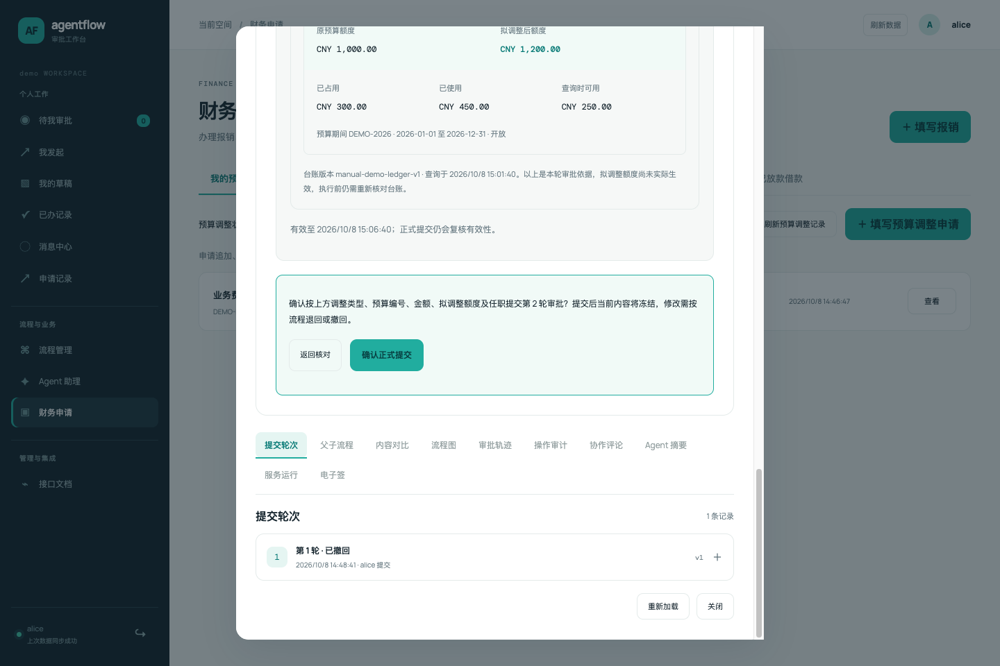

图 9　预算调整第二轮提交确认：可“返回核对”或“确认正式提交”；下方第 1 轮已撤回记录属于历史，不能据此判断第二轮已提交。

正式提交会固定本轮内容。财务申请被退回或符合撤回条件后，从“我发起”或对应财务视图打开原单详情，根据第5章该业务说明进入原单的填写并提交入口。修改并保存对应财务草稿后，重新选择任职及必要的会计日期，重新预检，再依次点“核对并提交审批”“确认正式提交”。重提开启新一轮并保留历史，不能直接套用普通表单的“保存修改”“重新提交审批”按钮。

### 4.3 提交前容易遗漏的条件

财务目录应包含本人可用法人及相应主数据。目录读取失败时使用“重试财务目录”；过期或配置变化时“刷新财务目录”，再核对原选择。法人、账户、类别或成本对象不可用，应交财务或主数据管理员处理；流程不支持当前业务或审批职责缺失，应交流程管理员核对。

新建财务业务单编号必填，最多 128 字；财务标题最多 256 字。金额填写普通十进制，最多两位小数。事前及报销的原币字段使用三位大写币种代码；借款、采购付款和预算调整使用所选法人的本位币。各章截图中的金额、账号尾号、编号和公司名称均为演示样例，实际填写以本人业务资料和当前目录为准。

修改内容、切换任职、修改报销会计日期，或事实/目录/查验依据到期后，应重新保存和预检。旧的成功检查不能继续授权新内容。法人当地日期变化也可能使汇率或借款日期检查失效。

关闭表单前有未保存提醒，可“继续填写”或“放弃本地修改并返回”。已经保存的草稿仍保留；页面暂存输入不等同服务器草稿。遇到版本冲突，读取最新单据后重新核对；遇到“结果尚未确认”，先恢复原操作，具体方法见第 13 章。

## 5 五类财务申请

### 5.1 事前申请：先批准计划，再引用额度报销

**使用场景：**提前申请费用计划。全部审批通过后形成批准额度，实际费用另填报销单。

**入口：**“财务申请 → 我的事前申请 → ＋ 填写事前申请”。

1. 填写“计划单编号”，选择“计划流程”，填写“事前申请标题”，选择“计划法人”“计划类型”。类型包括差旅、日常费用、业务招待、培训和其他费用。
2. 点击“＋ 添加计划行”，选择“费用类别”“计划城市”，填写“计划日期”、需要时填写“结束日期（选填）”，填写“原币币种”“计划金额”“计划依据”。
3. 填写本行“成本分摊”：选择本法人“成本中心”，按需选择“项目”，填写“分摊金额”。需要拆分时“＋ 添加分摊”，合计应等于本行计划金额。
4. 点击“保存计划草稿”。选择本次任职，点击“开始计划预检”；核对本轮计划总额、各行金额及换算依据，按第 4.2 节正式提交。

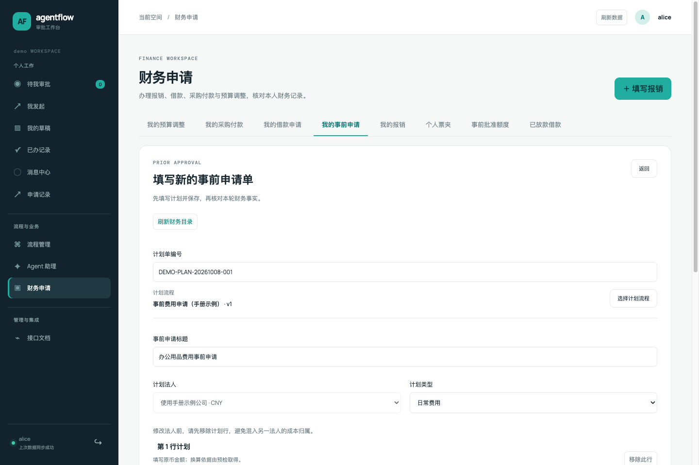

图 10：选择计划法人后添加计划行，填写日期、金额、依据及成本分摊。

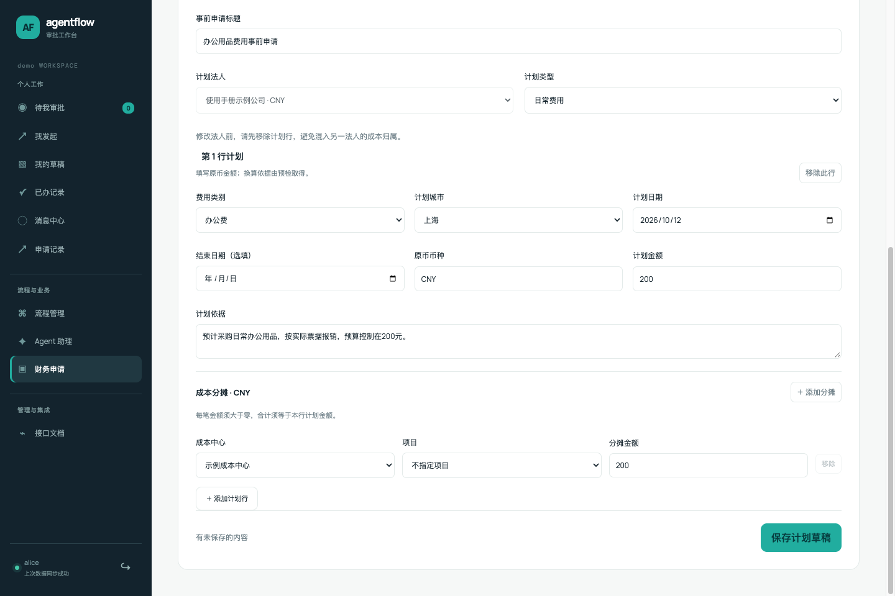

图 11　计划明细与分摊：分摊合计须等于本行计划金额。

**填写限制：**标题最多 256 字；每行计划依据最多 2000 字；每份计划最多 200 行，每行 1 至 50 笔分摊。金额和每笔分摊须大于零；同一成本中心及项目应合并；结束日不得早于计划日。已有计划行时不能直接换法人，应先移除计划行。可以先保存没有明细的草稿，预检前应至少补充一行并保存。

**结果与继续办理：**在“我的事前申请”按“计划状态”筛选，使用“刷新计划记录”“查看”“加载更多计划”。可编辑详情点击“填写并提交计划”。本人当前审批中可“撤回计划审批”，填写操作说明并“确认撤回计划”；草稿、已退回、已撤回可“作废事前申请”，作废后不能恢复编辑或提交。历史轮次只读。

批准后到“事前批准额度”核对实际余额并在报销引用，详见第 6.3 节。计划总额不等于当前可用余额。类别、汇率、城市或成本归属变化时，按提示刷新目录或补正并重新预检。

### 5.2 费用报销：填实际费用、票据与成本归属

**使用场景：**申请报销实际发生的费用，并按需要引用批准额度或冲销已放款借款。

**入口：**“财务申请 → 我的报销”，点击“＋ 填写报销”。

1. 填写“费用单编号”，选择“费用流程”，填写“报销标题”，选择“费用法人”“费用类型”。
2. 点击“＋ 添加费用行”，选择“费用类别”“发生城市”，填写发生日期、需要时的结束日期、数量、计量单位、原币币种、含税金额、可抵扣税额和费用说明。
3. 填写本行成本中心、选填项目和分摊金额。页面显示“分摊已配平”或差额，按提示调整。
4. 需要制度或事前额度例外时，填写“制度或事前额度超额说明（适用时填写）”。
5. 点击“选择发票、事前额度或借款”，按下文关联材料和资金。
6. 点击“保存费用草稿”。选择本次任职与“会计日期”，“开始费用预检”，按第 4.2 节核对并正式提交。

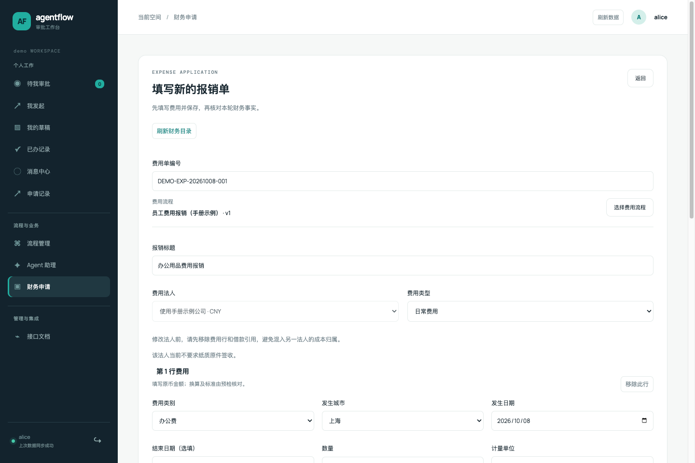

图 12：填写单号、标题、法人和费用类型，再向下填写各行金额、税额、成本分摊及资源引用。

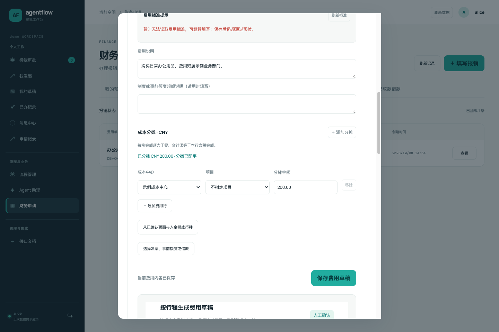

图 13　费用明细与成本分摊：本例分摊200元且已配平，选择引用资料后保存费用草稿。含税额和可抵扣税额按上文步骤核对。

**金额与分摊：**标题最多 256 字，每行费用说明和例外说明最多 2000 字；最多 200 行费用，每行最多 50 笔分摊。数量大于零、不超过 100 万、最多三位小数；含税金额大于零，税额不超过含税额。每笔分摊大于零，合计等于该行含税额，同成本中心与项目应合并。费用发生日期和可抵扣税额应依据实际业务填写，不能直接照搬开票日期和票面税额。可以先保存无费用行的草稿，预检前应至少补一行并保存。

**标准和补贴：**选齐法人、类别、城市、日期、币种和单位后，“费用标准提示”查询适用规则，可“刷新标准”及查看版本与来源。定额补贴须填完整行程起止日期，天数、金额和零税额由系统计算；补贴行不能关联发票。改行程或制度变化后重算，同类别行程不能重叠，跨制度有效期按期间拆分。标准提示仍需保存后预检。

**关联资源：**

- **发票：**切到“本人已验发票”，先选“归属费用行”，再“引用发票”。原件需上传完成、当前查验通过且有效、同法人，未被别单占用或核销。同一票只归属一行，每行最多 50 份。
- **事前额度：**切到“事前批准额度”，选择归属费用行及类别一致的批准行，“引用额度”。关闭的额度不能新增引用；原引用能否保留由预检确认。
- **借款：**切到“已放款借款”，选择同法人、同本位币、当前可用借款，在“本次借款抵扣”填写每笔金额。最多 50 笔，未到账借款申请不能抵扣。

选择尚不预留资源，正式提交再核对。无可选项时检查法人、查验/批准/放款状态、占用和是否还有下一页。切换法人前先移除费用行及借款引用。

**预检后处理：**结果列出问题行、核对码和可用的“去处理”入口。补正后重新保存、预检。制度明确禁止的费用按提示处理或移除；超标需要说明。核对“核定含税额”“借款抵扣”“应付余额”、收款账户、汇率日期和有效期，也可展开项目负责人、事前累计及各行制度依据。预算例外批准仍需等待实际预算确认。

**辅助填写：**可从本人已确认票面逐项带入金额或币种，但仍需正式验票和引用；币种带入不执行换汇。行程建议只追加人工确认的费用行，金额和分摊金额由员工补填。采纳预检解释只保存意见，仍要自己补正、保存和重检。冲销建议会替换草稿中的借款选择，也要保存重检。发送原文、模型目的地、选择范围及逐项确认步骤见第 11 章。

**查看与修改：**“我的报销”支持状态筛选、刷新记录和查看。详情核对“原申报合计 → 当前核定合计 − 借款冲销 = 应付余额”，并查看逐行依据和核减记录。可编辑时“填写并提交报销”。

本人撤回需当前能力允许，点击“撤回审批”、填写说明并确认。**本轮曾进入财务审核后不能撤回，即使已流转后续节点。**退回或撤回后补正重提；草稿、已退回、已撤回可按页面能力“作废费用单”，不可恢复。撤回保留预留供补正，作废安排释放；配置预算保留期时，以详情天数和到期时刻为准，修改草稿不延长期限。票据、事前额度、借款和预算分别处理。批准后的财务进度见第 12 章。

### 5.3 员工借款：核对用途、归还日与本人账户

**入口：**“财务申请 → 我的借款申请 → ＋ 填写借款申请”。

1. 填“借款单编号”，选择“借款流程”，填写“借款申请标题”“借款法人”“借款金额”“归还日期”“借款用途”。
2. 点击“保存借款草稿”，选择本次任职，“开始借款预检”。
3. 核对金额、用途、归还日和系统读取的脱敏本人收款账户，按第 4.2 节正式提交。

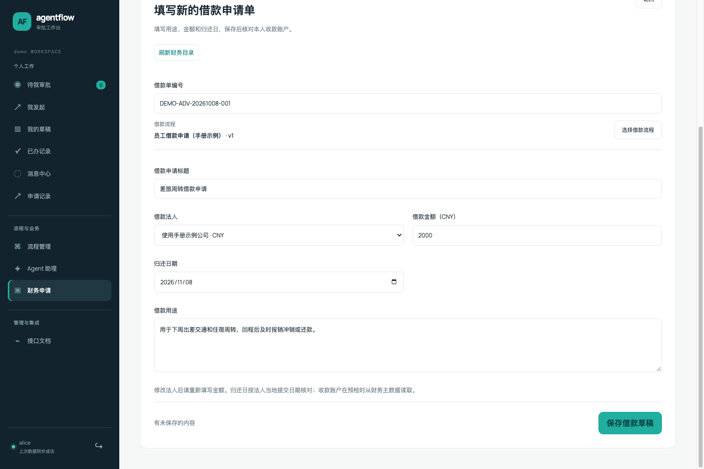

图 14：借款示例填写 2000 元，并说明用途和归还日期；示例金额不是通用限额。

标题最多 256 字、用途最多 2000 字，金额须为法人本位币正数。切换法人后重填金额。归还日不得早于法人当地提交日，预检跨日需重新检查。账户来自财务主数据，不在此填写完整账号；批准前账户变更需维护并补正重提，批准后交财务复核及重新授权。

逾期控制以预检页面说明为准。明确启用阻断时，同法人下未处理的逾期借款会阻止新提交；允许或未配置不能理解为已实施阻断。账户失效、日期已过去、任职法人不符，按提示补正或由财务维护后重检。

列表可筛选“借款状态”，刷新、查看或加载更多。可编辑时“填写并提交借款”。本人审批中可“撤回借款审批”，说明后“确认撤回借款”；草稿、已退回、已撤回可“作废借款申请”。撤回重提开新轮，作废不能恢复。审批通过后仍要等待实际付款成功，才形成可冲销余额；查询见第 6.4 节。

### 5.4 采购付款：引用已匹配并挂账的原应付

**使用场景：**对已经验收、开票并挂账的供应商原应付申请付款。合同、订单、验收和挂账应先在原业务系统完成。

**入口：**“财务申请 → 我的采购付款 → ＋ 填写采购付款申请”。

1. 填“采购付款单编号”，选择“采购付款流程”，填标题、采购付款法人、本次付款额、供应商编号、原应付编号和付款用途。
2. 点击“保存采购付款草稿”，选择本次同法人任职，“开始采购付款预检”。
3. 核对供应商、脱敏收款账户、到期日、原应付含税额/已结金额/未结余额，以及合同、订单、三单匹配、挂账和预算依据。
4. 对照订单、验收、发票逐行数量与金额，确认本次付款不超过未结余额，再正式提交。

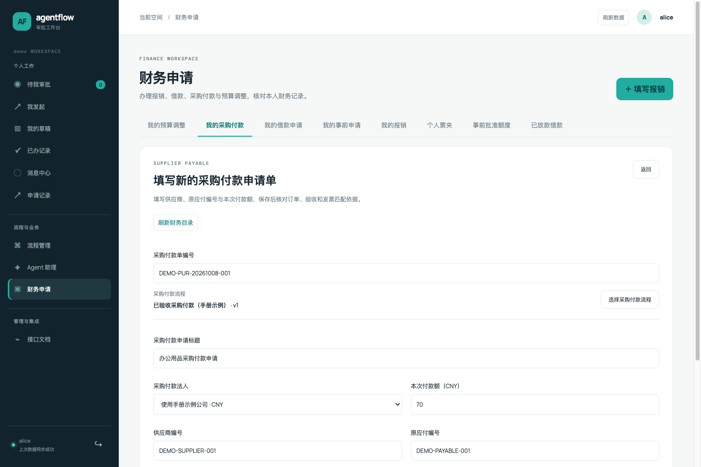

图 15　采购付款申请：核对所选法人、供应商、原应付编号和本次付款金额。原应付总额、已结与未结余额在预检结果中核对。

标题最多 256 字、用途最多 2000 字，供应商号和应付号各最多 128 字，不含控制字符；金额为法人本位币正数。换法人后重填供应商、原应付及金额。正式提交后同一原应付只保留一份有效付款申请；关联发票不能被报销占用或归属其他采购应付。

重复申请、原应付/供应商/账户不可用、匹配依据缺失或金额超余额，先核对原资料；需要在原系统补正的交财务处理，再重新预检。查询原应付只是读取依据，尚未预留或授权付款。

列表可筛选“采购付款状态”，刷新、查看和加载更多。可编辑时“填写并提交采购付款”；本人审批中“撤回采购付款审批”，说明后确认，原应付占用保留供重提。草稿、已退回、已撤回可“作废采购付款申请”，不可恢复，并释放本申请应付占用。批准后仍需独立财务授权、实际付款与结算，见第 12 章。

### 5.5 预算调整：追加、调减或同期间调拨

**入口：**“财务申请 → 我的预算调整 → ＋ 填写预算调整申请”。

1. 填“预算调整单编号”，选择“预算调整流程”，填写标题、法人、调整金额、类型、日期和原因。
2. 选“预算追加”时填“追加预算编号”；选“预算调减”时填“调出预算编号”；选“预算调拨”时分别填不同的调出和调入编号。
3. 点击“保存预算调整草稿”，选择本次同法人任职，“开始预算调整预检”。
4. 核对原额度、拟调整后额度、已占用、已使用、查询时可用、期间与台账依据，再正式提交。

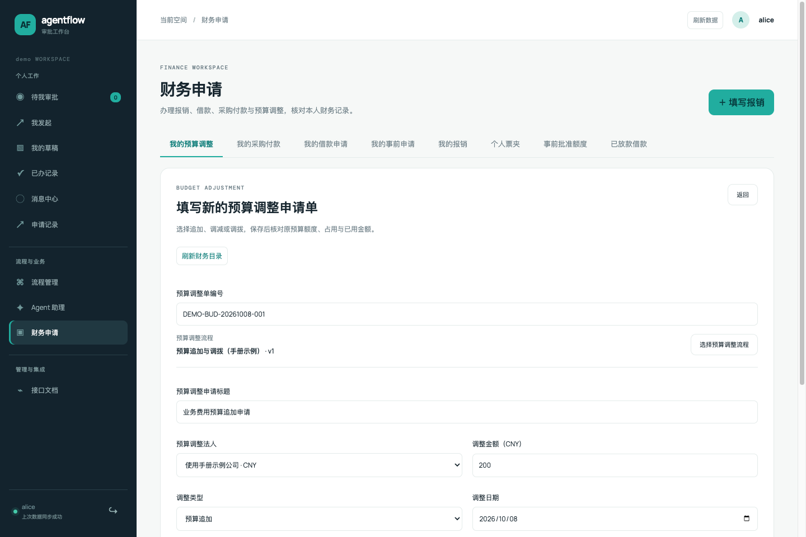

图 16：预算追加示例填写调整金额 200 元；调整类型决定需要填写的预算编号。

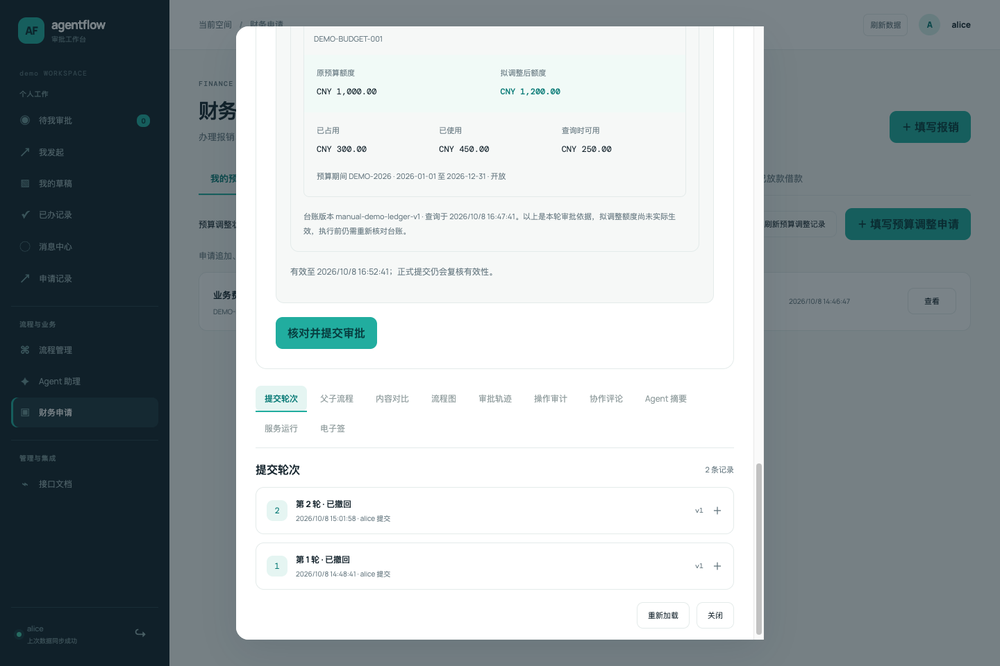

图 17：本例原额度 1000 元，已占用 300 元、已使用 450 元，查询时可用 250 元；追加 200 元后拟额度为 1200 元。拟额度仍是申请依据。

金额为法人本位币正数；标题最多 256 字、原因最多 2000 字、预算号最多 128 字，不含控制字符。换法人后重填预算编号与金额。

调减只能使用尚未占用、尚未使用部分：原额度减已占用减已使用，低于零按零可调减。调拨须同法人、同币种、同预算期间且两端不同；期间关闭禁止新提交和执行。预检发现台账不可用、余额不足或期间不同，应补正申请或交财务核对台账，重新预检。

“我的预算调整”支持状态筛选、刷新、查看和加载更多。可编辑时“填写并提交预算调整”；本人审批中可“撤回预算调整审批”，说明后确认；草稿、已退回、已撤回可“作废预算调整申请”。撤回保留本轮依据，重提开新轮；作废不可恢复，外部预算额度不因此变化。

“审批通过”后交财务独立执行。执行前重新核对最新台账，调拨两端共同成功才记为已生效。预检中的“拟调整后额度”和审批批准都不能直接当作已生效预算。

## 6 票夹、批准额度与借款余额

### 6.1 上传、查看与恢复发票原件

进入“财务申请 → 个人票夹”，点击“选择发票原件”，核对文件名与大小，再“确认上传原件”。支持 PDF、OFD、PNG、JPEG、XML；实际单文件大小、个人累计次数和字节上限以页面为准，历史及未完成上传也计入累计。

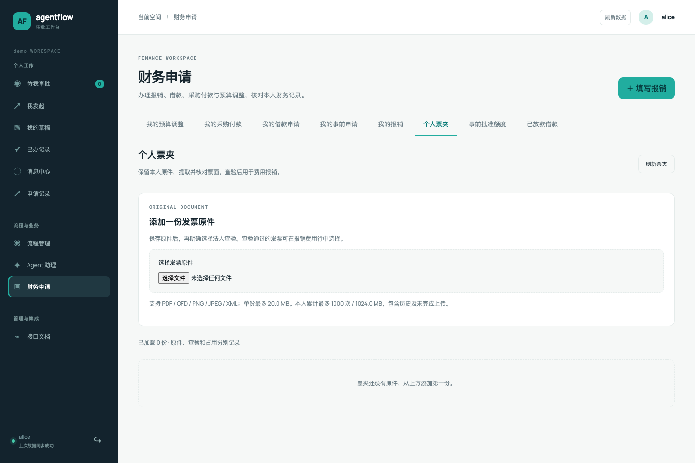

图 18：个人票夹的添加原件入口。上传后，可在票据列表分别查看原件、查验和占用状态。

上传完成后可“查看与处理”“刷新票据”“下载发票原件”，更多材料用“加载更多票据”。上传结果未知时“继续原上传”，使用同一原文件和原登记；文件摘要/大小不一致不能恢复。原件成功保存只是上传结果，还须正式查验才能按条件引用报销。

### 6.2 票面确认、正式查验与引用资格

**票面提取：**在详情“提取票面，逐项核对”中先核对处理来源。结构化 XML 可“提取本地 XML 字段”；其他方式按页面提示发送完整 XML、完整原文件或 OFD 全部页面。查看目的地、发送内容并勾选确认后再提取。排队或执行中刷新本条结果，不重复发送。

提取完成后对照原件、原始值与来源，逐字段勾“保存本人确认值”，必要时改确认值，再“保存勾选字段的确认值”；也可“放弃本次结果”。该确认只保留本人核对值，正式查验、财务金额和占用仍各自办理。未保存复核仅在当前页面会话，刷新或关闭浏览器会丢失。完整发送与辅助带入说明见第 11 章。

**正式查验：**在“核对法人，查验票面”选择“票面买方法人”，核对实际查询目标，点击“核对并查验”或“核对并重新查验”，再“确认发送原件查验”。使用“刷新查验状态”“查看查验历史”核对结果；已经确认的买方法人固定，重新查验仍使用该法人。

报销引用还需原件就绪、当前查验通过且有效、同法人及占用允许。旧查验成功不能保证当前费用预检通过。票据已占用时，有权限会显示报销单号、轮次和行；无权查看或来源暂不可用时，按提示交财务核查，不应猜测归属或重复占用。

### 6.3 查询与关闭事前批准额度

进入“事前批准额度”，查看来源申请、批准行、批准额、控制方式、阈值/参考金额、余额、预留和已使用；“查看来源申请”追溯原计划。

严格控制和历史硬上限按硬上限办理；容差控制显示阈值，累计超阈值需说明和独立审批；“不限制额度”仍显示参考金额。累计使用包含同批准行的其他报销，具体以当前余额和预检为准。

不再使用剩余额度时，点击“关闭剩余额度”，填写 1 至 2000 字“关闭原因”，再“确认关闭额度”；暂不办理可“暂不关闭”。**关闭不可撤销。**关闭后不能新增或增加占用，已有预留继续结算或释放，原批准结果保留。结果冲突先刷新本人额度，结果未知先恢复原操作。

### 6.4 查询已放款借款与还款

“已放款借款”只显示实际放款。核对“实际放款”“可用余额”“当前预留”“已报销冲销”“净有效还款”“累计原收款”“还款已退回”“原放款已退回”“未还款”。预留尚未完成冲销，不能据此认定欠款已结清。

借款详情的“借款还款与结清”可“刷新还款记录”，查看已确认还款的收款、资金流水/凭证、日期和确认人；可读更早还款、原还款复核和放款退回记录。付款、凭证或还款待核对时，后续使用暂停，原记录保留，由财务核对。

员工还款后，把原收款编号和材料交财务办理。“查询还款凭据”“核对并确认还款”仅符合当前财务资格且非借款本人者办理；员工查看已确认记录并刷新余额。

## 7 审批队列与任务办理身份

### 7.1 查询并打开待办

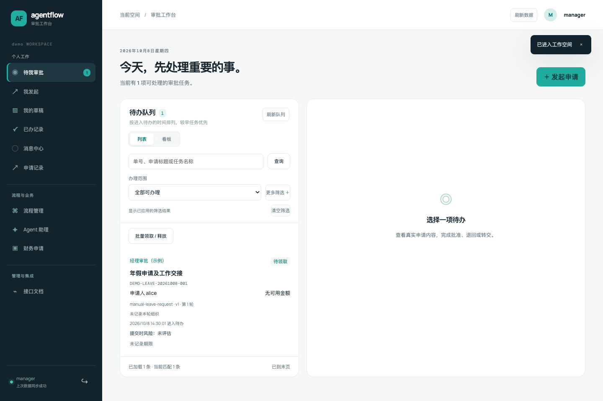

图 19　待办队列：按办理范围及更多条件找当前可办理任务。

1. 进入“待我审批”，选择“列表”或“看板”。
2. 输入单号、标题或任务名称；办理范围可选“全部可办理、指派给我、待领取、待我回交”。
3. 需要时打开“更多筛选 ＋”，选择流程、精确申请人、本轮组织、期限、提交风险、金额范围，点“查询”。
4. 打开任务，等待重新核对权限和申请版本，再检查详情。

队列较早任务优先。看板分“待领取、已指派、待回交”，列数仅为已加载条数，有“加载更多”则继续读取。条件改动后查询才生效；无结果可“清空筛选”或“刷新队列”。组织按本轮任职名称匹配，金额只匹配可识别数值。未评估和规则未命中不等于低风险。

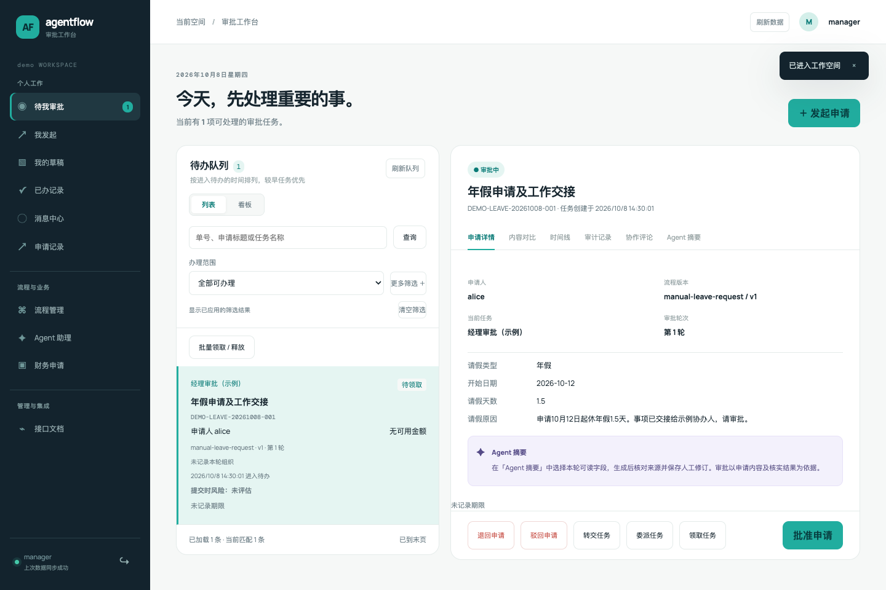

图 20　任务详情：核对申请材料、当前任务与审批轮次后办理。

### 7.2 领取、释放与有效身份

单人候选任务可“领取任务”，明确由本人接手；当前处理人可“释放任务”回到候选状态。这两项不产生审批结论。具有当前候选权限时也可直接决定，系统会记录实际处理人，不要求所有任务先领取。

本人须有当前有效审批资格、任务指派或候选关系；代理须满足有效授权。管理员、历史办理人或能看到申请的人不能据此处理当前任务。任务已被他人领取、转交、结束或版本更新时，刷新后重新核对；不能沿旧列表继续发决定。

### 7.3 批量领取或释放

1. 在队列点“批量领取 / 释放”，选择本次操作和已加载任务，每次最多 20 项。
2. 点“核对已选 N 项”，检查可办理、不可办理及跳过记录。
3. 填 1 至 500 字符办理说明，再“确认领取 N 项”或“确认释放 N 项”。
4. 逐项核对结果，关闭面板回刷新后的队列。

每项单独授权、保存结果，整批可能部分成功。某项结果未知时后续不再发送，关闭面板后用“恢复上次操作”，其余任务重新选择。批量功能只领取或释放，不批量批准、退回或驳回。

## 8 批准、退回、驳回与协作审批

### 8.1 批准当前任务

**前提：**当前允许作决定，申请和任务已重新加载，财务专用检查要求已满足。

1. 阅读申请详情、附件、提交轮次和相关审计；需要时比较补正内容。
2. 点“批准申请”。有代理选择时核对“办理身份”。
3. 填选填“批准意见”，点“确认批准申请”。
4. 核对操作成功提示、申请当前状态及已办记录。

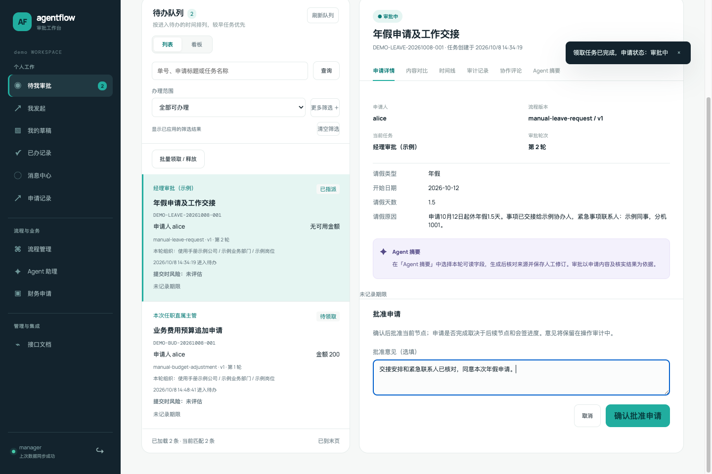

图 21　批准确认：当前节点办理结果与整单后续进度分别核对。

批准只完成当前节点。还有后续节点、并行或会签时申请可继续审批中；财务单据已批准也不代表款项到账。

### 8.2 退回或驳回

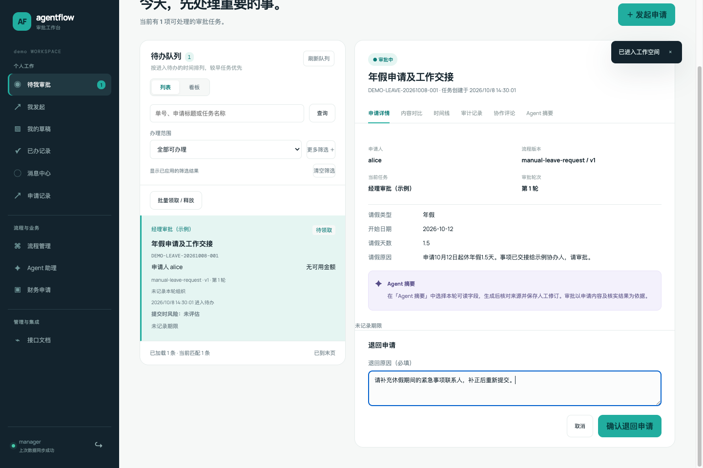

图 22　退回处理：原因必填，写明需要补正的材料或内容。

需申请人补充后重提时，点“退回申请”，填写“退回原因（必填）”，核对后“确认退回申请”。本轮待办停止，申请人按第 3.2 节补正重提。

决定终止原申请时，点“驳回申请”，填写“驳回原因（必填）”，再“确认驳回申请”。原申请不能按退回方式修改重提。两项都先确认任务和材料；没有原因不能执行。操作后核对状态与留存意见。

### 8.3 转交、委派与回交

| 动作 | 责任归属 |
|---|---|
| 转交任务 | 接收人继续作审批决定 |
| 委派任务 | 接收人核实并回交，原责任人作最终决定 |
| 填写意见并回交 | 受托人完成协助，申请继续审批中 |

1. 当前任务允许时点“转交任务”或“委派任务”。
2. 等实时“接收人”名单，选另一个可用审批账号；说明选填。没有可接收账号时不能自行填任意姓名，先核对组织资格和职责限制。
3. 点对应确认按钮，核对成功提示和任务当前归属。
4. 受托人到“待我回交”，阅读材料后点“填写意见并回交”，填写必填处理意见，再点击显示原审批人账号的回交确认按钮，例如“确认回交给 manager”。
5. 原审批人读审计中的受托意见，继续批准、退回或驳回。

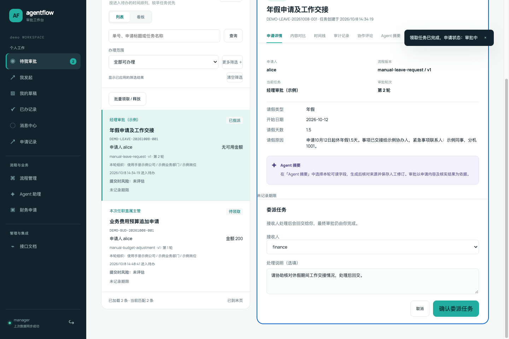

图 23　委派处理：接收人协助核实，最终责任仍属原审批人。

接收人须同租户有效且不是本人。受托期间只能回交，不能作最终决定或再次转交、委派。原责任人缺失时，请管理员核对原分配，不自行替换。

### 8.4 会签与人员增减

全员会签须全部必要责任人同意；任一或按比例方式达到人数门槛后结束其余待办，不给未办人员补同意。按比例人数向上取整。达标前任一驳回结束本轮。

会签责任固定，不允许领取、释放或转交；可委派协助，再由原责任人决定。本人直接承担全员会签责任且页面允许时：

1. 点“查看与增减会签人”，读当前未决任务、已同意人员及“节点开始时的名单”。
2. 点“增加会签人”或“移除会签人”，选择目标。
3. 填必填“变更原因”，最多 2,000 字符，点“确认加签 / 确认减签”。
4. 核对必要人数、未决任务和操作审计，再继续本人的审批。

加签会创建实际必要审批任务，最多 100 名；不能重复加入已承担或完成本节点责任的人。减签不能移除自己、最后一张必要待办、已完成意见或仍在委派中的任务。项目负责人会签名单固定，不可增减；任一、比例会签门槛固定，不提供普通增减操作。

### 8.5 使用有效审批代理与期限

管理员维护直接代理授权后，审批者在决定表单的“办理身份”选“以本人审批职责办理”或“代理某原审批人办理”。只有代理权时应明确原审批人；多份代理必须选本次依据，核对有效至时间。

通用任务动作中，代理只允许批准、退回、驳回，不代领、释放、转交、委派、回交或增减。提交时再次复核期限和范围，审计同时留实际办理人与原审批人。财务阶段还需代理人自己的财务角色，授权不会继承他人的系统角色。原件签收、费用核减等专用动作还需满足第 9 章当前节点的独立资格与条件。代理过期刷新任务后处理，不按本人职责绕过失效依据。

任务期限从各自创建时刻按绑定工作日历起算，转交、委派、回交不重新计算。已超时并不自动批准；配置的超时、升级提醒在消息中心查询。管理员暂停后保留原待办和意见，恢复接续剩余时长，已超时仍超时。

## 9 财务审批节点的额外核对

### 9.1 根据业务核对固定依据

审批者从实际待办打开单据，确认业务、当前轮次、办理身份及可读材料，再按第 8 章办理当前任务。各类关注点如下：

| 业务 | 当前审批前重点核对 |
|---|---|
| 事前申请 | 用途、类别、日期/城市、金额与换算、成本分摊；计划总额与后续余额的区别 |
| 费用报销 | 申报/核定金额、可抵扣税额、票据及查验、成本/项目、事前累计、借款抵扣、账户、纸件和预算 |
| 员工借款 | 用途、金额、归还日、法人及本人账户，页面逾期控制说明 |
| 采购付款 | 原应付未结余额、供应商/账户、合同、订单、验收、发票匹配、挂账/预算凭据 |
| 预算调整 | 调整方向、预算号、期间、原额度/占用/已用/可调减余额及拟额度 |

报销中的“项目负责人依据”保留本轮提交任职及项目责任。申请人兼负责人时按本次任职上溯直属主管，同人多项目保留映射并合为一份会签责任。审批者在实际任务核对项目分摊；该依据面板不是修改项目负责人的入口。

“事前额度依据”“跨单路由依据”固定本轮事实，后续核减或规则改版不会覆盖。未记录、未配置、明确关闭与已检查是不同结果；不能把无记录当成已排除风险。跨单路由金额用于业务路由，财务审核和付款使用本单财务金额。

“预算审批依据”区分需要例外审批、人工授权已记录但尚无实际确认、实际预算已确认。需例外时由当前预算负责人在任务办理；批准后仍须实际预算确认。已确认的原预算可能使该节点自动通过，查看实际记录判断。

### 9.2 逐项签收纸质原件

仅当前纸件收单节点可决策人或有效代理、且本轮要求纸件尚未签收时，提供“确认原件签收”。

1. 打开该按钮，逐项核对“报销单纸质材料”及各费用行各份票据材料。
2. 勾选实际收到项，填写“操作说明”。
3. 齐全后确认签收，刷新核对“本轮原件已签收”及签收人/时间。
4. 继续按第 8 章完成当前节点审批。

有缺件不能签收，可“缺失并退回”，缺失项带入退回草稿；还需核对原因并正式确认退回。签收不替代电子原文件，点击“批准申请”不会自动签收。委派待回交期间不能办理；代理选项出现时核对办理身份与有效期。

### 9.3 财务审核任务中的核减

本节适用于**当前财务审核任务办理人**。纸件已就绪、当前金额实际预算确认且授权有效时，才可“核减费用”。

1. 打开“核减费用”，填各行“核减后含税额”“核减后可抵扣税额”。
2. 选择各行核减原因，可“统一填写原因（可逐行调整）”，再填操作说明。
3. 核对“核减预览 · 尚未保存”的原申报、核减后核定、借款冲销和应付余额。
4. 点击“确认财务核减”，刷新核对新增核减记录和当前金额。
5. 等本次预算调整确认后，再办理当前任务审批。

至少减少一行的含税额或税额，只能减少当前核定金额，税额不高于含税额。原始申报保留，借款抵扣随核定额减少。保存核减不等于已批准；预算调整待确认时不能批准当前任务。委派待回交、代理到期、版本变化或纸件未齐时，先处理相应条件再刷新。

### 9.4 费用风险解释与人工复核

风险解释辅助审批者核查所选费用，仍需独立办理任务审批。

1. 在“费用风险解释与复核”选择本单费用行。需要对照时按单号/标题“查找对照单”，“添加并核对明细权限”，选择同申请人、同法人对照行；最多 20 单、合计 200 行。
2. 按需选择工作日历；不选表示不判断非工作日。点击“预览本次发送内容”。
3. 查看可发送费用事实、范围与查验覆盖，逐项查看原文，核对目的地，勾选后“发送所选内容并生成解释”。
4. 刷新记录或本条解释，核对实际发送来源、解释、局限与检查建议。
5. 勾选认可条目，填写可选复核说明，“记录采纳所选解释”；不采用时“放弃本条解释”。再回到当前任务办理。

同日、非工作日或票号相邻本身不构成违规。结果只覆盖选择范围，来源或权限变化导致当前不可采纳时，不沿用旧结论。未提交选择可清除；采纳仅记录人工判断，不会自动批准、退回、核减或改变业务状态。

## 10 进度、历史与协作记录

### 10.1 查当前申请与办理记录

从“我发起 / 已办记录 / 申请记录”打开原申请，先核对当前状态，再查历史。已办记录的“办理后”状态属于那次操作；页面的“申请当前状态”可能已继续变化。“申请记录”支持关键词、状态、申请人、流程及版本、创建日期，修改条件后点“查询申请”。创建日期筛选按 UTC 且包含首尾两天，显示时间按设备时区，查询跨日记录时注意该差异。

### 10.2 提交轮次、内容比较、流程图与审计

在“提交轮次”展开目标轮次，读提交人、时间、绑定版本、任职、风险、内容和处理意见。旧轮次只读，修改当前申请不会覆盖；保存草稿尚未产生提交快照，缺失的早期记录不会补写。

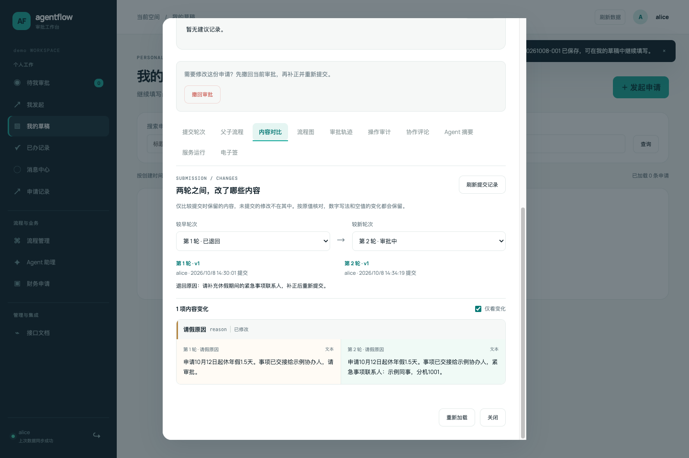

图 24　内容对比：比较提交快照，核对退回后的实际补正。

在“内容对比”选较早和较新轮次，可勾“仅看变化”，再核对修改值和配置变化。至少两轮才可比，未提交修改不参与；数字写法和空值变化保留原样。

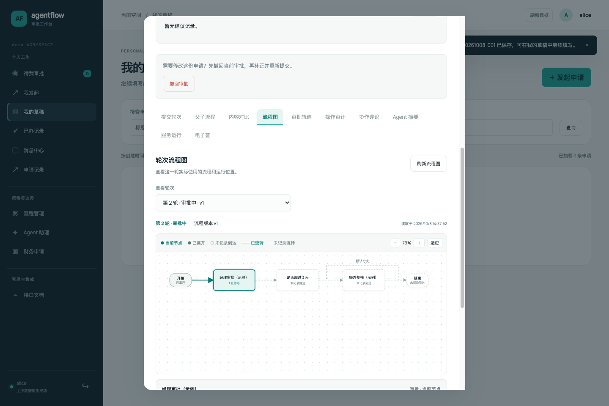

图 25　流程图：查看该轮实际到达的节点和已记录流转。

“流程图”选择轮次，点击节点看当前待办、进入和结束记录，可缩放或“适应”。实线为已记录流转，虚线为未记录流转；“已离开”不等于审批通过，结论以本轮状态和审计为准。

“审批轨迹”按发生时间看节点与申请动作；“操作审计”看真实保存操作、最新在前。选择轮次；审计可加操作类型、开始和截止时间，再“应用筛选”。核对操作人、接收人、代理依据、前后状态及意见，时间按当前设备时区输入。

### 10.3 父子流程与后台运行

“父子流程”选择关联轮次，使用“查看来源轮次 / 查看子流程轮次”打开已授权关联申请，打开时重新核权。尚未激活的节点不显示为已创建申请；不能因为无关联入口就推断业务已完成。先保存或取消当前编辑，再导航。

“服务运行”选择轮次、刷新运行记录，查已进入后台节点的结果。结果待确认或持续失败时，将“查看操作编号”中的原编号交流程管理员处理。审批已暂停时原待办、意见保留，需管理员恢复；员工和审批者不自行终止后台操作。

### 10.4 追加协作评论与提醒

**前提：**有该申请读取权限，且当前状态审批中。其他状态可读已有评论。

1. 在“协作评论”填 1 至 4,000 字符补充说明。
2. 需要提醒时点“@ 选择或核对提醒对象”，查询并勾选当前可提醒账号，最多 20 人。
3. 核对内容和对象，点“追加评论”，检查保存提示。
4. 按“记录时的轮次”筛选历史，需要时“加载更早评论”。

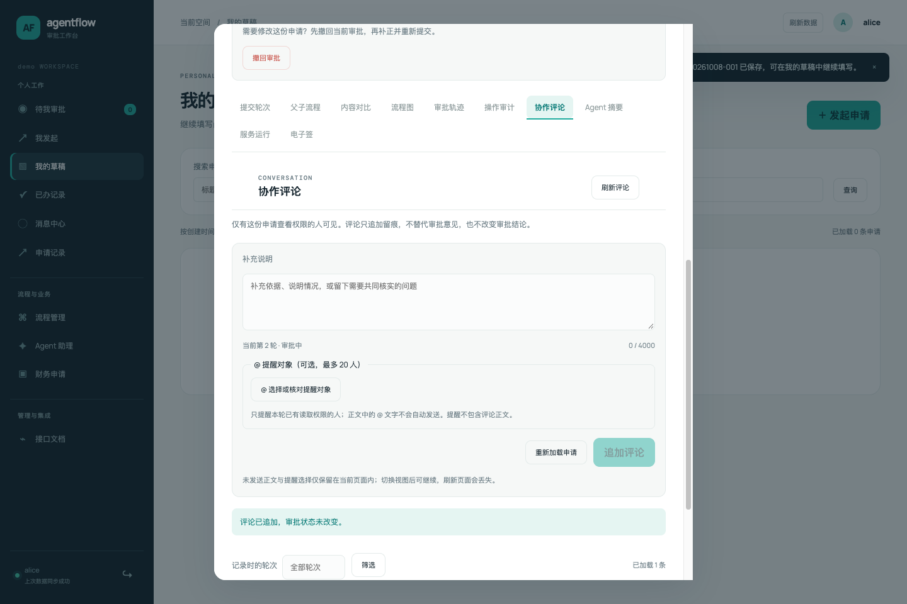

图 26　协作评论：沟通记录与审批决定分别保存。

评论只追加留痕，不改审批结论。正文写 @ 不自动发送提醒；选择名单仅含本轮已有读取关系的他人，提醒不带评论正文。未发输入只留当前页面，刷新会丢失。申请变化时，先“重新加载申请”，核对后“已核对，使用最新版本”，重新选择提醒对象，再发送；也可“清空草稿”。

### 10.5 消息与个人通知偏好

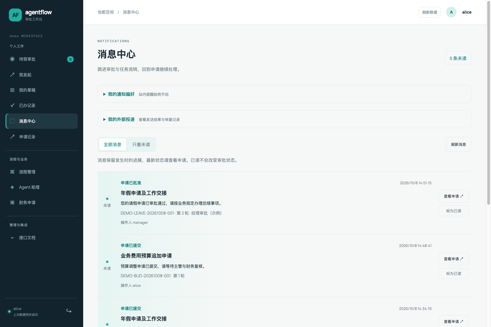

图 27　消息中心：查看进展、返回原申请并设置个人外部提醒。

点“全部消息 / 只看未读”选择范围，“刷新消息”取最新记录，点“标为已读”确认阅读。已读不审批，消息状态属于发生时，最新结果到原申请核对。“查看待办”实时复核任务；旧任务已变化时回到申请查询。“查看抄送”是对应轮次只读快照，不显示后续草稿，不授审批权。

展开“我的通知偏好”，选“邮件提醒 / 企业 IM 提醒”，点“保存通知偏好”。站内常开，外部初始关闭；须渠道接通并绑定本人账号才发送新消息，开启不补发旧消息，关闭停止尚未开始发送提醒。保存不表示送达。

展开“我的外部投递”，筛选渠道、状态，点“查看投递详情”查历史。“服务器已受理”还需通过相应渠道核实送达。允许重试时填 1 至 1,000 字符原因，勾核实原投递；结果未知时额外接受可能重复提醒，再“确认重试”。原同意、接收资格或目的地失效时交管理员核查，不更换地址补发原记录。

### 10.6 电子签授权与结果

**前提：**当前已批准轮次有可读且上传完整的附件原件，当前账号有启用的具名签署资料，组织资格与签署存储可用。审批通过本身不授予签名或印章使用权。

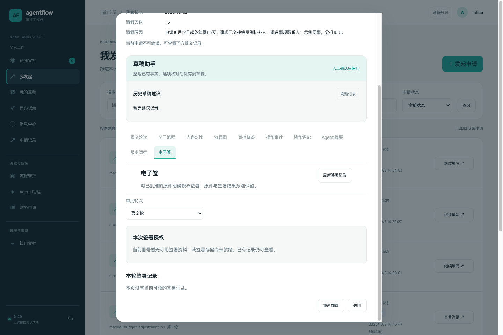

图 28　电子签：核对当前轮次、签署资料和原件；不可用原因按页面提示处理。

1. 在“电子签”选审批轮次，勾原件、选择签署资料。
2. 填用途及首次发送有效分钟，点“核对本次签署”。最多 10 份，单份 16 MiB、合计 32 MiB，用途必填、最多 1,000 字符，有效期最多 24 小时。
3. 再核对文件、资料版本、用途和截止时间，勾本次授权确认，点“确认授权签署”。本次授权用于把所选原件发送到配置的签署服务。
4. “刷新签署记录”，打开原编号查结果；全部保存完成后“下载签署结果”，原件可单独“下载原件”。

无资料、原件或存储时按提示交管理员核对。结果待确认/查询中沿原编号等结果，不重复授权。“正在收集 / 正在保存签署结果”还不能下载完整结果。仅原发起人能取消尚未发送的授权：打开原签署记录，点“取消尚未发送的签署”，核对原记录及未发送状态，勾选取消确认，再点“确认取消签署”，刷新核对结果。已发送或未知继续查原记录，授权过期只拦尚未发送部分。

## 11 Agent 助理与数据确认

### 11.1 当前待办摘要

**前提：**本人当前可作批准决定，模型服务已配置，所选本轮材料允许发送。

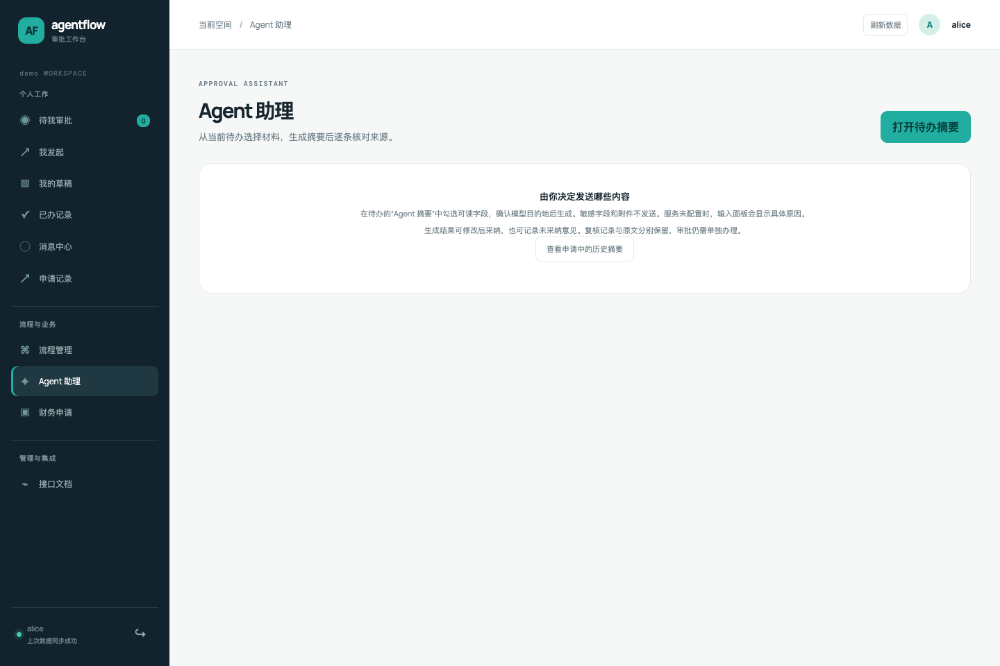

图 29　Agent 助理：从真实待办进入摘要，配置未启用时按提示处理。

1. 在“Agent 助理”点“打开待办摘要”，或打开任务的“Agent 摘要”页签。
2. “刷新输入目录”，核对服务、模型及目的地，勾需要发送的来源；最多 64 项、合计 64 KiB。
3. 点“生成所选内容摘要”，刷新记录等生成结果。
4. 对照“模型原文”及同轮来源，修改“人工修订稿”，再“采纳修订稿”，或“记录未采纳”。

仅发送所选可读内容，敏感、隐藏、脱敏字段及附件不进入摘要。模型未启用/不可用时按显示原因交管理员，不能把等待执行写成生成完成。采纳保留人工稿和原文，不自动审批；申请或待办变化后旧摘要不能采纳。自报置信度、来源绑定仍需人工核实。

### 11.2 普通表单草稿助手

**前提：**本人普通申请可编辑并配置了表单，模型服务可用。

先“保存修改”，在“草稿助手”填“本次生成要求”，最多 8,000 字符；勾需要发送的已有字段，核对目的地，点“发送所选内容并生成建议”。等待并刷新当前建议，逐项对照原值和来源，勾选要保存字段、必要时修改值，再“保存勾选字段到草稿”或“记录未采纳”。

只保存明确选中值，其余保持原样，尚未提交。敏感字段、附件和受限明细不参与。申请版本或状态变化时不能采纳旧建议；助手仍有本地输入时先完成或“清空本地助手输入”，再改或提交申请。

### 11.3 财务辅助的核对与采纳

财务页面的辅助入口与普通摘要各有输入和结果。使用前保存当前编辑，核对页面显示的发送原文、范围及目的地，再作发送确认。具体业务编辑见第 5 章，票夹见第 6 章，风险核对见第 9 章。

| 功能 | 员工或审批者如何核对 | 采纳后的实际结果 |
|---|---|---|
| 按行程生成费用草稿 | 填要求、日期、城市、用途，选允许类别、成本中心/项目；预览并确认发送；生成后逐行核对 | 追加确认行，金额与分摊金额仍需填写、保存、预检 |
| 从确认票面带入 | 选费用行、本人原件和已确认记录，逐字段勾选；改变币种需额外确认 | 改未保存输入，不自动引用发票、不换汇；开票日不当发生日，票面税额不当可抵扣税额 |
| 提取票面 | 先“重新核对来源”；结构化 XML 可本地读字段，其他路径按页面确认外发原文/原件范围；逐字段核对后保存本人确认值 | 仅保存确认值，正式验票、报销占用和财务金额另行办理 |
| 预检解释与补正建议 | 保存和预检后刷新目录，选择原结论、问题及必要费用行，核对原文再发送；最多 20 问题、64 来源 | 采纳仅留人工意见，自己补正、保存并重新预检 |
| 借款冲销建议 | 核对已放款、预留、其他占用及待核对冻结，确认采用的冲销明细 | 替换草稿冲销后仍须保存和重检，不自动清偿 |
| 审批费用风险解释 | 明确本单/对照单行，同申请人同法人；最多 20 单、200 行；核对可发送事实、范围与查验覆盖 | 逐项采纳或放弃供人工检查，不自动判违规或批准 |

#### 11.3.1 从本人已确认票面带入金额或币种

1. 在可编辑报销的“从已确认票面带入金额或币种”中，选择目标费用行，再选择本人票夹原件及对应已确认记录。
2. 对照原件、确认值和来源，逐字段勾选本次要带入的值；改变币种时完成额外确认。
3. 点击“带入勾选字段，继续编辑”，检查费用行的本地输入，再补全日期、金额、可抵扣税额和分摊。
4. 按第 6.2 节完成正式查验，再按第 5.2 节“关联资源”在目标费用行引用发票，保存费用草稿后重新预检。

带入只改未保存输入，不自动引用发票，也不执行换汇。开票日期和票面税额应分别核对，不能直接作为费用发生日和可抵扣税额。

#### 11.3.2 按行程生成费用草稿

**前提：**当前报销可编辑、已保存；服务及允许目录可用。

1. 在“按行程生成费用草稿”填写要求、行程日期、城市和用途，勾选允许使用的费用类别、成本中心及项目。
2. 点击“预览将发送的内容”，核对原文、范围和目的地，勾选发送确认，再“发送所选内容并生成建议”。
3. 等结果后逐条核对，选择“新建此行”，核对建议类别和成本分摊对象，再点“记录逐项确认”。
4. 点击“填入费用草稿”，核对新增行，手工填写金额和分摊金额，再保存并预检。

只追加人工确认的行，金额不会由建议直接提交。目录、原单或有效期变化时重读来源，不能填入旧建议。

#### 11.3.3 预检解释与补正建议

**前提：**已保存报销并取得预检结果，发送目录及服务可用。

1. 点击“刷新发送目录”，勾选原检查结论和需要解释的问题，按需附选费用行；最多 20 个问题、64 项来源。
2. 核对所选原文与目的地，完成确认后“发送所选内容并生成解释”。
3. 等结果并对照原问题、原文和来源，勾认可条目，“记录采纳所选解释”；不用时“放弃本条解释”。
4. 回费用编辑页自行补正，重新保存、预检，再核对是否满足正式提交条件。

采纳只留存人工意见，不自动修改金额或使检查变通过；原检查和来源变化时重新核对，不沿用旧解释。

#### 11.3.4 采用借款冲销建议

**前提：**当前费用预检可用，借款已实际放款且资源可用。

1. 查看“先冲销较早放款的借款”，核对每笔借款、可用余额、本次抵扣及提示。
2. 点击“核对并采用建议”，核对将替换的草稿冲销明细，再“确认替换草稿冲销”。
3. 检查替换后的借款选择与金额，必要时调整，保存并重新预检。

建议最多 50 笔，按放款日期从早到晚、同日按借款编号排列，并考虑本单预留、其他占用和待核对冻结。确认会替换本次草稿的原冲销选择，尚未形成实际清偿。

票面提取的确认与查验见第 6.2 节，审批费用风险解释见第 9.4 节。以上解释和建议均需独立核对后继续相应业务操作。

## 12 财务与其他角色后续交接

### 12.1 批准后查询什么

员工从相应业务列表“查看”，核对批准轮次，再看当前可读财务进度；审批者可从获授权的申请详情查询。每一步以实际状态和回执判断：

| 事项 | 后续接手与核对结果 |
|---|---|
| 事前申请 | 最终批准形成额度；员工在批准额度核对余额后引用报销 |
| 报销/借款挂账 | 财务会计处理；“已过账”只确认挂账，后续付款与结算独立 |
| 员工或供应商付款 | 财务复核/授权，独立出纳办理；实际到账以银行确认结果为准 |
| 付款凭证 | 依据成功回单入账；凭证准备/查询/重发不会再次付款 |
| 报销核销 | 分别核对发票、额度、借款冲销与预算实际占用是否完成 |
| 借款还款/退回 | 财务核对原收款、会计记录及复核，员工查看已确认还款与未还余额 |
| 预算调整 | 财务重新读取最新台账并执行，调拨两端共同成功才生效 |
| 电子归档 | 本轮资料齐全后后台归档，获授权读者下载本轮档案包 |

财务已授权、出纳已登记执行、已进入付款队列或“付款结果待确认”，均应继续核对资金结果。全额借款冲销或零应付可以没有现金付款，仍要确认结算依据；这类结算不生成付款凭证。

### 12.2 报销结算与档案查询

批准后在对应区域使用“刷新挂账凭证状态”“刷新付款凭证状态”“刷新付款状态”“刷新结算状态”“刷新归档状态”。结算页面区分本轮资源核销和预算实际占用；一个阶段完成不能替代全部结果。

电子档案包括本轮报销、审批轨迹、核减记录、会计凭证、付款回单和发票原文件。已归档时“下载本轮档案包”，包内包含清单校验文件。归档等待提示可能指向付款/凭证/预算/纸件/原文件，按提示交对应财务或文件存储管理员核对。后续争议按当前财务记录办理，原档案保持历史内容。

### 12.3 发现错误后交给谁

- **目录、账户或原财务依据问题：**提供单号、法人、当前提示及有关主数据/原收款/应付编号，交财务或主数据管理员；系统目标/文件存储不可用交管理员。
- **流程、节点或明细读取问题：**提供所选流程版本、当前节点和提示，交流程管理员，补正后重新预检。
- **批准后取消报销：**员工提供原单和原因交财务核对。“撤销已批准报销”须符合财务资格；凭证开始外发或已登记付款/核销后，不能直接撤销，要核对原金融记录及后续调整。
- **付款或预算结果未知：**保持原单和原操作，先恢复未确认请求再刷新。财务、出纳核对原结果；员工不能通过新建同额单据推定旧操作已失败。

联系处理人时，应说明“当前在哪一阶段、页面显示什么、上次操作是否已确认”，便于对方接续同一笔业务。

## 13 常见问题、检查单与按钮索引

### 13.1 按现象定位

| 现象 | 先检查 | 处理办法与交接 |
|---|---|---|
| 找不到流程或无法重提 | 原流程版本是否已发布、允许新发起 | 流程管理员核对原版本；旧申请不会自动换新版 |
| 保存成功没有待办 | 是否只保存草稿/修改 | 普通单继续提交；财务单按预检和正式确认流程办理 |
| 已退回但草稿列表找不到 | 我发起的状态筛选 | 到“我发起”打开原单，看原因后补正重提 |
| 任职为空或提交被拦 | 本人有效任职、原版本及子流程任职要求 | 刷新/重试读取，管理员维护法人、部门、岗位与有效期 |
| 附件未完成或不能提交 | 原文件、上传状态、容量、引用是否保存 | 恢复原文件上传并保存；存储问题交管理员 |
| 待办消失或没有决定按钮 | 队列筛选、当前角色/资格、任务归属、委派或代理 | 刷新任务；受托任务先回交，失效授权交管理员核对 |
| 任务“申请已更新” | 当前版本和实际已办记录 | 重新加载、核对最新材料后决定，不自动再发旧意见 |
| 费用预检可用但无法正式提交 | 单据、任职、会计日、检查有效期是否变化 | 重新保存、预检并确认，资源问题交财务核对 |
| 发票/额度/借款不可引用 | 当前查验、同法人、有效期、实际可用余额与占用 | 按第 6 章核对；无权限来源交财务，不猜他人单据 |
| 报销撤回按钮消失 | 本轮是否已进入财务审核 | 按当前允许退回或财务交接处理，不绕过阶段限制 |
| 采纳解释后状态没变 | 是摘要、票面、预检解释还是实际业务命令 | 按各自结果再保存、重检或审批，采纳不替代业务动作 |
| 已批准却未到账/归档 | 第 12 章各后续阶段的当前结果 | 将原单和具体阶段提示交财务、出纳或存储管理员 |

### 13.2 结果未知与版本冲突

“上次操作的结果尚未确认”表示原请求可能已执行，也可能未执行。保留原页面及内容，恢复连接/原会话后点“恢复上次操作”，只核对和重试该原操作。成功后刷新业务现态，再决定下一步；恢复不自动提交或批准。

不要先改目标人、正文或金额再当原请求重试。恢复槽仅保留当前页面，刷新/关闭后须先查原单、轮次、审计和业务记录，确认是否已成功再发新操作。“申请已被更新”或设置版本冲突则先读最新版本，再明确处理保留的本地输入。

### 13.3 提交与审批检查单

提交前，核对身份、业务入口、标题与单号、原流程版本、必填字段、明细和附件；需任职时明确选择。财务申请额外检查当前法人/币种、资源引用、会计日、预检依据及正式确认内容。

提交后，核对成功提示、实际状态与轮次；仅保存、生成建议或预检完成不能算提交。没有待办时检查流程阶段和权限，不重复建单。

审批前，重新加载任务和申请，核对材料、旧轮次差异、代理依据及期限、会签/委派状态；财务节点完成本节点要求。退回、驳回、回交填写原因或意见；人员变化只选实时有效名单。

审批后，核对当前申请和任务结果、已办记录及审计；有后续节点继续跟进。财务阶段独立核对付款、凭证、核销、归档或预算生效，出现未知结果先恢复原操作。

### 13.4 常用按钮索引

| 菜单或按钮 | 章节 |
|---|---|
| 进入工作台、使用企业账号登录、重新检查 | 1.1 |
| 重新登录、恢复当前会话、仅退出平台、同时退出企业账号 | 1.3 |
| ＋ 发起申请、申请流程 | 2.1 |
| 保存草稿、继续填写、保存修改 | 2.2 |
| 添加附件、重试本次上传、选择原文件恢复、移除引用、下载 | 2.3 |
| 刷新任职、重试读取任职、创建并提交、提交申请、重试提交草稿 | 2.4 |
| 重新提交审批 | 3.2 |
| 撤回审批、确认撤回审批 | 3.3 |
| 作废申请、确认作废申请 | 3.4 |
| 列表、看板、更多筛选、查询、清空筛选、刷新队列、加载更多 | 7.1 |
| 领取任务、释放任务 | 7.2 |
| 批量领取 / 释放、核对已选、确认领取、确认释放 | 7.3 |
| 批准申请、确认批准申请 | 8.1 |
| 退回申请、确认退回申请、驳回申请、确认驳回申请 | 8.2 |
| 转交任务、委派任务、填写意见并回交、确认回交给（后接原审批人账号） | 8.3 |
| 查看与增减会签人、增加会签人、移除会签人、确认加签、确认减签 | 8.4 |
| 办理身份 | 8.5 |
| 查询申请、提交轮次、内容对比、仅看变化、流程图、适应、应用筛选 | 10.1–10.2 |
| 查看来源轮次、查看子流程轮次、服务运行、查看操作编号 | 10.3 |
| 追加评论、@ 选择或核对提醒对象、已核对，使用最新版本、清空草稿 | 10.4 |
| 全部消息、只看未读、标为已读、查看抄送、保存通知偏好、查看投递详情、确认重试 | 10.5 |
| 电子签、核对本次签署、确认授权签署、刷新签署记录、取消尚未发送的签署、确认取消签署、下载原件、下载签署结果 | 10.6 |
| 打开待办摘要、生成所选内容摘要、采纳修订稿、记录未采纳 | 11.1 |
| 发送所选内容并生成建议、保存勾选字段到草稿、清空本地助手输入 | 11.2 |
| 我的事前申请、我的报销、我的借款申请、我的采购付款、我的预算调整 | 4.1、5.1–5.5 |
| 重试财务目录、刷新财务目录 | 4.3 |
| 核对并提交审批、返回核对、确认正式提交、刷新预检结果 | 4.2 |
| ＋ 填写事前申请、＋ 添加计划行、＋ 添加分摊、保存计划草稿、开始计划预检 | 5.1 |
| 刷新计划记录、加载更多计划、填写并提交计划、撤回计划审批、确认撤回计划、作废事前申请 | 5.1 |
| ＋ 填写报销、＋ 添加费用行、保存费用草稿、开始费用预检、去处理 | 5.2 |
| 刷新标准、查看规则版本与来源、选择发票、事前额度或借款、引用发票、引用额度、选择借款 | 5.2 |
| 填写并提交报销、撤回审批、作废费用单 | 5.2 |
| ＋ 填写借款申请、保存借款草稿、开始借款预检、填写并提交借款、撤回借款审批、确认撤回借款、作废借款申请 | 5.3 |
| ＋ 填写采购付款申请、保存采购付款草稿、开始采购付款预检、填写并提交采购付款、撤回采购付款审批、作废采购付款申请 | 5.4 |
| ＋ 填写预算调整申请、保存预算调整草稿、开始预算调整预检、填写并提交预算调整、撤回预算调整审批、作废预算调整申请 | 5.5 |
| 选择发票原件、确认上传原件、查看与处理、刷新票据、加载更多票据、继续原上传、下载发票原件 | 6.1 |
| 重新核对来源、提取本地 XML 字段、保存勾选字段的确认值、放弃本次结果 | 6.2 |
| 核对并查验、核对并重新查验、确认发送原件查验、刷新查验状态、查看查验历史 | 6.2 |
| 查看来源申请、关闭剩余额度、确认关闭额度、暂不关闭、刷新本人额度 | 6.3 |
| 已放款借款、刷新还款记录 | 6.4 |
| 确认原件签收、缺失并退回 | 9.2 |
| 核减费用、统一填写原因、确认财务核减 | 9.3 |
| 查找对照单、添加并核对明细权限、预览本次发送内容、发送所选内容并生成解释、记录采纳所选解释、放弃本条解释 | 9.4 |
| 从已确认票面带入金额或币种、带入勾选字段，继续编辑 | 11.3.1 |
| 按行程生成费用草稿、预览将发送的内容、新建此行、记录逐项确认、填入费用草稿 | 11.3.2 |
| 刷新发送目录、发送所选内容并生成解释、记录采纳所选解释、放弃本条解释 | 11.3.3 |
| 先冲销较早放款的借款、核对并采用建议、确认替换草稿冲销 | 11.3.4 |
| 刷新挂账凭证状态、刷新付款凭证状态、刷新付款状态、刷新结算状态、刷新归档状态、下载本轮档案包 | 12.2 |
| 恢复上次操作 | 13.2 |
