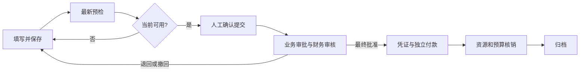

# AgentFlow 系统使用手册

员工填报和审批办理的分步图文说明、Word/PDF 下载及配套截图，见[员工与审批者图文操作手册](employee-approver-manual/README.md)。

本文面向申请人、审批人、流程管理员、财务、出纳和部署维护人员，按“安装 → 首次配置 → 发起 → 审批 → 财务执行 → 查询与恢复”的顺序说明系统用法。

源码核对日期：**2026-10-08**。核对基线：[`a7230ded`](https://github.com/liulangjietou/agent-flow/tree/a7230ded299e1b1c5772ca35c5f6cc276b75fa7d)。本文中的菜单、演示身份、配置默认值和操作规则均以该基线为依据。其他专题文档保留了分阶段记录，阅读其中“尚未完成”等段落时应结合日期与[当前任务台账](remaining-task-ledger.md)判断。

AgentFlow 管理流程定义、版本化表单、人工审批及结构化财务业务。Flowable 负责运行已发布流程；业务服务维护权限、金额、资源和外部执行事实；Agent 提供需要人工复核的建议。**审批通过、ERP 已过账、银行已付款、资源已核销、单据已归档是五种不同事实。**

几个贯穿操作的用语：

| 用语 | 在本系统中的含义 |
| --- | --- |
| 轮次 | 同一申请的一次实际提交及其审批；退回或撤回后重提产生新轮次 |
| 任职 | 某个人在指定法人、部门和岗位中的有效组织关系 |
| 版本 / 修订 | 发布版本固定业务规则；编辑修订及申请版本用于发现竞争修改 |
| 财务双版本 | 同时核对审批申请版本和专用财务单据版本，两者独立变化 |
| worker | 在后台领取持久任务的执行器，负责预检、查询或受控外部执行等工作 |
| ERP | 企业会计/资源管理系统，本平台通过其权威回执确认凭证过账等事实 |
| SLA | 任务的办理时限，在本平台按绑定工作日历计算 |
| FIFO | 借款冲销建议的先入先出顺序，最终引用仍由本人核对和确认 |

## 阅读路线

| 你的任务 | 建议阅读顺序 |
| --- | --- |
| 第一次体验系统 | [安装与启动](#安装与启动) → [登录与账号权限](#登录与账号权限) → [跑通第一条请假流程](#跑通第一条请假流程) |
| 填写与跟踪普通申请 | [工作空间导航](#工作空间导航) → [普通申请的填写与补正](#普通申请的填写与补正) → [消息历史与查询](#消息历史与查询) |
| 办理审批 | [审批人的日常操作](#审批人的日常操作) → [财务审核付款与归档](#财务审核付款与归档) → [失败与结果未知时的恢复](#失败与结果未知时的恢复) |
| 管理流程与组织 | [首次配置与组织维护](#首次配置与组织维护) → [流程与表单设计](#流程与表单设计) → [发布版本与运行控制](#发布版本与运行控制) |
| 办理报销、借款、采购或预算 | [财务业务的启用前提](#财务业务的启用前提) → [个人票夹与发票](#个人票夹与发票) → [费用报销的完整操作](#费用报销的完整操作) → [其他财务业务](#其他财务业务) |
| 接口集成与部署维护 | [接口调用约定](#接口调用约定) → [部署维护与备份恢复](#部署维护与备份恢复) → [常见问题排查](#常见问题排查) |

## 安装与启动

### 用 Docker 启动本机演示

准备已运行的 Docker Engine / Docker Desktop 和 Docker Compose v2。首次构建需要下载镜像、Maven 和 npm 依赖，宿主机可以不安装 Java、Maven、Node.js。

在仓库根目录执行：

```bash
docker compose -f compose.demo.yml up --build -d --wait --wait-timeout 180
docker compose -f compose.demo.yml ps
```

三个服务分别是 PostgreSQL 数据库、Java 后端和 Web。容器健康后，打开 **http://127.0.0.1:8180**，使用租户 `demo`、账号 `admin`、密码 `demo` 登录。

默认只把 Web 发布到本机回环地址，数据库和后端没有宿主机端口。这里的 8180 是浏览器入口，不是数据库端口，也不是后端容器内部的 8080。

8180 已被占用时，保持后续命令使用同一端口值：

```bash
AGENTFLOW_DEMO_PORT=8181 docker compose -f compose.demo.yml up --build -d --wait --wait-timeout 180
AGENTFLOW_DEMO_PORT=8181 docker compose -f compose.demo.yml ps
```

需要检查启动失败时：

```bash
docker compose -f compose.demo.yml logs --tail=120 server
docker compose -f compose.demo.yml logs --tail=80 database
docker compose -f compose.demo.yml logs --tail=80 web
```

`--wait-timeout` 结束不代表服务一定已经停止。先看 `ps` 和各服务日志，确认是依赖下载、数据库连接、迁移还是健康检查失败，再决定重试。

停止与重新启动：

```bash
docker compose -f compose.demo.yml stop
docker compose -f compose.demo.yml up -d --wait --wait-timeout 180
```

数据在 `demo-postgres` 持久卷中。日常停止不需要删除卷；`down -v` 会删除项目卷中的数据库。Compose 默认项目名固定为 `agentflow-demo`，不同代码目录可能管理同一实例。并行演示应同时使用不同的 `-p` 项目名和不同 Web 端口，并在所有管理命令中保持一致。

### 用本地 Java 与 Vue 启动

按仓库当前要求准备 Java 17+、Maven 3.9+，以及 Node.js 20.19+ 或 22.12+；CI 使用 Java 17 和 Node.js 22。用 `java -version`、`mvn -version`、`node --version` 核对实际执行版本。安装了 JDK 17 不代表终端的默认 Java 已经切换。

默认后端连接本机 PostgreSQL 的 `agentflow` 库。可先用下面的**本机演示数据库**配置启动独立实例；账号和密码只用于这份示例：

```bash
docker run --name agentflow-postgres \
  -e POSTGRES_DB=agentflow \
  -e POSTGRES_USER=root \
  -e POSTGRES_PASSWORD=123456 \
  -p 127.0.0.1:5432:5432 \
  -v agentflow-postgres:/var/lib/postgresql/data \
  -d postgres:17
```

在仓库根目录构建并启动后端：

```bash
# macOS 示例：选择已安装的 JDK 17
export JAVA_HOME=$(/usr/libexec/java_home -v 17)
export PATH="$JAVA_HOME/bin:$PATH"

mvn -pl agentflow-server -am package
java -jar agentflow-server/target/agentflow-server-0.1.0-SNAPSHOT.jar
```

另开终端，在同一仓库启动前端：

```bash
cd agentflow-web
npm ci
npm run dev -- --host 127.0.0.1
```

浏览器访问 **http://127.0.0.1:5173**。Vite 把 `/api` 代理到 `http://127.0.0.1:8080`；首次启动默认由 Flyway 创建业务表，Flowable 创建引擎表及加载示例流程。默认运行库已经是 PostgreSQL，不能根据早期文档推断为 H2；自动化测试则默认使用隔离 H2 数据库。

| 配置 | 作用 |
| --- | --- |
| `AGENTFLOW_DATASOURCE_URL` | JDBC 地址，默认 `jdbc:postgresql://localhost:5432/agentflow` |
| `AGENTFLOW_DATASOURCE_USERNAME` / `AGENTFLOW_DATASOURCE_PASSWORD` | 数据库账号与密码，本地默认 `root` / `123456` |
| `AGENTFLOW_DATASOURCE_DRIVER` | 默认 `org.postgresql.Driver` |
| `SERVER_PORT` / `SERVER_ADDRESS` | 后端端口与监听地址，默认 `8080` / `127.0.0.1` |
| `AGENTFLOW_WEB_ORIGIN` | 允许的前端 Origin，需要和实际访问来源一致 |
| `VITE_API_BASE` | 前端 API 前缀，默认 `/api/v1`；独立前后端部署时按实际地址配置 |

改后端端口时也要调整 Vite 的代理目标。不要把 `localhost` 和 `127.0.0.1` 当成同一个浏览器 Origin；单独改变域名、协议或端口也会改变来源。

安装细节见[演示安装](demo-installation.md)；企业部署另见[部署维护与备份恢复](#部署维护与备份恢复)。

## 登录与账号权限

### 演示账号

当前演示租户为 `demo`，以下账号密码均为 **`demo`**。密码按原输入校验，注意大小写和误输入的空格。

| 账号 | 明确拥有的角色 | 用途 |
| --- | --- | --- |
| `admin` | `EMPLOYEE`、`APPROVER`、`FINANCE`、`FINANCE_CONFIG_ADMIN`、`PROCESS_ADMIN`、`ADMIN` | 流程、组织、日历、制度与科目配置；具备相应业务资格时办理审批或财务 |
| `manager` | `EMPLOYEE`、`APPROVER`、`MANAGER` | 演示经理节点审批，也可发起申请 |
| `finance` | `EMPLOYEE`、`APPROVER`、`FINANCE` | 演示财务审核、凭证及付款授权 |
| `cashier` | `EMPLOYEE`、`CASHIER` | 独立出纳付款；不具备普通审批权限 |
| `employee`、`alice`、`bob` | `EMPLOYEE`、`APPROVER` | 员工申请；被实际指定为审批人时可办理 |

系统角色、组织中的审批资格、法人任职、任务指派和字段权限是分别检查的条件。拥有 `APPROVER` 不代表可以审批任意申请；拥有 `FINANCE` 不代表可以读取全企业财务明细。`ADMIN` 也没有敏感字段旁路。

**`admin` 没有 `CASHIER` 角色。** 付款授权与出纳执行要使用满足各自条件的不同身份，不能通过“管理员权限最高”的假设让同一人包办。

### 企业身份

企业部署使用管理员配置的 OIDC 登录入口，租户和系统角色来自经过验证的身份映射。OIDC 登录不会自动建立部门、岗位、主管关系或法人任职；这些资料在组织目录中另行维护或同步。

演示登录令牌在服务重启后失效。企业会话也可能因空闲、ID Token 到期、身份映射变化或注销而失效；是否支持跨实例与重启保持取决于 JDBC 会话配置。退出平台与退出企业身份源是两个动作，页面可用时可选择“同时退出企业账号”。

建议在不同浏览器配置文件中演示不同账号。企业 Cookie 会话可能在同一浏览器的多个标签间共享；旧标签会核对当前身份，不应继续操作另一账号留下的页面。重新登录后的原操作恢复见[失败与结果未知时的恢复](#失败与结果未知时的恢复)。

## 工作空间导航

菜单根据当前角色显示，服务端在执行时继续检查业务权限。

| 菜单 | 用法与范围 |
| --- | --- |
| 开始使用 | 管理员查看租户初始化和第一条真实流程进度 |
| 待我审批 | 当前可处理任务，支持列表、看板及筛选 |
| 我发起 | 本人发起的申请，包括退回、撤回和终态记录 |
| 我的草稿 | 本人 `DRAFT` 申请；已退回、已撤回从“我发起”继续 |
| 已办记录 | 本人实际办理动作；一张申请可出现多条记录 |
| 消息中心 | 站内提醒、已读状态、本人外部渠道偏好与投递记录 |
| 申请记录 | 当前身份可访问的申请，管理员与参与者的检索范围不同 |
| 流程管理 / 模板中心 | 管理流程草稿、表单、模拟、发布版本及模板副本 |
| Agent 助理 | 对实际有权处理的任务选择来源、生成与复核建议 |
| 财务申请 | 本人报销、事前申请、借款、采购付款、预算调整和个人票夹 |
| 费用财务报表 | `FINANCE` 身份的可读范围报表 |
| 出纳付款 | `CASHIER` 身份在有效法人范围内的付款记录与执行 |
| 科目映射 / 费用制度 | `FINANCE_CONFIG_ADMIN` 管理配置 |
| 组织与人员 / 审批代理 / 工作日历 | 管理员维护本租户组织、代理和日历 |
| 集成投递 / 操作审计 / 审批运营 / 系统自检 | 管理员查询集成、审计、运营及依赖状态 |
| 接口文档 | 查询与下载当前已认证的 OpenAPI 契约 |

列表的“已加载条数”不是全量总数。看到“加载更多”时还有下一页；看板列计数也只包含已加载任务。刷新会按当前筛选重新读取；错误提示和空结果是不同情况，查询失败不能据此判断没有业务记录。

## 首次配置与组织维护

### 管理员初始化

管理员进入“开始使用”，按向导完成：

1. **身份与空间**：核对当前租户、账号、已验证角色，并填写空间名称。
2. **组织任职**：明确法人、部门、岗位和本人的任职；已有有效任职时可以采用原记录。
3. **工作日历**：创建明确的时区与工作时段，或采用已有日历的精确修订。
4. **通知选择**：核对站内消息及本人愿意启用的、已有受控绑定的外部渠道。
5. **确认初始化**：检查实际来源和完整配置，勾选确认后提交。

初始化记录会保存原组织、日历和通知选择，后续修订不覆盖这份记录。已初始化租户不能再创建第二套初始化对象。向导只改变当前租户的上述本地配置，不创建 IdP 账号、不授予新的系统角色，也不自动连接财务或模型服务。

向导草稿在页面内存中保留；刷新或关闭可能丢失。目录或通知绑定发生变化时，要明确读取并采用新来源，重新确认。结果未知时恢复原请求，不能再点一次初始化来生成另一套组织。

### 组织与人员

进入“组织与人员”，启用并维护本租户目录，核对法人、部门、岗位、人员、任职和主管关系。人员账号标识必须与认证身份一致；企业模式通常使用稳定 `sub`，不能凭显示姓名或邮箱猜测身份。

业务使用前至少核对：

- 申请人的有效任职、所属法人、部门及适用主管。
- 审批人的人员状态、审批资格，以及认证源赋予的 `APPROVER` 角色。
- 财务和出纳的有效法人任职及各自明确的系统角色。
- 动态选人使用的主管链、部门负责人或字段关系是否完整。

启用本地目录后，先补齐真实参与人员；不能继续假设演示账号目录会代替缺失组织资料。多任职员工按页面要求选择**本次发起任职**，其上下文固定到当前提交轮次，不能在后续审批中随意替换。

目录停用或资格变化会收紧当前操作权限，但不会改写已提交的任职和历史候选依据。外部组织同步先读取批次、预检差异和冲突，再由管理员具名确认应用；它不会隐式创建认证账号或授予系统角色。

### 工作日历与审批代理

工作日历需要明确时区、每周开放时间及日期例外。企业节假日要按实际制度录入。任务期限使用创建时固定的日历修订；转交、委派不会重新开始计时，日历后来修订也不会重算旧任务。

“审批代理”用于有期限的代办授权：指定原审批人、代理人、一个已发布流程版本、开始时间、结束时间和原因。有效区间包含开始、不包含结束；换流程版本需要另行授权。代理不复制角色、不递归继承其他代理，也不能用领取或转交把临时权限变成永久权限。

详见[初始化向导](tenant-initialization.md)、[组织维护](local-organization.md)、[组织同步](organization-sync.md)、[工作日历](business-calendars.md)和[审批代理](approval-proxies.md)。

## 跑通第一条请假流程

先用普通表单的请假模板体验人工审批。它使用演示角色，不需要先接入模型、银行或财务网关。

**准备身份：** `admin` 负责复制和发布；`alice` 发起；`manager` 审批。如果已启用本地组织目录，先确保这些人员、审批资格及所需任职有效。尚未启用目录的演示环境可使用内置账号目录。

### 复制、检查与发布

1. `admin` 打开“模板中心”，选择“请假申请”。先看字段、依赖、风险说明和示例路径。
2. 复制为独立草稿，使用新的流程标识，例如 `leave_guide_20261008`，填写便于识别的名称。
3. 在“流程管理”核对经理节点为 `role:MANAGER`，额外复核节点为 `role:ADMIN`。
4. 核对分支条件 **`durationDays > 3`**。这是示例规则；恰好 3 天不会进入额外复核。
5. 使用模板示例或模拟入口检查短假、3 天边界和长假路径，检查表单错误。
6. 保存草稿，点击“保存并发布”，填写非空变更说明并确认。
7. 核对发布版本、发布记录和允许新发起状态。仅保存草稿还不能发起真实审批。

### 发起与办理

1. `alice` 打开“申请记录”的发起入口，选择刚发布的请假流程**准确版本**。
2. 填写标题、业务单号以及表单。例如请假类型“年假”、开始日期 `2026-10-12`、天数 `1.5`、原因“处理个人事务，工作已完成交接。”。
3. 保存申请草稿，再提交。需要本次任职时选择有效任职并确认。
4. `manager` 登录“待我审批”，打开该任务，核对申请、当前轮次和内容，明确批准。
5. `alice` 回到“我发起”，确认申请已批准，并查看轮次、真实轨迹和审计。

再创建一张 4 天申请：经理批准后，应出现 `admin` 的额外复核任务；该任务批准后申请才最终通过。

| 天数 | 模板预期行为 |
| --- | --- |
| `1.5` | 经理批准后结束 |
| `3` | 仍走经理后结束的默认分支 |
| `4` | 经理批准后进入管理员示例复核 |
| `0.1` | 低于表单最小值，提交被校验阻断 |

请假模板不计算假期余额或工作日，也没有自动限制半天步进。经理和管理员示例角色需要在实际企业使用前改成已确认的审批关系。

“开始使用”中的四项进度来自真实保存、发布、提交轮次和批准记录。模拟、预览、驳回或手工勾选均不等同于完成批准。

## 普通申请的填写与补正

### 填写与附件

选择可新发起的已发布普通表单流程，核对准确版本后填写。当前表单支持文本、多行文本、精确数字、日期、单选、布尔、重复明细及附件；实际字段由发布版本决定。

必填项、上下界、选项和字段权限由服务端校验。页面显示隐藏或脱敏时，当前身份可能不能读取原值；管理员也不能通过另一入口取得这些原值。

附件需要部署人员先配置持久目录，并在流程中配置附件字段。先保存申请草稿，再登记并上传文件、保存引用；未完成上传不能提交。中断后选择同一原文件恢复，大小与摘要必须一致。补正时移除的是当前引用，旧轮次仍保留原文件。

### 状态与允许操作

| 状态 | 含义 | 申请人通常可以做什么 |
| --- | --- | --- |
| `DRAFT` 草稿 | 已保存，尚未提交审批 | 编辑、提交、作废 |
| `IN_APPROVAL` 审批中 | 当前轮次在运行 | 查看；业务守卫允许时撤回 |
| `RETURNED` 已退回 | 需要补充或调整内容 | 阅读原因、编辑、重提或作废 |
| `WITHDRAWN` 已撤回 | 本人结束当前在审轮次 | 编辑、重提或作废 |
| `APPROVED` 已批准 | 本轮人工审批通过 | 查看；财务业务继续独立执行 |
| `REJECTED` 已驳回 | 本轮拒绝，终态 | 查看；如需另申请，创建新单 |
| `CANCELLED` 已作废/终止 | 作废或管理员终止的终态 | 查看历史，不能恢复或重提 |
| `REVOKED` 已撤销 | 专用报销财务撤销结果 | 查看原批准与财务历史；规则见后文 |

普通表单的编辑和作废权限属于申请人；管理员不能替本人作废草稿。结构化财务还有资源和外部执行守卫，不能只凭该表判断可以撤回或撤销。

### 退回、撤回与重提

退回后从“我发起”打开原单，阅读原因，修正并保存，再提交。本人主动撤回也先填写说明并确认，随后才能编辑。

保存修改增加申请版本，不产生新审批轮次。重提才建立新轮次与新实例，旧轮次的原内容、金额、意见及任职快照继续保留。重提沿用原绑定流程版本；原版本停用时需先由管理员恢复，不能在原申请上悄悄切换最新版。

驳回是终态，退回是可补正状态。办理前应准确选择；不能把“驳回”当成“让申请人改一下”。财务申请从对应专用页面补正，并重新预检。

详见[表单](versioned-forms.md)、[附件](field-attachments.md)、[补正重提](approval-resubmission.md)和[申请作废](application-cancellation.md)。

## 审批人的日常操作

### 读取任务与作出决定

打开“待我审批”，使用筛选并读取当前任务。列表和看板使用同一任务来源；看板分为待领取、已指派、待回交，拖动卡片不会改变审批状态。

打开详情后依次核对申请人、本次任职、准确流程版本、轮次、内容和附件，查看历史意见及当前允许动作。费用业务还要核对签收、财务金额、预算与职责要求。旧消息里的链接或曾经参与该申请，都不能替代当前任务权限。

未指派的候选任务，如果当前允许动作包含批准，具备资格的候选人可以直接批准，不要求先领取。领取用于明确本人负责；任务已指派给其他人时，候选身份不能继续直接办理。第一条请假示例中的经理按实际允许动作直接批准即可。

| 动作 | 操作含义 | 注意事项 |
| --- | --- | --- |
| 批准申请 | 完成当前人工审批决定 | 可能还有后续节点；一次批准不一定最终通过 |
| 退回申请 | 要求申请人补正 | 必填意见，说明缺失材料或修改要求 |
| 驳回申请 | 形成拒绝终态 | 必填意见，确认不需要按原单补正 |
| 领取任务 | 将候选任务指派给本人 | 不形成批准事实 |
| 释放任务 | 解除本人当前领取 | 不形成退回或驳回事实 |
| 转交任务 | 接收人继续负责审批 | 从有效目录选人，受职责分离限制 |
| 委派任务 | 让另一审批人协助核实 | 原责任人保留最终决定责任 |
| 填写意见并回交 | 受托人完成核实后交回原责任人 | 必填意见；受托人不能直接批准待回交任务 |

写入成功后刷新状态。冲突时重新核对最新任务，不能依据旧详情继续发决定。

### 会签、职责分离与期限

会签按发布规则分为全员、任一人或比例。节点激活时固定名单及门槛，达到条件后结束剩余任务。只有页面实际开放、当前授权允许的情况下，才使用加签或减签，并填写依据；不能靠减签绕开审批门槛。

职责分离可排除申请人或前序实际批准人。候选为空会阻断当前提交或推进，需要管理员核对目录和流程，不会自动跳过人工步骤。

费用自审批上溯、相邻重复业务审批受控通过、跨单合计金额路由、项目负责人会签是**显式配置的专用策略**。旧流程不会因为升级程序就自动获得这些规则，财务职责仍需按其独立约束办理。

任务期限从真实创建时刻计算。转交、委派和代理不重置 SLA。到期提示与升级只表示原任务的时间和处理规则，不代表系统自动批准。

### 批量领取与释放

批量面板最多选择当前已加载的 20 项任务。先逐笔核对最新版本与允许动作，再填写统一说明并确认。系统顺序办理，显示每笔成功、拒绝、冲突或未发送结果；某笔明确失败不回滚其他成功任务。

批量能力仅用于领取和释放，**没有批量批准**。某笔响应未知或认证失效时，后续任务停止发送；先恢复该笔原操作，再重新选择剩余任务。

详见[待办看板](task-board.md)、[委派与回交](task-delegation.md)、[会签](countersign-policies.md)、[职责分离](approval-responsibilities.md)、[期限](task-deadlines.md)和[批量办理](task-batch.md)。

## 流程与表单设计

### 从模板或新草稿开始

流程管理需要 `PROCESS_ADMIN` 或 `ADMIN`。模板中心当前有请假、用印、合同审批、采购付款、预算调整、费用报销、事前申请、借款 **8 个模板**。复制后得到独立草稿，目录后来升级不会覆盖已有副本。

普通模板用于普通表单；五种结构化财务模板必须从相应专用业务入口填报和提交，不能通过普通申请绕过财务事实。

设计的一般顺序：

1. 确定业务类型、流程标识、名称及适用制度。
2. 配置表单字段、校验、明细与附件。
3. 配置人工节点、选人、会签、职责分离及字段权限。
4. 配置分支、默认路径及必要等待、子流程或受控服务。
5. 校验结构与依赖，用正常、边界和拒绝输入模拟。
6. 核对版本差异，保存并发布。

流程、节点和连线标识会进入 BPMN。使用 `leave_guide`、`manager_review` 这类清晰标识；数字开头、空格、冒号和斜杠等非法标识会阻断。已保存流程的业务标识不可直接更换，修改节点编号时也要同步引用。

### 快速设计与高级画布

快速设计适合结构化步骤、条件和并行；高级画布适合查看连接、属性和布局。两种视图共用同一份图，不会生成两套审批规则；不满足快速视图结构要求时，按提示在高级画布处理。

画布支持缩放、适应、拖动、自动布局、连线、插入和删除接续、撤销与重做。缩放和滚动只是视图变化；移动或自动布局修改坐标后仍需保存。未完成拖线可用 Esc 取消，已发布版本只能查看。

自动保存可以辅助保存合格草稿，不能代替确认发布。显示冲突、失败或“自动保存已暂停”时，应保留本地修改、读取并比较服务器状态，再明确继续；切换流程和离开页面时处理未保存提示。

### 节点选择

| 节点 | 适用操作与约束 |
| --- | --- |
| 开始 / 结束 | 确定合法入口与终点 |
| 人工审批 `USER_TASK` | 配置真实审批人、会签与字段权限 |
| 抄送 `COPY` | 将只读信息发送给固定范围，抄送不授予审批权 |
| 排他网关 `EXCLUSIVE_GATEWAY` | 条件分支按顺序判断，配置明确默认分支 |
| 并行网关 `PARALLEL_GATEWAY` | 使用受支持的结构化分支和汇合 |
| 定时等待 `TIMER_WAIT` | 按固定规则到期恢复，不代替人工审批 |
| 事件等待 `EVENT_WAIT` | 选择准确的可信事件契约版本，等待匹配事件 |
| 子流程 `SUB_PROCESS` | 绑定准确已发布版本和输入，保留主子关系 |
| 服务任务 `SERVICE_TASK` | 绑定部署人员安装的白名单操作版本和允许字段 |

服务任务在当前基线已接通公开设计和运行记录，旧资料中的“始终拒绝发布”是历史阶段。它不接受任意 URL、Bean、脚本或结果变量；模拟只检查输入与路径，不调用外部服务。申请详情的“服务运行”展示原轮次的操作记录，未知结果按原操作查询恢复。该能力的浏览器及 PostgreSQL 新范围验收仍见台账。

### 表单权限与分支条件

字段标识决定条件和数据映射，发布前核对类型、必填、选项、精确上下界及各节点原样可读/只读/隐藏/脱敏规则。明细列不能任意嵌套明细。财务模板使用专用敏感明细组，不应删除或替换来规避签收、审核或金额校验。

分支使用平台白名单条件语言。先用字段条件编辑器，复杂条件按当前条件语言版本处理；不能粘贴 Java、脚本或 JUEL。排他分支的顺序会影响多个条件同时满足时的结果，默认分支用于其余输入。

至少模拟：正常路径、恰好等于阈值、超过阈值、缺少必填字段、非法选项或日期。模拟成功说明所选输入下的路径和规则检查通过，不证明真实组织、模型、银行或 ERP 已完成业务。

详见[模板中心](process-templates.md)、[快速设计器](quick-workflow-designer.md)、[画布](designer-canvas.md)、[条件语言](condition-language.md)、[字段权限](organization-context-and-field-permissions.md)、[服务任务](service-tasks.md)和[图形导出](designer-bpmn-di.md)。

## 发布版本与运行控制

草稿 `revision` 是并发编辑修订，发布 `version` 是业务流程版本。发布时填写变更说明，核对校验结果、精确依赖和版本差异，成功后查看发布人、时间和说明。

已发布图与表单不可原地修改。复制为新草稿、编辑并发布下一版；已有申请和在审轮次继续绑定原版。模板更新、组织调岗、制度换版或画布调整均不应被理解为自动修改旧审批依据。

停用“允许新发起”会阻止该版本的新建、首次提交及退回/撤回重提；既有在审实例继续。恢复同一版本后，原申请可按规则重提。停用版本不是暂停运行实例。

具体入口：管理员打开“流程管理”，从流程目录选择申请绑定的**原已发布版本**，在“版本使用”区域点击“恢复此版本”，填写操作原因，再点“确认恢复”。核对状态变为“允许新发起”后，申请人回原单重提。停用也在同一区域使用“停用此版本”。不要把这里的定义版本恢复与下方申请实例的运行恢复混淆。

管理员在原申请的运行控制中填写原因，按当前版本执行：

| 动作 | 实际影响 |
| --- | --- |
| 暂停 | 当前申请仍为审批中，暂不办理任务；不释放财务占用 |
| 恢复 | 接续原实例；人工任务按原日历与剩余工作时长处理 |
| 具名终止 | 当前在审根轮次及未完成后代结束为 `CANCELLED`，不能恢复或重提 |

主子流程从根申请统一控制。已批准或驳回的既有结论不会被终止覆盖。财务资源按各自业务收尾，终止流程不能直接当成银行退款或 ERP 冲回。

详见[发布记录](definition-publication.md)、[版本可用性](definition-availability.md)、[版本比较](definition-comparison.md)、[实例控制](instance-control.md)和[子流程](subprocesses.md)。

## 财务业务的启用前提

**默认演示 Compose 能运行普通审批，但没有自动提供真实企业财务系统。** 默认 `AGENTFLOW_FINANCE_GATEWAY_ENABLED=false`，附件目录和模型也未配置。财务入口存在不代表目录、验票、预算、ERP 或银行可用。

办理财务前，由对应管理员核对：

| 前提 | 需要确认的内容 |
| --- | --- |
| 身份与组织 | 员工、业务审批人、独立财务、独立出纳的角色、资格、法人任职 |
| 已发布专用流程 | 业务类型、财务敏感字段、人工审核及签收/复核策略完整；允许新发起 |
| 财务目录 | 法人和时区、员工账户、类别、币种、城市、单位、成本中心与项目来自授权来源 |
| 制度与科目 | 类别、费用制度、科目映射的发布版本及适用法人/币种；ERP 对映射的明确认可 |
| 外部端口 | 主数据、汇率、税务查验、预算、会计期间、凭证和资金服务的可信配置与实际回执 |
| 原件 | 持久目录可用；发票、附件及必要纸件证据符合实际法人规则 |
| 后台执行器 | 需要的预检、查验、预算、凭证、付款、结算与归档 worker 可领取任务 |

“费用制度”和“科目映射”由 `FINANCE_CONFIG_ADMIN` 管理，普通 `FINANCE` 或单独 `ADMIN` 不隐含该权限；演示 `admin` 是明确配置了该角色。

配置通常经过“读取当前修订 → 修改草稿 → 校验 → 填写原因 → 发布/选择生效版本”。草稿未发布不作为已生效制度。类别与授权外部目录取适用交集，平台配置不会扩展员工财务访问范围。历史轮次和原凭证保留其原版本。

本地合成网关、模型及财务样例用于隔离演示与协议验证，其金额、制度和成功回执不是企业标准或真实银行事实。要完整演示财务，参考[员工财务样例](financial-template-examples.md)，在独立环境准备配套目录、制度、原件和服务，不应只复制一个模板就期待付款成功。

详见[财务网关](finance-gateway.md)、[费用配置](expense-configuration.md)、[科目配置](account-mapping-configuration.md)和[财务模板样例](financial-template-examples.md)。

## 个人票夹与发票

从“财务申请 → 个人票夹”管理本人原件。原件状态、抽取建议、税务查验和占用状态分别展示。

### 上传与抽取

1. 选择原文件并登记，完成不可变字节上传；当前默认单文件上限为 20 MiB，其他限额按部署设置。
2. 确认原件 `READY`，需要时下载原件对照。
3. 可选择票据抽取。当前有 PNG/JPEG、PDF、XML 和 OFD 路径；支持范围及资源边界见对应专题。
4. 已识别结构的 XML 优先本地解析；未知结构或本地失败不会自动发给模型。模型路径需核对目的地及实际发送内容并明确确认。
5. 逐字段对照原件、页码与依据，选择、修正并确认候选。置信度不表示已测准确率或票据真实性。

OFD 抽取会检查可支持的内容、资源和部署字体，模型页图最多 10 页。签章图像呈现和密码学签名有效性分别判断，不能因为看到印章就断言签名有效。遇到明确不支持的原件，保留原文件并按错误处理，不静默丢页或签章。

### 查验与引用

1. 明确选择本人目录中的买方法人，核对服务端配置的查验目标。
2. 发起独立查验任务；`202` 表示已排队，等待实际终态。
3. 核对成功票面、金额、税额、时效和原件。`REJECTED` 是业务拒绝，`UNAVAILABLE` 是没有可信结论。
4. 在费用行中选择符合本法人、当前查验及占用规则的发票，再由费用预检核对。

抽取 `CONFIRMED` 只证明本人确认建议，不能代替查验成功。辅助带入票面金额或币种只更新未保存的费用输入；不会自动保存、查验、引用或提交。开票日期不能直接当成费用发生日，票面税额也不能直接当成可抵扣税额。

重复票号或已有占用会阻断新的不合法使用。占用来源提示按当前身份授权显示，不能据此读取另一张单据的敏感正文。管理员不能代看他人的私人票夹；审批原件按原轮次字段权限读取。

上传中断时先读取原记录；已经 `READY` 时不再发送字节，需要恢复时选回同一文件。查验或模型已领取后结果未知，按任务及租约状态确认；不会自动重复外发。

详见[个人票夹](invoice-wallet-ui.md)、[票据抽取](invoice-extraction.md)、[OFD](invoice-ofd-extraction.md)、[XML 原件](invoice-xml-originals.md)、[查验](invoice-verification.md)和[占用提示](invoice-occupation.md)。

## 费用报销的完整操作

### 填写和保存

进入“财务申请”，点击“填写报销”，选择准确的已发布 `EXPENSE` 流程版本、报销类型和法人。选择员工授权目录中的类别、单位、城市、成本中心和项目，填写用途及费用发生信息。

逐行填写原币含税金额、税额、数量、日期和成本分摊，按规则选择本人发票、事前批准额度与已放款借款。分摊合计必须精确等于要求金额，页面显示已分摊、还差或超出；差一分钱也不能视为配平。移除行后原行号保持，错误按稳定行号定位。

定额补贴来自发布制度和实际行程计算，不能由模型或员工直接填一个标准金额替代。超标、禁止类别和缺少说明按制度处理；需要例外审批的标记不会因后续核减就自动消失。

保存成功后读取服务端版本。费用输入在按身份隔离的页面内存中保留，刷新或关闭可能丢失未保存内容；列表余额只是读取时的事实，尚未形成正式预留。

### 运行最新预检

保存后选择本次有效任职、明确会计日期和财务目标，启动预检。预检本身不提交审批，不占用发票、不预留额度、不冻结预算。

| 预检状态 | 下一步 |
| --- | --- |
| `QUEUED` / `RUNNING` | 已排队/运行，等待或读取同一任务 |
| `READY` 且当前可用 | 核对候选金额、账户掩码、日期与时效，准备提交 |
| `READY` 但不可用 | 是历史候选；修正来源或重新预检 |
| `BLOCKED` | 阅读业务问题，按原行号补正，再保存和重新检查 |
| `UNAVAILABLE` | 缺少可信依赖结论；处理连接、配置或超时，按实际状态决定新检查 |

“去处理”可定位行级问题，仍需本人修改、保存和重新检查。模型解释只帮助理解问题，不能把阻断改成通过。

有效期取各来源有效期、**5 分钟本地上限**及法人当地次日零点中的最早时刻，可能明显短于 5 分钟。双版本、任职、目标、资源、制度等发生变化都会使候选失效。新检查一经登记，旧 READY 即失效；新检查失败也不会退回沿用旧成功。

### 确认并提交

确认最新可用预检后，核对应付金额、税额、分摊、账户掩码、借款冲销和其他引用，再正式提交。服务端重新检查双版本和全部事实，冻结本轮、预留资源、启动审批并登记预算原命令。

提交成功后应看到新的在审轮次和真实待办；预算排队仍不代表冻结成功。预算明确不足可能退回当前轮次；柔性超支仅在原配置及独立人工确认规则允许时处理，未知预算结果不能当作可用额度。



### 退回、撤回与重提

从报销专用详情打开补正，沿原流程版本修改，保存后重新预检并提交新轮次。旧轮次金额、制度与原件保持；本轮资源释放、迁移和预算保留按其实际状态执行。

事前额度使用批准行固定的控制规则：

| 模式 | 累计使用规则 |
| --- | --- |
| `STRICT` 严格控制 | 累计有效预留及净核销不能超过原批准额度 |
| `TOLERANCE` 容差控制 | 阈值为批准额乘以 `1 + 已配置比例` 并向下取整到分；超过阈值需逐行说明和独立额度例外审批，流程缺少该节点时阻断提交 |
| `NONE` 参考控制 | 不因超过计划金额本身阻断，仍完整记录预留与核销，并检查本人、法人、币种、类别、关闭状态和并发版本 |

容差由管理员显式配置，没有自动采用的企业比例；多张报销共享同一批准行的累计阈值，不能每张单各享一次完整容差。历史未配置记录继续原严格规则，关闭后的额度在任何模式下都不能新增或增额。参考余额不能当成实际可提交上限。

跨单拆分风险和合计路由使用明确配置的窗口、阈值与币种，不是模型看到“相似”就自动命中。

详见[费用填报](expense-origination.md)、[预检](expense-precheck.md)、[正式提交](expense-submission.md)、[逐行反馈](expense-feedback.md)、[事前额度控制](expense-prior-controls.md)、[跨单路由](expense-split-routing.md)和[柔性预算](expense-budget-exceptions.md)。

## 财务审核付款与归档

### 审核与核减

在“待我审批”打开对应报销任务，按当前节点的实际财务职责办理：

- **收单检查/纸件签收**：逐项核对材料；法人要求纸件时登记真实签收。材料不齐时先填写退回意见，明确确认后退回。
- **财务审核**：查看申报与核定额，必要时按行核减、记录原因，保存后再办理批准。未保存的核减或未知写结果会阻断继续审批。
- **财务复核**：按原制度例外及最新核定金额核对；不以申请人输入总数代替服务端事实。

核减不能直接变成银行退款，也不能增加原申报金额。页面的实时预览帮助核对，保存和后续审批仍各自明确确认。财务人员需满足非本人、法人任职、字段权限及业务审批人分离等条件。

### 凭证、授权与出纳执行

最终批准后，在专用详情按阶段查看：

首次凭证链路由后台触发：最终批准在同一事务登记凭证准备任务；准备执行器查询会计期间和科目，满足条件后自动登记唯一原凭证命令，再由凭证执行器发送 ERP。财务在已批准的报销或借款详情中打开凭证状态面板，核对结果；正常首次过账不需要额外点一个“过账”按钮。准备受阻时，按面板允许动作填写原因并重新准备；已有原命令时沿原号查询和受控恢复。

| 阶段 | 如何操作或确认 | 不能误认为 |
| --- | --- | --- |
| 凭证准备 | 查看期间、科目依据和准备状态；有权财务按提示刷新准备 | `READY` 就是 ERP 已过账 |
| ERP 过账 | 查看原操作状态和权威凭证号；未知时查询原号 | 排队或网络超时就能新建凭证 |
| 财务付款授权 | 有权独立财务核对批准、过账、金额和收款事实，填写期限与原因确认 | 授权成功就已到账 |
| 出纳付款 | `cashier` 打开“出纳付款”，选择当前有效法人范围内记录，读取账户、手工选择并确认执行 | 账户下拉框已读取就已发款 |
| 银行结果 | 查看原资金操作及权威成功/失败/未知结果 | `202`、`READY` 或后台受理等同付款成功 |
| 核销 | 查看发票、事前额度、借款及预算消费结果 | 银行成功就一定 `SETTLED` |
| 归档 | 核对必要终态、凭证和完整原件；读取封存清单或授权下载 | 批准或下载按钮存在就已完整归档 |

出纳只获得付款所需最小信息，不因此取得完整申请正文。财务授权人、申请人不能代执行同笔付款。金额与收款账户由原批准事实派生，出纳不能自行改成另一收款人或金额。

**未知资金结果先查询原交易。** 权威查无且业务规则允许时，只有相应原责任人明确确认原号重发；不能为了尽快到账换号生成另一笔。

全额借款冲销或全部核减后的零应付走对应独立核销路径，不制造零额银行付款。资源已消费但预算未确认时显示 `BUDGET_PENDING`；真实消费完成才成为 `SETTLED`。争议或退票有独立复核和冲回路径，不恢复成一张新的草稿绕过原账。

归档包保存清单及实际持有的原件。银行端口只提供回单编号时，系统不会虚构银行 PDF；下载中断的 ZIP 不能视为完整档案。

### 已批准报销的财务撤销

当前基线开放专用报销财务撤销。由具备当前原轮次完整权限、法人任职及独立财务资格的人员，在详情核对影响、填写原因并确认。

适用的是**尚未发生凭证发送尝试、付款授权或核销依据等禁止事实**的已批准报销。已有发送、未知结果或后续外部事实时，使用原对账及冲回流程。被禁止的撤销不能靠先改审批状态来实现。

撤销后申请为 `REVOKED`，原批准轮次、金额、原件和财务历史保留；未发送的相应凭证停止，资源按原计划释放，预算释放登记原命令。外部预算确认前仍显示实际冻结事实，不能看到“已撤销”就认定已经释放。

历史读取还有一条兼容规则：旧数据中即使一张已撤销单已经存在付款、凭证或迟到银行事实，也继续展示原记录并允许必要的原号对账。这只说明历史查询范围，**不扩大当前撤销入口的适用条件**；新入口仍拒绝已有发送尝试、付款授权或核销依据的报销。

### 电子签与结果文件

有电子签需求时，在已批准申请详情的“电子签”页读取当前轮次。部署人员先安装可信签署资料与服务配置；审批角色、显示姓名或管理员身份本身不能推导签署权限。

1. 核对当前申请和轮次确实已批准，并选择当前可用的签署资料精确版本。
2. 从该轮被冻结、当前有权读取的附件中明确选择原件；文件和签署资料不会默认选中。
3. 填写用途及 1–1440 分钟首次发送期限，核对文件、轮次、截止时间及发送范围，勾选确认后授权。
4. 读取原签署操作及收集状态。`COLLECTING`、`FETCHING_FILES` 表示仍在保存结果，全部文件完成的 `SIGNED` 才提供结果下载。
5. 下载后核对文件完整性及服务方实际签名验证。页面状态不代替证书、文件内部签名和时间戳验证。

当前每次最多 10 份原件，单份 16 MiB、合计 32 MiB。仅实际可取消的未发送操作提供取消入口；已发送或未知结果沿原号查询，不能取消后另发来绕过原操作。签署授权与人工批准、银行付款各自独立。

详见[核减](expense-resource-adjustments.md)、[签收清单](expense-receipt-checklist.md)、[审核反馈](expense-review-feedback.md)、[凭证](voucher-workspace.md)、[付款工作区](payment-workspace.md)、[核销](expense-settlement.md)、[归档](expense-archives.md)、[已批撤销](approved-expense-revocation.md)、[撤销后财务历史](expense-financial-history.md)和[电子签页面](electronic-signature-ui.md)。

## 其他财务业务

“财务申请”还有以下视图。每种业务使用自己的保存、预检、提交与后续执行，不能用普通表单声明“已付”“已批准”来替代事实。

| 入口 | 操作顺序 | 关键注意事项 |
| --- | --- | --- |
| 我的事前申请 | 选择专用版本，填写计划行与分摊 → 保存 → 任职/目录/汇率预检 → 提交 → 人工批准 | 最终批准后才形成事前额度；关闭额度停止新增/增额，不抹掉原批准和已存在预留 |
| 事前批准额度 | 查看本人批准行的批准额、预留、已用和可用/参考金额，必要时具名关闭 | 预留不等于已实际消费；控制模式决定硬限制与参考含义 |
| 我的借款申请 | 填用途、法人本位币金额和归还日 → 保存 → 账户预检 → 提交 → 批准 → 挂账、授权、独立出纳放款 | 批准不生成可冲销余额，只有真实到账才进入已放款借款 |
| 已放款借款 | 核对实际放款、预留、报销冲销、净还款及未还金额 | 报销中的 FIFO 建议要人工采纳；还款与退回依真实收款、复核和原回单办理 |
| 我的采购付款 | 填法人、供应商、原应付号和金额 → 预检原合同/订单/验收/发票/应付 → 提交 → 审批及独立供应商付款/结算 | 当前匹配应付路径不隐含支持预付款、无订单或外币付款；供应商账户不作为员工账户 |
| 我的预算调整 | 填原预算来源、会计日期和调整明细 → 保存 → 查原预算预检 → 提交 → 人工批准/授权 → 原调整执行 | 页面不能自报新余额；批准、执行成功和预算账本变化分别确认 |

逾期借款控制根据法人当地日期和租户明确配置执行；提醒与是否阻断新借款分别判断。预算、供应商付款、凭证冲回及退票出现未知或争议时，沿原操作复核，保留原账和修订。

详见[事前申请](expense-plan.md)、[额度关闭](expense-request-closure.md)、[借款申请](advance-request-ui.md)、[冲销建议](advance-offset-suggestion.md)、[逾期控制](advance-overdue-controls.md)、[还款](advance-repayments.md)、[采购付款](procurement-payments.md)、[供应商付款](supplier-payments.md)和[预算调整](budget-adjustments.md)。

## Agent 辅助的使用边界

模型默认关闭。部署人员需配置可信目的地、模型、凭据及后台执行器；用户在每次授权来源中核对实际发送内容。配置有效不等于真实连接、准确率或业务质量已验证。

| 能力 | 使用方式 | 结果的作用 |
| --- | --- | --- |
| 审批摘要 | 当前可作审批决定的人，从 Agent 助理/任务入口选择可读来源，生成后编辑采纳或拒绝 | 保存带来源建议；不批准申请 |
| 普通草稿助手 | 普通表单的本人编辑入口选择允许输入，逐项复核建议 | 辅助填写，仍需保存和提交 |
| 票据抽取 | 本人票夹中选择本地或明确授权模型路径，对照原件确认字段 | 确认票面候选；不替代税务查验 |
| 预检解释 | 本人报销中选择当前预检事实，生成带来源解释 | 理解问题与补正建议；不改变 READY/BLOCKED 等结论 |
| 费用填单助手 | 本人报销编辑器中选择行程、类别与分摊来源，逐项确认后带入 | 追加未保存费用输入；补贴仍按制度计算 |
| 费用风险提示 | 当前有权的费用审批人选择主单及获授权的对照事实，运行并人工复核 | 提示局部观察；不自动驳回、核减或更改金额路由 |

通用审批摘要排除隐藏、脱敏、敏感字段及附件；专用费用能力有独立的完整明细授权和发送清单，不能把它理解为通用模型已经可以读取所有材料。

模型自评置信度、同日费用、发票连号或相似文本都不是违规结论。对照单缺权限、版本变化、任务转交或来源过期时，原建议可能不可采纳；重新读取并按新来源明确创建新运行。

运行排队不等于结果生成。已领取运行中断、超时或结果未知时不自动重复调用；查看原运行和租约终态，需要重做时明确创建新运行，旧记录和人工修订保留。

详见[Agent 执行](agent-execution.md)、[普通草稿助手](draft-assist.md)、[预检解释](precheck-explanation.md)、[费用填单助手](expense-draft-assist.md)和[风险提示](expense-risk-hints.md)。

## 消息历史与查询

### 消息和意见

消息中心可筛选未读、标记已读并打开原申请或任务。站内业务消息始终开启；本人邮件和 IM 偏好默认关闭，需有部署绑定并由本人确认开启。

启用渠道不回补发送历史消息。站内产生提醒、外发意向、渠道受理与最终收件可见是不同事实；`PENDING` 不表示已送达。旧通知链接仍按当前权限读取，不能恢复已经结束的任务权。

申请评论用于讨论材料；正式审批意见通过审批动作保存。评论、标记已读、查看详情都不产生批准或退回决定。

### 历史轮次和审计

从申请详情明确选择轮次，查看当轮提交内容、定义版本、任职、候选依据、路径和意见。“已办记录”一行表示一次实际办理动作，不等于一张申请最终结果；当前状态与当时办理后状态可能不同。

没有历史快照的旧单会说明缺失，不会用当前表单补造旧记录。节点的初始候选也不等于后续领取人、转交人或最终批准人。

管理员在“操作审计”按申请、动作、操作者或时间查询/导出；在“审批运营”查看实际轮次和任务口径。查询与导出不发起对账、模型、预算或付款动作。

### 财务报表

财务从“费用财务报表”选择日期、法人、部门或类别，读取和导出当前身份可读范围的统计。默认按 UTC 提交日期选近 30 天，范围最长 366 天；需要按法人当地日期理解借款逾期时，遵循对应指标说明。

报表分别按币种展示，不按当前汇率混成一个总额。当前借款余额、事前额度和凭证/付款积压是生成时存量，不是筛选日期末的历史余额。跨类别轮次计数不可简单相加；空样本、未知依据和不适用指标不能当成零。

详见[站内消息](notification-inbox.md)、[通知偏好](notification-preferences.md)、[投递](notification-delivery.md)、[评论](application-comments.md)、[历史](approval-history.md)、[审计](audit-search.md)、[运营](approval-operations.md)和[财务报表](expense-financial-reporting.md)。

## 失败与结果未知时的恢复

**先判断“已明确拒绝”还是“请求可能已成功，只是没有收到回执”。** 断网、超时、无法解析成功响应或登录失效不能直接当成没有执行。

| 情况 | 正确处理 |
| --- | --- |
| 字段或业务规则明确拒绝 | 阅读错误，修正必要输入，再发起新的明确操作 |
| 版本冲突 | 保留本地内容，重新读取并比较最新资源，人工确认后再操作 |
| 网络中断、超时、回执不可读 | 使用“恢复上次操作/未确认操作”，保持原账号、路径、正文、版本和幂等键 |
| 登录失效 | 按页面重新登录原账号、恢复当前会话，再主动恢复原操作 |
| 原操作已成功回放 | 核对回执，再 GET 读取当前状态；原回执可能早于当前状态 |
| 外部执行未知 | 读取原任务/命令并查询原操作，按其明确恢复入口办理 |

前端原请求恢复槽主要存在于页面内存。刷新、关闭或清除站点数据可能丢失原正文和键。结果未确认前，先在原页面恢复；页面已关闭时先从申请、轮次、运行记录和审计核实事实，不立即新建同样单据或付款。

幂等解决同一请求重复发送，乐观版本解决不同操作的竞争。修改说明、字段顺序、请求体空白或版本后复用同一个幂等键，都可能触发冲突。幂等响应保留窗口为首次执行开始后 24 小时；过期键不会自动重执行，先查询原结果再决定下一步。

## 接口调用约定

接口文档页和已认证的 `GET /api/v1/openapi.json` 是当前契约入口。接口路径前缀为 `/api/v1`，租户、用户与权限来自认证上下文；不能在请求里另指定身份以扩大范围。

下面仅演示本机演示模式的登录与只读身份查询。登录回执中的令牌应作为会话凭据妥善处理，不按 JWT 解析；将占位值替换为自己的回执，不把真实令牌保存到仓库。

```bash
curl --fail-with-body -sS \
  -H 'Content-Type: application/json' \
  -d '{"tenantId":"demo","username":"alice","password":"demo"}' \
  http://127.0.0.1:8180/api/v1/auth/login

curl --fail-with-body -sS \
  -H 'Authorization: Bearer <登录回执中的token>' \
  http://127.0.0.1:8180/api/v1/auth/me
```

企业模式使用 OIDC Cookie 会话。写请求需要当前 CSRF 令牌及页面身份绑定，按[企业登录](enterprise-oidc.md)与机器契约实现，不能用演示 Bearer 方式替代企业登录。

业务写接口按契约携带 `Idempotency-Key`，一次新操作生成一个键，同次重试保留原键。保存申请/任务使用相应 `expectedVersion`，保存定义使用 `expectedRevision`，发布的 `expectedRevision` 在查询参数，`changeNote` 在正文。财务双版本分别携带申请和财务版本，不能把一个数字复制到两个字段来猜测。

| 返回 | 含义与处理 |
| --- | --- |
| `201` | 资源创建成功，保存返回的标识与版本 |
| `202` | 异步任务已登记，继续读取同一任务终态 |
| `400` | 输入格式、未知字段、幂等键或查询参数不合法 |
| `401` | 未认证或登录失效，恢复原身份 |
| `403` | 当前权限不足，核对角色及具体业务资格 |
| `404` | 不存在或当前身份不可访问；不推断其他租户存在性 |
| `409` | 版本竞争、幂等键复用/过期或具体状态冲突，读取错误码区分 |
| `422` | 已理解请求，但领域规则拒绝，按具体原因修正 |

数字金额采用契约规定的精确字符串；例如普通 `NUMBER` 字段为 `"1.5"`，布尔字段为 `true` 或 `false`。禁止用客户端浮点总数替代服务端财务金额。HTTP 200 的校验或模拟响应仍要检查其中的错误与结果，不能只判断状态码。

集成 webhook、事件、组织同步、服务任务或财务端口时，固定来源和契约版本，先用隔离合成数据验证重复、迟到、超时与恢复，再接入已授权业务数据。事件从“集成投递”管理契约及收件状态；重排队不等于已经推进，按原记录查询结果。

详见[开放 API](openapi-reference.md)、[幂等](request-idempotency.md)、[Webhook](webhook-delivery.md)、[事件工作区](event-workspace.md)和[事件收件](event-inbox.md)。

## 部署维护与备份恢复

### 系统自检

管理员进入“系统自检”，查看本次完成时间和各项状态：

- `UP`：该检查项本次实际检查通过。
- `DOWN`：检查失败，按受控错误分类处理。
- `UNKNOWN`：超时、繁忙或中断，尚无结论。
- `WARNING`：未配置、只确认配置或存在明确限制，需要按项目语义判断。

数据库和迁移检查会实际查询/验证；模型与通知自检主要检查配置和后台条件，不调用模型、不证明递送。组织目录通过只证明启用记录可读，不能证明所有主管关系和人员资格完整。健康探针也不能替代业务验收。

### 企业安装与升级

使用 `compose.production.yml` 和仓库部署模板准备固定发布镜像、PostgreSQL、HTTPS 证书、OIDC 声明映射及受控密钥文件。生产关闭演示认证，普通应用启动使用结构验证，迁移由独立维护命令执行。

在已替换并核对 `/etc/agentflow/production.env` 等受控配置后，按生产专题执行配置检查、迁移、验证、Nginx 检查和启动：

```bash
docker compose --env-file /etc/agentflow/production.env \
  -f compose.production.yml config --quiet

docker compose --env-file /etc/agentflow/production.env \
  -f compose.production.yml --profile maintenance run --rm migrate

docker compose --env-file /etc/agentflow/production.env \
  -f compose.production.yml --profile maintenance run --rm migrate --schema=validate

docker compose --env-file /etc/agentflow/production.env \
  -f compose.production.yml run --rm --no-deps web nginx -t

docker compose --env-file /etc/agentflow/production.env \
  -f compose.production.yml up -d --wait --wait-timeout 180
```

安装附件、模型或监控时，所有相关后续 Compose 命令都带相同的 override 文件。生产附件目录需要持久存储，并满足非 root 进程 UID/GID `10001` 的访问要求；多实例还需满足原件共享与一致性条件。

升级先在隔离副本演练，维护窗口停止所有写入节点和 worker，备份数据库及原件，保留匹配旧镜像/配置，再迁移和验证。不要修改已发布迁移文件或用 `repair` 掩盖不明校验和变化。旧二进制不能直接连接新结构作为回滚，回退需要匹配版本的数据库与文件恢复点。

### 演示数据库备份

仅数据库演示可用仓库工具，输出目录每次选尚不存在的新目录：

```bash
python3 scripts/demo_database.py backup \
  --project agentflow-demo \
  --output /fyoung/tmp/agentflow-backup-20261008-01

python3 scripts/demo_database.py check \
  --bundle /fyoung/tmp/agentflow-backup-20261008-01

python3 scripts/demo_database.py restore \
  --bundle /fyoung/tmp/agentflow-backup-20261008-01 \
  --project agentflow-recovery-20261008-01 \
  --port 8281 \
  --output /fyoung/tmp/agentflow-recovery-20261008-01
```

恢复目标使用新项目、新卷和新端口，不覆盖原实例；本机要保留备份清单记录的镜像 ID。`CHECKSUM_VALID` 只证明文件和清单一致，恢复成功要看实际回执，再核对旧申请、待办、轮次和一次可办理审批。

**已有附件、票据或归档原件时，以上数据库工具不足以单独完成恢复。** 使用生产数据库与附件的配套备份/恢复方案，保持同一停写点及对应文件清单，验证原件摘要。只恢复数据库会留下缺文件的业务记录；只复制目录也没有审批及财务依据。

详见[生产容器部署](production-container-deployment.md)、[数据库生命周期](production-database-lifecycle.md)、[多实例](multi-instance-deployment.md)、[演示恢复](demo-backup-recovery.md)、[生产配套恢复](production-backup-recovery.md)、[监控](production-monitoring.md)和[系统自检边界](system-adapter-checks.md)。

## 常见问题排查

按原对象、原操作和实际错误码定位，先核对事实，再决定是否需要新操作。

| 现象 | 优先核对 | 处理方向 |
| --- | --- | --- |
| 浏览器打不开演示 | Docker 状态、Compose 项目、实际 Web 端口、`ps` 和日志 | 用正确项目/端口管理原实例，等待或修正真实失败 |
| Maven 提示目标版本 17 无效 | `mvn -version` 显示的 Java 路径 | 切换 JDK 17+ 后重建 |
| 本地前端读不到 API | 后端是否监听 8080、Vite 代理、实际 Origin | 同步端口及来源配置，保留原操作结果 |
| `demo` 登录失败 | 租户、账号、原密码及演示开关 | 默认租户只能用 `demo`；企业模式走 OIDC |
| 菜单或按钮缺失 | 系统角色、当前任务动作、字段权限和业务状态 | 使用正确身份与入口，不能仅给 ADMIN 解决 |
| 没有待办或看板某列为空 | 筛选、分页、指派/代理、人员资格、暂停、真实分支 | 读取当前申请及运行事实，不把空列当全量结论 |
| 发布被拒绝 | 图错误、标识、条件、默认分支、有效成员及依赖版本 | 在原草稿修正并重新校验；不手改引擎表 |
| 旧申请不能重提 | 原流程版本是否停用、申请状态及资源守卫 | 恢复原版本或按原业务处理，不切最新版冒充重提 |
| 财务目录为空或预检不可用 | 法人任职、授权目录、网关绑定、目标和 worker | 完成配套财务配置，不能手填权威事实绕过 |
| 预检 READY 仍不能提交 | `usable`、最新尝试、双版本、时效、制度及资源 | 保存必要修改并明确重新检查 |
| 发票无法选择 | READY 原件、最新查验、法人、时效和票号占用 | 修复实际原因；抽取确认不代替查验 |
| 没有出纳入口 | 当前是否具有 CASHIER 和有效法人任职 | 使用独立出纳身份；admin 没有该演示角色 |
| 银行超时、结果未知 | 原授权、原交易、原命令与回执状态 | 查询原号；未明确查无前不重发或换号 |
| 核销/归档未完成 | 实际资源消费、预算确认、凭证、回单与原件 | 处理缺失阶段和原争议，不只修改审批状态 |
| Agent 不可用或建议不能采纳 | 模型启用、目的地、worker、来源权限与版本 | 读取原运行，修复条件后明确重新授权 |
| 邮件/IM 未收到 | 本人偏好、部署绑定、后台、实际投递记录及渠道反馈 | 区分站内生成、受理和最终可见；不靠重复审批催发 |
| 自检 WARNING/UNKNOWN | 项目说明及本次时间 | 补配置或重试有界检查，不能等同全部健康 |
| 版本/幂等冲突 | 当前资源、原键、原正文、身份和错误码 | 恢复原请求或重新比较，不自动刷新版本重发 |
| 已撤销仍看到冻结或付款历史 | 原预算释放命令及旧金融事实 | 查询原操作；撤销不覆盖已经发生的事实 |

提交问题时保留部署版本、菜单与对象编号、轮次、时间、错误码和当前原操作状态；有请求/操作关联编号时一并保留。日志和记录只截取需要的受控信息，避免把令牌、完整账户或私人原件混入公开问题。

## 能力验收与资料维护

本文说明当前源码提供的使用路径。真实企业 IdP、组织源、模型质量、税务、预算、ERP、资金、邮件/IM、电子签及目标容量，需要在各自目标环境完成实际验收；本地合成成功回执只证明相应本地协议路径。

截至核对基线，任务台账仍保留多项真实浏览器、PostgreSQL 新范围、最终整体验收和企业联调门禁。需要判断某能力是否可以投入目标环境时，读取[当前台账](remaining-task-ledger.md)和对应运行证据，不用旧测试数量、菜单存在或一张截图推断整个平台已经完成交付。

维护本手册时优先核对以下来源：

| 内容 | 当前实现来源 |
| --- | --- |
| 菜单与入口 | [workspaceNavigation.ts](../agentflow-web/src/workspaceNavigation.ts)、[App.vue](../agentflow-web/src/App.vue)、[财务工作区](../agentflow-web/src/components/ExpenseWorkspace.vue) |
| 演示账号 | [AuthService.java](../agentflow-server/src/main/java/io/agentflow/auth/AuthService.java) |
| 运行默认值 | [application.yml](../agentflow-server/src/main/resources/application.yml)、[生产配置](../agentflow-server/src/main/resources/application-prod.yml)、[Compose](../compose.demo.yml)、[Vite 配置](../agentflow-web/vite.config.ts) |
| 模板与示例 | [模板资源目录](../agentflow-server/src/main/resources/process-templates/)、[模板专题](process-templates.md) |
| API 格式与错误 | [OpenAPI 契约](../agentflow-server/src/main/resources/api/openapi.json)、[请求恢复](../agentflow-web/src/pendingWrites.ts) |
| 历史状态和验收范围 | [机器台账](remaining-task-ledger.json)、[使用与运行专题](../README.md#详细文档) |
